# GDD - Game Design Document - Projeto Conexão Cielo - Módulo 1 - Inteli


## Blue Codes (Grupo 01)

- <a href="https://www.linkedin.com/in/bruno-calenda-45607b3aa/">Bruno Calenda Abreu</a>
- <a href="https://www.linkedin.com/in/enzo-ferreira-de-andrade-88566829a?utm_source=share&utm_campaign=share_via&utm_content=profile&utm_medium=android_app">Enzo Ferreira de Andrade</a>
- <a href="https://www.linkedin.com/in/guilherme-ludovico-fraga-0625b425a/">Guilherme Ludovico Fraga</a> 
- <a href="https://www.linkedin.com/in/laura-fontoura-tosar-2210593b0?utm_source=share_via&utm_content=profile&utm_medium=member_ios">Laura Fontoura Tosar</a> 
- <a href="https://www.linkedin.com/in/lucas-delmirio-da-silva-26b245359/">Lucas Delmirio da Silva</a>
- <a href="https://www.linkedin.com/in/marco-tulio-vieira-teixeira-a229a727b/">Marco Túlio Vieira Teixeira</a> 
- <a href="https://www.linkedin.com/in/matteus-haikal-86b2bb39b">Matteus Ferreira Haikal Giglio</a>
- <a href="https://www.linkedin.com/in/stephany-marq">Stephany Marques dos Santos</a>

## Sumário

[1. Introdução](#c1)

[2. Visão Geral do Jogo](#c2)

[3. Game Design](#c3)

[4. Desenvolvimento do jogo](#c4)

[5. Casos de Teste](#c5)

[6. Conclusões e trabalhos futuros](#c6)

[7. Referências](#c7)

[Anexos](#c8)


# <a name="c1"></a>1. Introdução

Desenvolvido para a Cielo durante o Módulo 1 do Inteli, este projeto consiste em um jogo educacional que utiliza simulação e narrativa interativa para capacitar Gerentes de Negócios (GNs) sobre o portfólio e as técnicas de atendimento da companhia. Para estruturar essa iniciativa, este documento detalha desde a análise estratégica do setor de pagamentos até as especificações técnicas de funcionamento do jogo, servindo como guia fundamental para o desenvolvimento e a futura manutenção do software.

## 1.1. Plano Estratégico do Projeto

O Plano Estratégico estabelece a fundação do projeto, alinhando as necessidades de negócio da Cielo com a solução gamificada proposta. Esta seção abrange desde a análise do cenário competitivo — por meio do modelo de Porter e da matriz SWOT — até a definição da identidade do projeto (Missão, Visão e Valores) e da sua Proposta de Valor. Além disso, o plano detalha a solução desenvolvida, mapeia os riscos e oportunidades e estabelece metas e indicadores (KPIs) claros, garantindo que o jogo seja não apenas imersivo, mas uma ferramenta de negócios mensurável e eficiente para o treinamento de novos colaboradores.

### 1.1.1. Contexto da indústria

A Cielo atua no altamente competitivo setor de adquirência brasileiro, mercado marcado pela rápida digitalização. Seu modelo de negócio evoluiu da simples captura em terminais físicos para um ecossistema financeiro multicanal, englobando e-commerce, APIs e soluções antifraude (Cielo, s.d.). Enfrentando fortes concorrentes como Stone, PagSeguro, Rede e Getnet (Instituto Propague, 2023; Finsiders Brasil, 2023; InvestNews, 2023), o setor lida com a comoditização das taxas transacionais, conforme indicam dados recentes do mercado (Abecs, 2024). Assim, a tendência do mercado é focar na expansão do Pix, Open Finance e na monetização via serviços de valor agregado, como softwares de gestão e crédito (Febraban, 2025; G1, 2025; Edrone, 2024). Para mapear a fundo essa dinâmica competitiva e entender a posição da empresa nesse cenário, a subseção a seguir detalha o mercado através do Modelo de 5 Forças de Porter.

#### 1.1.1.1. Modelo de 5 Forças de Porter

As 5 Forças de Porter são uma ferramenta clássica de estratégia de negócios utilizada para analisar o cenário competitivo de uma empresa. Conforme proposto por Porter (1980), o modelo ajuda a entender o nível de atratividade de um setor ao avaliar cinco fatores fundamentais que determinam a lucratividade e a posição de mercado de um negócio. Abaixo, apresento a aplicação prática desse framework para o cenário da nossa empresa:

<p align = 'center'><b>Figura 1.1.1.1 </b> - 5 Forças de Porter</p>


<p align = 'center'>Fonte: Material produzido pelos autores (2026)</p>


**Força 1: Ameaça de Novos Entrantes no Mercado de Serviços de Pagamento**
1. Principais Obstáculos para Novos Entrantes
Regulamentação rigorosa do Banco Central: O setor no Brasil apresenta um elevado nível de supervisão. Para operar formalmente, novas instituições precisam de autorização prévia, o que exige o cumprimento de requisitos legais, operacionais e financeiros, demandando tempo e elevados investimentos iniciais.

Proteção de dados e exigências da LGPD: A conformidade com a Lei Geral de Proteção de Dados exige que as instituições garantam a segurança e integridade das informações (Sebrae, s.d.; Zoop, s.d.). Isso demanda altos investimentos em tecnologia, infraestrutura de segurança e governança de dados.

2. Impacto Potencial na Indústria
Aumento da concorrência pelas Fintechs: O crescimento de empresas como Nubank e Banco Inter impactou diretamente as instituições tradicionais, especialmente no processamento de pagamentos instantâneos (Pix), resultando em maior velocidade e redução de taxas para o consumidor.

Inovação acelerada: Novos entrantes trazem modelos digitais nativos, pressionando as empresas estabelecidas a investir em digitalização, experiência do usuário (UX) e novos produtos financeiros para acompanhar o dinamismo do setor.

**Força 2: Ameaça de Produtos ou Serviços Substitutos**
1. Cenário de Vulnerabilidade Estratégica
Digitalização e Meios de Pagamento: A análise revela um cenário de risco elevado impulsionado pelo Pix, criptomoedas e carteiras digitais. Essas alternativas oferecem melhor relação custo-benefício, reduzindo as taxas para lojistas e otimizando a conveniência para o consumidor final.

Desintermediação Financeira: As criptomoedas utilizam a tecnologia blockchain para eliminar a necessidade de adquirentes tradicionais, enquanto as carteiras digitais permitem que o fluxo financeiro ocorra fora do ecossistema das credenciadoras convencionais.

2. Avaliação de Impacto e Barreiras Culturais
Classificação de Risco: A ameaça é classificada como Alta, dado o baixíssimo custo de troca (switching cost) para usuários e lojistas. O Pix, especificamente, apresenta taxas de aceitação próximas a zero (IDinheiro, 2024), desafiando a rentabilidade das transações de débito.

Resiliência de Métodos Tradicionais: Apesar da inovação, boletos bancários (para grandes transações) e o uso de cédulas físicas (em ambientes menos urbanizados) ainda coexistem como forças resilientes devido a barreiras culturais e de infraestrutura física.

**Força 3: Poder de Barganha dos Fornecedores**
1. Principais Fornecedores da Indústria
Hardware e Terminais POS: O fornecimento de máquinas de cartão é dominado por players globais como Ingenico (Worldline), Verifone e Pax Technology.

Componentes e Infraestrutura: Empresas como Samsung, Foxconn (semicondutores), Huawei e Totvs (software e conectividade) compõem a cadeia essencial para a montagem e integração dos sistemas de pagamento.

2. Avaliação do Poder de Barganha
Nível de Poder: O poder de barganha é considerado Moderado a Baixo. Embora existam poucos players dominantes em terminais POS, a existência de alternativas e importações chinesas reduz a dependência, permitindo negociações de preços.

Impacto na Indústria: A dinâmica favorece a competitividade. Com a regulação do Banco Central fomentando o Open Banking, o poder dos fornecedores tende a diminuir, auxiliando adquirentes como a Cielo na redução de despesas operacionais.

**Força 4: Poder de Barganha dos Consumidores (Clientes)**
1. Segmentação da Base de Clientes
Grandes Contas: Redes varejistas e companhias aéreas. Possuem alto volume financeiro, mas operam com margens de lucro muito apertadas.

Varejo (PMEs): Foco estratégico da indústria devido à maior rentabilidade.

Empreendedores e Autônomos: Profissionais liberais e MEIs que buscam soluções simplificadas.

2. Avaliação do Poder de Barganha e Estratégia
Nível de Poder: Classificado como Alto. O baixo custo de troca e a forte concorrência (Stone, PagBank, Rede) tornam os varejistas altamente sensíveis a preço.

Resposta da Indústria: Para reter clientes, as empresas deixaram de ser meras processadoras de pagamentos para oferecer ecossistemas completos (contas digitais e gestão), visando aumentar o custo de saída e diminuir o poder de barganha do lojista.

**Força 5: Rivalidade entre Concorrentes Existentes**
1. Principais Concorrentes e Diferenciais
Stone e PagBank: Focam no atendimento próximo ao varejo e na baixa burocracia para microempreendedores, utilizando estratégias de preços competitivos e inclusão financeira.

Mercado Pago e Nubank: Utilizam seus ecossistemas digitais e bases massivas de usuários para expandir a atuação no e-commerce e em serviços financeiros online.

InfinitePay: Atua com foco em taxas agressivas para MEIs, contribuindo para a compressão das margens no setor.

2. Dinâmica de Mercado e Rentabilidade
Estrutura do Setor: O mercado é estruturado e regulado, com alta complexidade operacional. O crédito parcelado é o segmento de maior rentabilidade (devido à antecipação de recebíveis), enquanto o débito apresenta margens cada vez mais reduzidas.

Ambiente Competitivo: A rivalidade é intensa, marcada por pressão sobre preços e baixa diferenciação nos serviços básicos, forçando as adquirentes a buscar novas fontes de receita além da simples captura de transações.

### 1.1.2. Análise SWOT 

A análise SWOT (acrônimo para Strengths, Weaknesses, Opportunities and Threats) constitui uma ferramenta fundamental para o planejamento estratégico da Cielo S.A., permitindo uma avaliação integrada entre suas competências internas e as variáveis do ambiente macroeconômico. Este diagnóstico é essencial para compreender como a organização pode alavancar suas forças operacionais para mitigar fraquezas e se posicionar frente aos desafios de um mercado em constante disrupção tecnológica (Cielo, 2025; Mazzoco, 2022).

No âmbito interno, a análise foca nos recursos e capacidades que conferem à Cielo sua posição de liderança, bem como nas limitações que podem comprometer sua eficiência. Externamente, o mapeamento identifica as tendências do setor de pagamentos que representam oportunidades de expansão ou ameaças à sustentabilidade do modelo de negócio tradicional de adquirência. A seguir, apresenta-se a matriz detalhada, sintetizando os pilares que orientam a tomada de decisão estratégica da companhia.

<p align = 'center'><b>Figura 1.1.2 </b> - Análise SWOT Cielo</p>

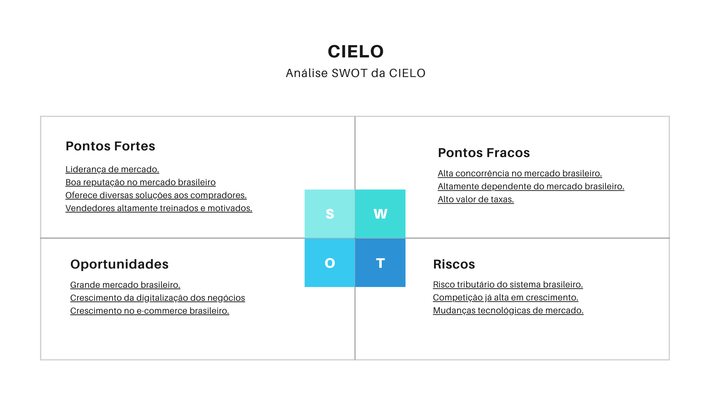

<p align = "center">Fonte: Modelo adaptado de Humphrey (1960). Adaptação feita pelos autores (2026).</p>

## Strengths:
A seção de forças identifica os pontos positivos internos de uma organização que oferecem vantagem competitiva frente ao mercado. No caso da Cielo, nota-se que a empresa possui uma sólida liderança de mercado, sendo a maior adquirente do país, o que é reforçado por sua boa reputação consolidada junto aos consumidores brasileiros. Além disso, a companhia se destaca por oferecer diversas soluções de pagamento e gestão aos compradores, contando com o suporte de vendedores altamente treinados e motivados, o que garante uma abordagem comercial eficaz e um atendimento qualificado.

* Liderança de mercado;
* Boa reputação no mercado brasileiro;
* Oferece diversas soluções aos compradores;
* Vendedores altamente treinados e motivados.

## Weaknesses:
A seção de fraquezas identifica os pontos falhos internos que podem comprometer o desempenho e a competitividade de uma organização. No caso da Cielo, nota-se que a empresa possui uma vulnerabilidade perante a alta concorrência, já que sua estrutura robusta dificulta uma resposta ágil às novas fintechs. Além disso, a companhia é altamente dependente do mercado brasileiro, o que concentra seus riscos em uma única economia, e enfrenta resistência pelo alto valor de suas taxas em comparação a modelos de negócio mais enxutos, dificultando a retenção de clientes que buscam menores custos operacionais.

* Alta concorrência no mercado brasileiro;
* Altamente dependente do mercado brasileiro;
* Alto valor de taxas.

## Opportunities:
A seção de oportunidades analisa os fatores externos positivos que podem ser explorados para o crescimento e a vantagem competitiva de uma organização. No caso da Cielo, nota-se que a empresa possui à sua disposição o grande mercado brasileiro, que oferece uma base massiva de clientes em potencial para suas soluções de pagamento (Fenacon, 2025). Além disso, o crescimento da digitalização dos negócios abre portas para a oferta de novos serviços tecnológicos, tendência que é reforçada pela expansão contínua do e-commerce brasileiro (CNN Brasil, 2023; Edrone, 2024), exigindo da companhia soluções cada vez mais integradas e eficientes para o comércio eletrônico.

* Grande mercado brasileiro;
* Crescimento da digitalização dos negócios;
* Crescimento no e-commerce brasileiro.

## Threats:
A seção de ameaças identifica os fatores externos que podem representar riscos significativos para a continuidade e o crescimento de uma organização. No caso da Cielo, nota-se que a empresa está exposta ao risco tributário do sistema brasileiro, onde mudanças na legislação podem impactar diretamente suas margens de lucro. Além disso, a companhia enfrenta uma competição já alta e em constante crescimento, com a entrada agressiva de novos participantes no setor de pagamentos. Por fim, as rápidas mudanças tecnológicas de mercado exigem constantes investimentos em inovação para evitar que seus serviços se tornem obsoletos perante novas soluções disruptivas.

* Risco tributário do sistema brasileiro;
* Competição já alta em crescimento;
* Mudanças tecnológicas de mercado.

### 1.1.3. Missão / Visão / Valores 

A base estratégica da Blue Codes é consolidada pelo tripé Missão, Visão e Valores, que atua como o alicerce fundamental para todas as nossas operações e decisões tecnológicas. A Missão define o nosso propósito imediato e a razão de existir da empresa no mercado atual, enquanto a Visão estabelece as nossas aspirações de longo prazo e o patamar de inovação que pretendemos alcançar no futuro. Complementando essa estrutura, os Valores representam os princípios éticos e os comportamentos inegociáveis que moldam a nossa cultura interna e o padrão de entrega aos nossos clientes. Juntos, esses pilares garantem que a Blue Codes mantenha uma direção clara, promovendo a coerência entre a excelência técnica e o impacto positivo que desejamos gerar no ecossistema digital.

* **Missão:** Levar equidade no ensino aos vendedores da Cielo, promovendo uma forma de aprendizagem simples, autônoma e igualitária para todos.
<br>
* **Visão:** Ser a principal plataforma gamificada de capacitação para vendedores da Cielo, tornando o aprendizado acessível, contínuo e transformador em todo o Brasil.
<br>
* **Valores:** Inclusão e equidade no acesso ao conhecimento, simplicidade e autonomia no aprendizado, inovação, colaboração e desenvolvimento contínuo das pessoas.

### 1.1.4. Proposta de Valor 

Segundo Osterwalder et al. (2014), o Canvas de Proposta de Valor é uma ferramenta visual estruturada para garantir o alinhamento perfeito entre as necessidades do cliente e a solução desenvolvida. Aplicando esse modelo ao escopo do projeto, o Perfil do Cliente detalha as tarefas diárias dos Gerentes de Negócios (GNs), que consistem em realizar o atendimento, conhecer profundamente os produtos da Cielo e efetuar vendas. Durante essas atividades, as principais dores enfrentadas são a insegurança no momento da venda, a falta de prática e o fato de os treinamentos tradicionais serem cansativos. Como contrapartida, os ganhos esperados pelos GNs são o aumento do engajamento, a melhoria no desempenho comercial e o desenvolvimento de habilidades de negociação.

Do lado da Proposta de Valor, o produto oferecido é um jogo de simulação de vendas com diálogos diretos entre vendedor e cliente. Como aliviadores de dores, a solução foca em reduzir a insegurança nas negociações e transformar a teoria em prática através da simulação. Os criadores de ganhos atuam proporcionando um treinamento mais dinâmico, facilitando a fixação do conteúdo e, consequentemente, melhorando os resultados de vendas. Esse alinhamento busca transformar a capacitação em um processo mais eficiente e menos exaustivo para a força de vendas (CIELO, 2023).

<p align = 'center'><b>Figura 1.1.4 </b> - Canvas Da Proposta de Valor</p>


<p align = 'center'>Fonte: Material produzido pelos autores (2026)</p>

### 1.1.5. Descrição da Solução Desenvolvida 

O cenário atual de capacitação dos novos Gerentes de Negócios (GNs) da Cielo consiste em uma etapa de onboarding teórico online (focada em produtos e técnicas de vendas), seguida por sessões presenciais de dinâmicas e jogos educativos de tabuleiro. O grande desafio desse modelo reside na capilaridade da própria empresa: como a Cielo está presente em 99% dos municípios brasileiros (Cielo, 2023), existe uma imensa dispersão geográfica de sua força de vendas. Devido a barreiras logísticas e financeiras de deslocamento, muitos futuros vendedores não conseguem participar dessas dinâmicas presenciais, gerando uma desigualdade na qualidade e na fixação do treinamento prático entre as diferentes regiões do país.

Para resolver esse gargalo de escalabilidade, a equipe Blue Codes desenvolveu um Simulador Digital de Vendas. Trata-se de um jogo virtual jogável na web, acessível diretamente por navegadores comuns (como Chrome, Safari e Edge), dispensando instalações complexas. Com mecânicas de mapa urbano e narrativa no estilo Visual Novel, o jogador assume o papel de um GN (Gerenciador de Negócios) da Cielo e precisa visitar diferentes estabelecimentos comerciais. O núcleo da solução baseia-se na interação imersiva com personagens (donos de negócios), em que o jogador deve conduzir diálogos, contornar objeções reais e utilizar o portfólio da empresa para convencer o cliente a fechar negócio.

O jogo será implementado como a etapa prática e final do onboarding. Após concluírem o curso teórico e adquirirem a bagagem técnica sobre os produtos, os GNs acessarão a plataforma de forma autônoma para testar seus conhecimentos em diversas fases e cenários narrativos exclusivos. A literatura especializada reforça a eficácia dessa abordagem: segundo Boller e Kapp (2018), o design de jogos de aprendizagem é ideal para o ambiente corporativo por fornecer aos colaboradores um "ambiente seguro" para explorar regras, testar hipóteses, falhar sem consequências reais e tentar novamente, transformando a teoria em prática de maneira muito mais retentiva.

Dessa forma, a implementação do simulador garante uma série de benefícios estratégicos e operacionais para a Cielo. O principal deles é a equidade e a democratização do ensino, assegurando que todos os GNs, independentemente de estarem em grandes capitais ou no interior, tenham acesso à mesma experiência de alta qualidade. Além disso, a solução viabiliza a escalabilidade logística ao eliminar os custos de envio de materiais físicos e de locomoção de turmas. Por fim, ao vivenciar simulações realistas, o colaborador desenvolve o pensamento crítico, treinando a inteligência emocional, a leitura de perfil de cliente e a tomada de decisão sob pressão de forma totalmente engajadora.

### 1.1.6. Matriz de Riscos e Oportunidades 

A Matriz de Riscos apresentada a seguir, fundamentada nas diretrizes de gestão de projetos de Carvalho (2018), tem como objetivo mapear, avaliar e propor planos de ação para os eventos incertos que podem impactar o desenvolvimento do simulador educacional. Em gerenciamento de projetos, o conceito de risco abrange tanto eventos negativos (ameaças) quanto eventos positivos (oportunidades).

Para essa análise, adotou-se uma metodologia de priorização que cruza a Probabilidade de ocorrência de cada evento com o seu respectivo Impacto no projeto, classificando-os em níveis de severidade (Baixo, Médio e Alto). Essa estruturação estratégica permite à equipe não apenas antecipar vulnerabilidades técnicas e operacionais (garantindo ações de mitigação e resposta), mas também identificar cenários favoráveis (garantindo ações de potencialização e exploração) para assegurar a melhor entrega possível do Produto Mínimo Viável (MVP).

<p align = 'center'><b>Figura 1.1.6.1 </b> - Matriz de riscos e oportunidades </p>


<p align = 'center'>Fonte: Material produzido pelos autores (2026)</p>

Conforme ilustrado na matriz e detalhado na Tabela 1.1.6.1 a seguir, os eventos do projeto foram divididos em duas categorias estratégicas: os riscos/ameaças (identificados de R01 a R10), com foco em neutralizar impactos negativos, e as oportunidades (identificadas de R11 a R13), com foco em maximizar o engajamento, a acessibilidade e a qualidade do código.

<p align = 'center'><b>Tabela 1.1.6.1 </b> - Descrição dos riscos e oportunidades do projeto </p>

| Risco | Descrição |Probabilidade | Impacto | Nível de Risco | Plano de Ação e Resposta | Responsável |
|----|----|-----|-----|--|---|---|
| R01 - Incoerência no impacto das escolhas | [Ameaça] A pontuação da Barra de Satisfação não refletir o peso real da resposta, frustrando o jogador. | 31% a 50% | Alto | Alto | Realizar testes de mesa (playtests) com usuários reais para calibrar os pesos e, caso o feedback aponte desbalanceamento, ajustar os multiplicadores diretamente no código. | Lucas Delmirio |
| R02 - Aumento de escopo não controlado (Scope Creep) | [Ameaça] Tentar adicionar mini-games complexos, animações muito elaboradas ou múltiplos finais que fujam da proposta linear do MVP. | 51% a 70% | Muito alto | Alto |Focar estritamente na entrega dos requisitos obrigatórios, movendo sumariamente quaisquer ideias secundárias para um backlog de trabalhos futuros. | Bruno Calenda |
| R03 - Incompatibilidade de hardware |[Ameaça] Lentidão ao renderizar o jogo no navegador em dispositivos mais antigos. | 51% a 70% | Alto | Alto | Otimizar os assets de pixel art e fazer testes de estresse, desativando animações secundárias do jogo se a taxa de quadros cair muito. | Guilherme Ludovico |
| R04 - Curva de aprendizado da interface |[Ameaça] Dificuldade do público não-gamer com mecânicas de navegação. | 71% a 90% | Moderado | Alto | Incluir instruções detalhadas no tutorial inicial com a Cielita e disponibilizar um botão de ajuda fixo na interface para suporte contínuo. | Enzo Ferreira |
| R05 - Fechamento acidental do navegador | [Ameaça] O usuário fechar a aba sem querer e perder a negociação em andamento. | 51% a 70% | Moderado | Médio |Implementar salvamento local (localStorage) do progresso contínuo e exibir um alerta nativo do navegador caso o usuário tente fechar a aba acidentalmente. | Matteus Haikal |
| R06 - Desatualização do portfólio (Conteúdo Hardcoded) | [Ameaça] Mudanças nos produtos da Cielo tornarem as respostas do jogo defasadas. | 11% a 30% | Alto | Médio | Manter os diálogos isolados em arquivos externos na arquitetura e documentar o padrão de formatação para que a própria equipe da Cielo possa atualizar os textos facilmente no futuro. | Stephany Marques | 
| R07 - Problemas de legibilidade e UX |[Ameaça] Tipografia pequena ou com baixo contraste. | 31% a 50% | Moderado | Médio | Seguir heurísticas de acessibilidade para garantir alto contraste e criar uma configuração nativa para o usuário aumentar o tamanho da fonte se necessário.| Laura Tosar |
| R08 - Inconsistências e erros de digitação nos artefatos | [Ameaça] Falhas ortográficas no GDD e nos diálogos, ou falta de padronização/comentários no código-fonte. | 51% a 70% | Muito baixo | Baixo | Estabelecer revisão por pares (peer review) antes da entrega dos artefatos e realizar correções em formato de hotfix assim que qualquer falha for detectada. | Guilherme Ludovico |
| R09 - Bloqueio automático de áudio pelo navegador |[Ameaça] Políticas do Chrome/Edge silenciarem o jogo até o primeiro clique. | 11% a 30% | Baixo | Baixo | Implementar tratamento de erro (catch) na função de autoplay e disponibilizar um botão para ativar o som manualmente, conforme estipulado no RF14. | Marco Túlio |
| R10 - Falhas em periféricos de entrada do usuário | [Ameaça] Mouse com defeito de duplo-clique ou tela touch pouco responsiva.| 11% a 30% | Baixo | Baixo | Ampliar a área de clique (hitbox) e o espaçamento vertical dos botões, além de implementar atalhos de teclado (setas e Enter) como método de entrada alternativo. | Lucas Delmirio |  
| R11 - Justiça no impacto das escolhas | [Oportunidade] A barra de satisfação refletir com alta precisão a realidade, gerando engajamento. | 51% a 70% | Baixo | Médio | Coletar informações de negociação com jogadores capacitados para refinar o modelo e usar essa precisão mecânica como um grande case de sucesso do simulador. | Lucas Delmirio |
| R12 - Salvaguardas de acessibilidade | [Oportunidade] O código apresentar salvaguardas robustas que tornem o jogo altamente acessível. | 31% a 50% | Moderado | Médio | Mapear os casos de uso extremos dos usuários para identificar as melhores práticas e destacar essa acessibilidade superior como um diferencial tecnológico na entrega. | Lucas Delmirio |
| R13 - Refinamento do Essencial do Projeto | [Oportunidade] Garantir que o MVP seja sólido e funcional, eliminando qualquer ruído visual ou mecânico que não contribua diretamente para o objetivo principal do projeto. | 60% a 70% | Moderado | Médio | Proibir a entrada de qualquer funcionalidade não listada como obrigatória no documento inicial, utilizando o tempo economizado no cronograma para realizar testes e polimentos adicionais. | Bruno Calenda |

<p align = 'center'>Fonte: Material produzido pelos autores (2026)</p>


### 1.1.7. Objetivos, Metas e Indicadores

A definição de objetivos, metas e indicadores é essencial para mensurar a efetividade da solução gamificada desenvolvida para a Cielo, garantindo o alinhamento com as estratégias de capacitação e desempenho comercial da companhia. O objetivo geral do projeto é aprimorar a qualificação técnica dos Gerentes de Negócios (GNs), elevando a eficiência nas negociações e o engajamento nos treinamentos corporativos sobre o portfólio de produtos. Para que os resultados sejam específicos, mensuráveis, atingíveis, relevantes e temporais, estabeleceram-se metas SMART focadas em três pilares: capacitação, eficiência e engajamento, seguindo a metodologia de gestão de desempenho proposta por Doran (1981).

No pilar de capacitação técnica, a meta é aumentar a taxa de sucesso nas simulações de vendas de 60% para 80% em até 3 meses após a implementação. Quanto à eficiência operacional, busca-se reduzir o tempo médio de treinamento de 20 horas para 14 horas em até 6 meses, utilizando metodologias de microlearning para combater a complexidade do setor de adquirência. Já para o engajamento, a meta é alcançar 80% de adesão voluntária dos vendedores ativos à plataforma no primeiro semestre de operação, visando mitigar os desafios de retenção e atualização destacados nos relatórios de governança da Cielo (2023).

A mensuração desses resultados será feita através de indicadores-chave de desempenho (KPIs), como a taxa de conclusão de módulos, o score médio nas simulações de acertos, o nível de satisfação interno (NPS de capacitação) e o tempo de rampa dos novos gerentes registrado no CRM. Essas métricas permitem avaliar se a solução contribui para a performance comercial e o fortalecimento competitivo da empresa frente à crescente concorrência no mercado de pagamentos. As definições desta seção baseiam-se no modelo SMART proposto por Doran (1981), em princípios de gamificação aplicados à aprendizagem corporativa, conforme discutido por Boller e Kapp (2018), e em boas práticas de treinamento e desenvolvimento amplamente adotadas por organizações como Deloitte (2020) e McKinsey & Company (2019).

## 1.2. Requisitos do Projeto

Esta seção apresenta os requisitos funcionais (Tabela 1.2.1) e os requisitos não funcionais (Tabela 1.2.2) definidos nas Sprints 1 e 2 do projeto, contemplando as principais funcionalidades implementadas e as diretrizes técnicas que orientam o desenvolvimento do jogo.

<p align = 'center'><b>Tabela 1.2.1 </b> - Requisitos Funcionais do Sistema</p>

| Nº | Requisitos Funcionais |
|----|------------------------|
| RF01 | O sistema deve direcionar o usuário para o cenário de navegação (mapa) e permitir a escolha de fases por meio de clique. |
| RF02 | O sistema deve possuir um botão para confirmar a escolha da fase, apresentando feedback visual da ação ao usuário. |
| RF03 | O sistema deve iniciar o jogo com um diálogo convidativo de boas-vindas. |
| RF04 | O sistema deve apresentar um diálogo de conduta de vendas específico para cada fase. |
| RF05 | O sistema deve apresentar múltiplas opções de resposta em momentos estratégicos do diálogo, sendo que cada escolha deve alterar o rumo da conversa e impactar diretamente a métrica de satisfação do cliente. |
| RF06 | O sistema deve disponibilizar diferentes produtos da Cielo como alternativas de venda, sendo que a escolha correta deve aumentar a satisfação do cliente e a escolha inadequada deve reduzi-la. |
| RF07 | O sistema deve possuir uma métrica visível de “Satisfação do Cliente” nas fases de dificuldade fácil e média, representada por uma barra ou indicador numérico, que aumente ou diminua de acordo com as escolhas realizadas pelo usuário durante a fase. |
| RF08 | Nas fases de nível díficil, o sistema não deve exibir a métrica de “Satisfação do Cliente”, representada por uma barra ou indicador numérico, que aumente ou diminua de acordo com as escolhas realizadas pelo usuário durante a fase.|
| RF09 | O sistema deve associar cada fase a um perfil de cliente com nível inicial de satisfação e comportamento específico, influenciando a variação da métrica de satisfação conforme as decisões tomadas pelo usuário. |
| RF10 | O sistema deve atribuir diferentes pontuações (reputação) para cada fase concluída com base na sua dificuldade. |
| RF11 | O sistema deve possuir uma métrica de reputação geral do jogador, que aumente conforme fases sejam concluídas com sucesso. |
| RF12 | O sistema deve desbloquear novas fases ou desafios com base no nível de reputação acumulado pelo jogador. |
| RF13 | O sistema deve possuir um botão “Voltar ao menu principal”, permitindo o retorno ao mapa durante a fase. |
| RF14 | O sistema deve possuir diversas fases com diferentes modalidades, abordando diversas situações reais dos GNs da Cielo. |

<p align = "center">Fonte: Tabela criada pelos autores.</p>
<br>

<p align = 'center'><b>Tabela 1.2.2 </b> - Requisitos Não Funcionais do Sistema</p>

| Nº | Requisitos Não Funcionais |
|----|----------------------------|
| RNF01 | O sistema deve apresentar interface intuitiva, com organização visual clara e elementos de fácil compreensão para o usuário. |
| RNF02 | O sistema deve ser responsivo, garantindo funcionamento adequado em navegadores de diferentes dispositivos e resoluções de tela. |
| RNF03 | O sistema deve possuir design gráfico em 2D (pixel art), com layout limpo, animações fluidas e boa legibilidade dos elementos visuais. |
| RNF04 | O sistema deve possuir design diversificado e representativo em relação aos NPCs (clientes). |
| RNF05 | O sistema deve utilizar tipografia adequada e em alto contraste (ou relevo) para facilitar a leitura e o entendimento do público-alvo. |

<p align = "center">Fonte: Tabela criada pelos autores.</p>

## 1.3. Público-alvo do Projeto 

O público-alvo do projeto é composto pelos futuros Gerentes de Negócios (GNs) que participam do programa de treinamento da Cielo e já foram aprovados no processo seletivo, o que demonstra engajamento e predisposição para o aprendizado de técnicas de vendas. Trata-se de um grupo com média de 44 anos de idade, formado por homens e mulheres distribuídos por todo o Brasil, atuando predominantemente fora dos grandes centros urbanos no modelo de vendas porta a porta. Em relação à escolaridade, a maioria possui ensino médio completo, havendo também um percentual significativo com graduação incompleta e uma minoria com ensino superior completo.

A escolha desse público como foco do jogo justifica-se, principalmente, pela barreira geográfica enfrentada por esses profissionais. Como estão espalhados por diferentes regiões do país, muitas vezes distantes dos grandes centros, o uso de um artefato digital promove maior equidade no processo de ensino, permitindo que simulem negociações e conheçam os produtos da Cielo sem a necessidade de deslocamento para treinamentos presenciais.

Considerando o perfil etário e a rotina de trabalho externa, esse público não possui, em sua maioria, experiência prévia significativa com jogos digitais. Suas preferências digitais tendem a ser mais utilitárias ou voltadas ao entretenimento casual, como jogos simples de celular, especialmente puzzles, além do uso frequente de redes sociais. Diante desse contexto e da diversidade de níveis de escolaridade, o jogo deve apresentar uma curva de aprendizado suave, sem exigir reflexos rápidos ou comandos complexos. Por esse motivo, optou-se pelo gênero Visual Novel (simulador de conversas), que se aproxima da dinâmica de leitura e interação presente em aplicativos de mensagens já familiares ao público, concentrando o desafio na tomada de decisões estratégicas de vendas, e não na habilidade motora do jogador.

# <a name="c2"></a>2. Visão Geral do Jogo 

Nesta seção, apresentamos como o jogo funciona e o que ele pretende entregar. O projeto foi criado para ser uma ferramenta de aprendizado prática, que mistura diversão com o treinamento do dia a dia. A ideia é oferecer um espaço onde o usuário possa treinar suas habilidades de venda através de situações reais, transformando o conteúdo teórico em uma experiência interativa e envolvente.

## 2.1. Objetivos do Jogo

O jogo tem como objetivo padronizar, fortalecer e aprimorar as habilidades de vendas dos Gerentes de Negócios (GN), com foco especial nos profissionais que não possuem acesso ao treinamento presencial da Cielo. Por meio de simulações de negociação com comerciantes, o jogador tem a oportunidade de praticar técnicas de abordagem, identificação de necessidades do cliente e apresentação das soluções de pagamento oferecidas pela empresa.

A vitória em cada fase ocorre quando o jogador consegue conduzir a conversa de forma estratégica e atingir o nível necessário na barra de satisfação do cliente. Durante os diálogos, o jogador deve escolher entre diferentes opções de resposta, sendo que decisões adequadas aumentam a satisfação do cliente e aproximam a negociação de uma venda concluída. Caso o jogador faça escolhas inadequadas repetidamente, a satisfação diminui e a negociação pode falhar.

O jogo é composto por fases principais, cada uma representando um tipo de estabelecimento comercial encontrado no cotidiano dos Gerentes de Negócios da Cielo: padaria, quitanda, restaurante, posto de gasolina, entre outros. Cada fase apresenta um perfil de cliente diferente e desafios específicos de negociação.

O sistema de progresso ocorre de forma linear entre as fases. Inicialmente, o jogador tem acesso apenas à fase da Padaria. Após concluir essa etapa com sucesso, novas fases são desbloqueadas gradualmente, permitindo que o jogador enfrente situações de venda cada vez mais complexas.

A reputação do jogador é representada dentro de cada fase pela barra de satisfação do cliente. Esse indicador reflete o desempenho do jogador durante a conversa e determina o sucesso ou fracasso da negociação. Dessa forma, o jogo incentiva o aprendizado progressivo, estimulando o jogador a melhorar suas decisões de venda para avançar no treinamento.

## 2.2. Características do Jogo 

Esta seção estabelece as diretrizes estruturais e técnicas que definem a identidade do Conexão Cielo. A seguir, são detalhados os parâmetros fundamentais que moldam a experiência do jogador, englobando a escolha do gênero gamificado, as plataformas e dispositivos suportados, a modalidade de interação, as referências de mercado que inspiraram as mecânicas e a expectativa de duração das sessões. O alinhamento de todas essas características foi planejado para garantir que o simulador cumpra seu propósito educacional de forma acessível, engajadora e tecnicamente viável para a realidade dos Gerentes de Negócios.

### 2.2.1. Gênero do Jogo 

O jogo se enquadra no gênero Visual Novel, caracterizado pela condução da narrativa por meio de diálogos interativos e escolhas realizadas pelo jogador. Nesse tipo de jogo, a progressão ocorre principalmente através da leitura de textos e da tomada de decisões que influenciam o desenvolvimento da história e o resultado das interações com os personagens. Diferentemente de jogos focados em reflexos ou ações rápidas, as Visual Novels priorizam a narrativa, o desenvolvimento de personagens e a tomada de decisões estratégicas durante conversas.

A escolha desse gênero está diretamente relacionada ao objetivo educacional do projeto. Como o jogo simula situações reais de negociação enfrentadas por Gerentes de Negócios da Cielo, o formato de diálogos interativos permite representar conversas de venda de forma realista. Assim, o jogador pode analisar o comportamento do cliente, escolher diferentes abordagens e observar as consequências de suas decisões, transformando o processo de aprendizagem em uma experiência prática e interativa.

### 2.2.2. Plataforma do Jogo

* **Dispositivos:** Desktop (PC/Mac), smartphones (Android/iOS) e tablets, otimizados para telas touch e para uso com mouse e teclado.
* **Sistemas:** Navegadores web compatíveis como Chrome, Firefox, Safari e Edge (HTML5/WebGL para jogabilidade fluida sem downloads).

### 2.2.3. Número de jogadores

O jogo possui mecânica *single player*, sendo projetado para a participação de apenas um jogador por vez. Nesse contexto, o jogador assume o papel de um Gerente de Negócios (GN) da Cielo em primeira pessoa, tomando decisões durante as simulações de vendas e conduzindo os diálogos com os clientes.

### 2.2.4. Títulos semelhantes e inspirações

O desenvolvimento do jogo foi inspirado principalmente em títulos do gênero Visual Novel, como *Coffee Talk* e *Amor Doce*, que utilizam diálogos interativos como principal mecânica de progressão. Em *Coffee Talk*, o jogador interage com diferentes personagens em um ambiente fixo, ouvindo suas histórias e tomando decisões que influenciam o rumo das conversas. Essa dinâmica influenciou diretamente a proposta do projeto, que também utiliza interações baseadas em diálogo para conduzir a experiência do jogador. Assim como nesse jogo, a narrativa e as escolhas realizadas durante as conversas possuem impacto no resultado final da interação.

Outra inspiração foi *Amor Doce*, conhecido por seu sistema de escolhas durante diálogos que alteram o desenvolvimento da história e a relação entre os personagens. Esse elemento foi adaptado para o contexto do projeto, no qual as decisões do jogador influenciam o nível de satisfação do cliente durante as negociações. Apesar dessas semelhanças estruturais, o jogo desenvolvido possui um propósito distinto: enquanto os títulos citados possuem foco narrativo e de entretenimento, o projeto busca aplicar essas mecânicas em um contexto educacional, simulando situações reais de vendas enfrentadas pelos Gerentes de Negócios da Cielo.

### 2.2.5. Tempo estimado de jogo
O tempo estimado de jogo para um jogador concluir a experiência de forma linear e bem-sucedida (sem falhas) é de aproximadamente 6 a 10 minutos. Esse período compreende a transição pelo mapa navegável e a conclusão interativa das 4 fases de negociação estipuladas.

No entanto, por se tratar de uma Visual Novel com viés educacional e simulador de vendas, a duração real das sessões é flexível e pode variar consideravelmente de acordo com o perfil do usuário. Fatores como a velocidade de leitura, o tempo dedicado à análise e reflexão antes da escolha das abordagens de diálogo, e o nível de conhecimento prévio do jogador sobre os produtos da Cielo influenciam diretamente o ritmo da progressão.

Além disso, o tempo total de interação pode ser estendido devido à mecânica de acertos e erros. Caso o jogador tome decisões inadequadas que reduzam a satisfação do cliente e culminem na perda da venda, será necessário repetir a respectiva fase. Essa abordagem de repetição incentiva a fixação do conteúdo educacional, mas adiciona minutos adicionais ao tempo total necessário para finalizar o jogo (conquistar todos os clientes no mapa).

# <a name="c3"></a>3. Game Design 

Esta seção apresenta a estrutura completa do Game Design do projeto. São descritos os elementos narrativos, mecânicos e estruturais que compõem a experiência do jogador, incluindo enredo, personagens, mundo do jogo, progressão entre fases, regras, mecânicas e trilha sonora.

## 3.1. Enredo do Jogo 
**Conexão Cielo** se passa em um ambiente urbano em constante movimento, onde diversos estabelecimentos de diferentes tamanho formam este ambiente. O jogador assume o papel de um novo Gerente de Negócios da Cielo guiado pela Cielita, uma agente virtual que conhece cada rua, cada lojista e cada obstáculo dessa cidade. A cada missão, o GN é enviado a um estabelecimento diferente: uma padaria, restaurante, quitanda e posto de gasolina. Em cada visita, ele precisa ouvir, identificar necessidades e propor soluções e cada palavra importa. Uma barra de satisfação e a mudança facial dos NPCs reflete em tempo real o humor deles, subindo a cada abordagem certeira e caindo a cada erro de leitura. Aqui, errar não é fracasso: é o começo do aprendizado. O verdadeiro objetivo não é vender e entender. É e através dessa jornada pelas ruas e história da cidade que o GN descobre o que significa, de verdade, conectar pessoas e negócios.

### 3.1.1 Contexto

O jogo se passa em uma cidade urbana, composta por diversos estabelecimentos comerciais, como padarias, restaurantes, farmácias, quitandas, supermercados e um posto de combustível. Nesse cenário, o jogador assume o papel de um Gerente de Negócios (GN) da Cielo.

Ao iniciar sua jornada, o jogador recebe orientações da Cielita, assistente virtual da empresa, que apresenta o funcionamento básico do jogo e os objetivos principais. O jogador é responsável por visitar comerciantes locais e oferecer soluções de pagamento adequadas às necessidades de cada negócio.

### 3.1.2 Desenvolvimento

Ao explorar o mapa da cidade, o jogador interage com diferentes NPCs (descritos na seção 3.2), cada um representando um tipo de empreendimento e possuindo características, desafios e perfis específicos. Durante as negociações, o jogador deve analisar as necessidades de cada cliente e escolher as melhores respostas em diálogos estratégicos. Cada decisão impacta diretamente no interesse do cliente e no sucesso da venda. Conforme realiza vendas bem-sucedidas, o jogador aumenta sua reputação na cidade, desbloqueando novos estabelecimentos e enfrentando desafios mais complexos.

### 3.1.3 Conflito

O principal conflito do jogo está na dificuldade de convencer os empreendedores a adotarem as soluções da Cielo, além de enfrentar diversos desafios que simulam cenários reais. Alguns clientes apresentam resistência, dúvidas ou experiências negativas com empresas concorrentes. Escolhas inadequadas durante as negociações podem resultar na perda da venda e aumentar o tempo para desbloquear outros estabelecimentos.

### 3.1.4 Resolução

A progressão narrativa culmina quando o jogador se torna um Gerente de Negócios experiente, conquistando a confiança dos comerciantes e expandindo a presença da Cielo na cidade. Nesse estágio, o jogador demonstra domínio das mecânicas de negociação, tomada de decisão estratégica e gestão de relacionamento com clientes.

## 3.2. Personagens

Esta seção detalha os agentes que compõem a narrativa e a mecânica de interações de Conexão Cielo. Os personagens são a peça central da simulação educacional, pois é por meio deles que os desafios de vendas e as abordagens de negociação ganham vida. A seguir, são apresentadas a perspectiva imersiva adotada para o protagonista, a caracterização e o papel dos Non-Playable Characters (NPCs) — que atuam como os clientes em cada fase — e o compromisso do projeto com a diversidade e a representatividade. Esse cuidado na construção dos perfis tem como propósito garantir que a experiência virtual reflita, de maneira autêntica e inclusiva, a pluralidade do mercado empreendedor brasileiro.

### 3.2.1. Controláveis
Como o projeto segue a premissa de uma Visual Novel, optou-se por não utilizar um personagem visível em tela. Essa escolha permite que o jogador assuma diretamente o papel do protagonista (em primeira pessoa), promovendo uma imersão total onde ele se sente o verdadeiro centro da narrativa e das decisões.

### 3.2.2. Non-Playable Characters (NPC)
Os NPCs (Non-Playable Characters) representam os estabelecimentos comerciais e os clientes. Cada NPC possui identidade visual própria, personalidade implícita e função específica no gameplay, contribuindo para a ambientação, progressão e dinâmica econômica do jogo.

#### 3.2.2.1 Padeiro
<p align = 'center'><b>Figura 3.2.2.1 </b> - Ficha do personagem NPC Padeiro</p>

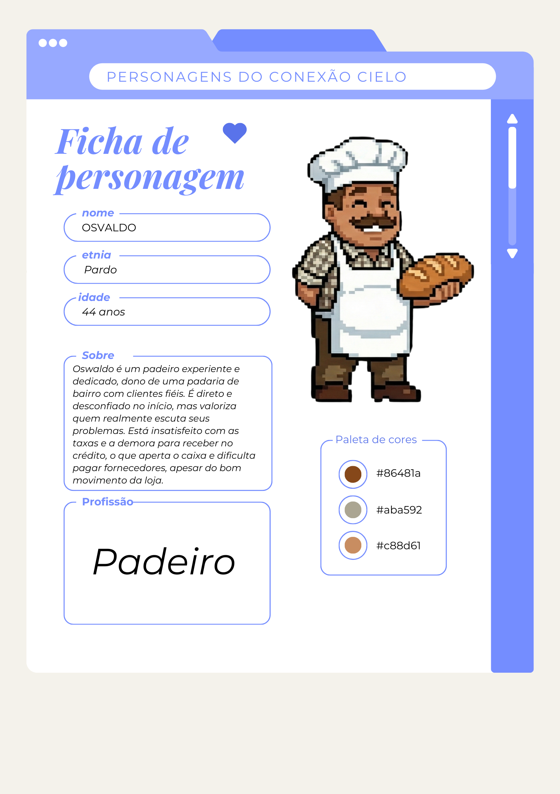
<p align = "center">Fonte: Figura criada pelos autores.</p>

**Descrição visual:** Personagem masculino, 44 anos, com bigode e expressão facial simpática. Utiliza chapéu tradicional de padeiro e avental branco, segurando um pão como elemento simbólico de sua atividade comercial.

#### 3.2.2.2 Chef de Cozinha
<p align = 'center'><b>Figura 3.2.2.2 </b> - Ficha do personagem NPC Chef de Cozinha</p>

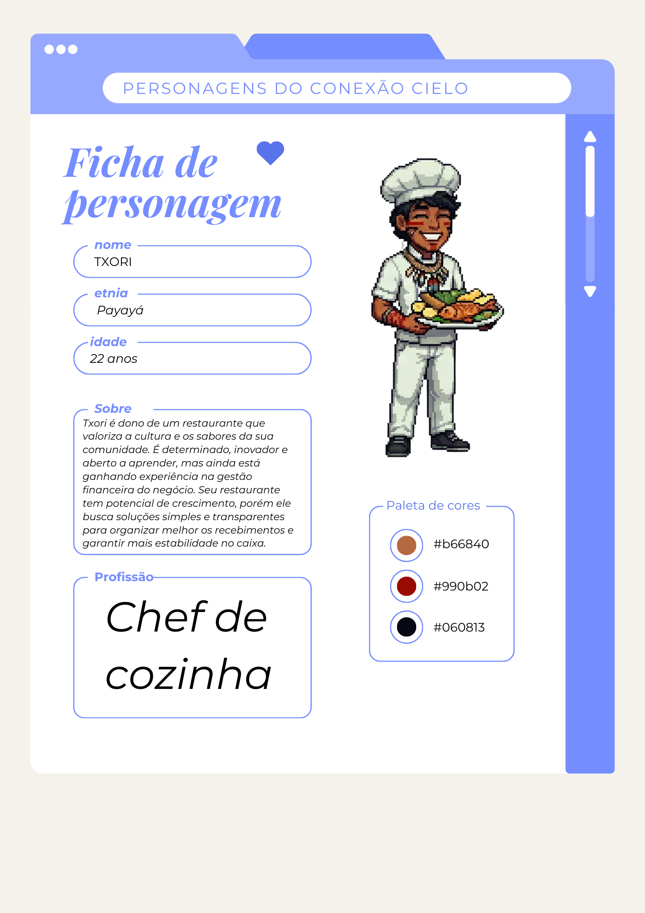
<p align = "center">Fonte: Figura criada pelos autores.</p>

**Descrição visual:** Personagem masculino, 22 anos, trajando uniforme branco de chef e chapéu de cozinha. Segura um prato de comida, simbolizando sua função dentro do sistema econômico do jogo.

#### 3.2.2.3 Quitandeira
<p align = 'center'><b>Figura 3.2.2.3 </b> - Ficha do personagem NPC Quitandeira</p>


<p align = "center">Fonte: Figura criada pelos autores.</p>

**Descrição visual:** Personagem feminina, 29 anos, com cabelo em tons vibrantes e coloridos. Utiliza jaqueta escura e avental, segurando frutas e legumes que reforçam sua identidade comercial.

#### 3.2.2.4 Dono do Posto
<p align = 'center'><b>Figura 3.2.2.4 </b> - Ficha do personagem NPC Dono do Posto</p>


<p align = "center">Fonte: Figura criada pelos autores.</p>

**Descrição visual:** Personagem masculino, 48 anos, com barba cheia e utilizando boné. Traja uniforme azul de posto de combustível e utiliza cadeira de rodas. Segura uma bomba de combustível como elemento representativo de sua atividade comercial.

### 3.2.3. Diversidade e Representatividade dos Personagens
O jogo foi desenvolvido no formato de visual novel, em que o usuário assume o papel de Gerente de Negócios (GN) da Cielo. A ausência de um protagonista com identidade fixa amplia a identificação do público-alvo, permitindo que qualquer vendedor possa se enxergar na narrativa.

As demais personagens representam os clientes com os quais o jogador deve interagir durante suas tentativas de venda, como: chefe de cozinha indígena, dona de quitanda negra, dono de posto de gasolina cadeirante e uma mulher de idade, dona de banco. Essa construção de personagens traz consigo a diversidade étnica, de gênero e de condições físicas, com o intuito de representar a realidade brasileira, que possui forte diversidade cultural e racial. Portanto, os perfis apresentados refletem, ainda que de forma representativa, a pluralidade existente no ambiente econômico brasileiro.

O impacto esperado dessa escolha é positivo em três dimensões principais: promove identificação e realismo, já que os vendedores reconhecem perfis semelhantes aos que encontram em sua rotina profissional; amplia a inclusão e a representatividade ao apresentar diferentes grupos sociais em posições de protagonismo econômico; e fortalece a proposta comercial ao transmitir que os produtos da Cielo atendem a negócios diversos, independentemente do perfil de cada empreendedor.

## 3.3. Mundo do jogo 

O mundo de **Conexão Cielo** é representado por um mapa urbano em pixel art, retratando uma metrópole brasileira viva e densa, repleta de estabelecimentos comerciais espalhados por suas ruas. A navegação é intuitiva e tátil: o jogador segura e arrasta o mapa como se estivesse explorando uma cidade em um tablet, tendo liberdade para percorrer os diferentes bairros e pontos comerciais. Para entrar em um estabelecimento, basta clicar sobre ele e a missão tem início. Nem todos os locais estão disponíveis desde o começo: o mapa se expande conforme o GN evolui, desbloqueando novos estabelecimentos à medida que conclui as missões anteriores com sucesso. Essa progressão reflete a jornada natural de um Gerente de Negócios que vai conquistando território, ganhando experiência e ampliando sua carteira um estabelecimento de cada vez

### 3.3.1. Locações Principais e/ou Mapas 
Todo o design visual do jogo é desenvolvido em pixel art. O mapa principal (Figura 3.3.3.1) apresenta uma estética urbana, caracterizada por elementos como ruas e veículos, sendo a navegação realizada sob uma perspectiva top-down (visão superior). Cada estabelecimento comercial possui uma identidade visual única, alinhada à sua temática. Além disso, ao acessar um comércio, a câmera transita do mapa externo para uma visão interna do respectivo ambiente.

<p align = 'center'><b>Figura 3.3.1.1 </b> - Mapa Principal do jogo</p>


<p align = "center">Fonte: Figura criada pelos autores.</p>

<p align = 'center'><b>Tabela 3.3.3.1 </b> - Descrição das cenas/fases do jogo</p>

| Fase | Descrição do Ambiente Interno | Imagem do Ambiente |
| :---- | :---- | :---- |
| Padaria | Ambiente interno e acolhedor de uma padaria em pixel art. O local exibe prateleiras repletas de pães e sacos de farinha, um balcão com expositor de vidro refrigerado para bolos e doces, e um forno de tijolos com fogo aceso ao fundo. | |
| Quitanda | Interior de uma loja de produtos frescos em pixel art. Apresenta um balcão de atendimento à esquerda e diversas prateleiras de madeira à direita, exibindo cestos organizados com frutas, hortaliças, legumes e potes de vidro. |  |
| Restaurante | Cenário aconchegante de um restaurante rústico em pixel art. O ambiente conta com paredes de tijolos aparentes, mesas de madeira fartas com alimentos (peixes, milho, grãos e pães) e uma cozinha aberta com um forno a lenha aceso. | |
| Posto de gasolina | Cenário em pixel art retratando um posto de combustível no período noturno, com destaque para duas bombas de abastecimento em primeiro plano, carros estacionados na pista e uma loja de conveniência iluminada ao fundo. |  |


<p align = "center">Fonte: Tabela criada pelos autores.</p>

Cada uma dessas locações foi projetada para ir além da estética, pois o ambiente interno de cada estabelecimento comunica, visualmente, a personalidade e a rotina do lojista que o jogador vai encontrar. A padaria, a quitanda, o restaurante e o posto de gasolina não são apenas cenários: são contextos que preparam o GN para adaptar sua abordagem antes mesmo de a conversa começar. Essa variedade de ambientes garante que o treinamento cubra perfis comerciais distintos, ampliando o repertório do vendedor e tornando a simulação fiel à diversidade real da carteira de clientes da Cielo.
### 3.3.2. Navegação pelo mundo

O jogo apresenta um sistema de navegação do qual o usuário pode selecionar uma fase para jogar, representada pelo comércio no mapa. A navegação entre as fases obedece a um sistema de progressão condicional, de modo que cada fase só é desbloqueada após a conclusão de uma etapa anterior. 

<p align = 'center'><b>Tabela 3.3.2.1 </b> - Fluxo de desbloqueio/dificuldade do jogo</p>

| Fase | Condição de Acesso / Desbloqueio |
| :---- | :---- |
| Padaria  | Fase Inicial. |
| Quitanda | Concluir a fase da Padaria. |
| Restaurante | Concluir a fase da Padaria. |
| Posto de gasolina | Concluir as fases da Quitanda e Restaurante. |

<p align = "center">Fonte: Tabela criada pelos autores.</p>

Essa estrutura de progressão foi pensada para respeitar a curva de aprendizado do jogador, introduzindo gradualmente cenários de maior complexidade. A padaria, por ser a fase inicial, funciona como ponto de entrada acessível, onde o GN se familiariza com as mecânicas do jogo. A partir dela, quitanda e restaurante se abrem em paralelo, oferecendo caminhos distintos de evolução. O posto de gasolina, por sua vez, representa o desafio mais avançado, exigindo que o jogador tenha consolidado as habilidades desenvolvidas nas etapas anteriores antes de enfrentá-lo. Dessa forma, a navegação pelo mundo não é apenas funcional, mas também pedagógica, conduzindo o GN por uma jornada de aprendizado progressivo e consistente.

### 3.3.3. Condições climáticas e temporais 
Não aplicável ao escopo do projeto.

### 3.3.4. Concept Art
No Conexão Cielo, a concept art foi pensada para definir a identidade visual do jogo antes da criação final dos assets. Ela ajuda a guiar como os cenários, objetos e outros elementos visuais devem ser produzidos, mantendo um mesmo estilo em todo o projeto. Como o jogo foi desenvolvido em pixel art, essa etapa é importante para garantir que os ambientes tenham unidade visual e façam sentido dentro da proposta do jogo.

A figura abaixo mostra a paleta de cores oficial utilizada no projeto. Essa paleta serve como base para a criação dos elementos gráficos e foi escolhida para combinar com a proposta de cada ambiente, como padaria, quitanda, restaurante e posto de gasolina. Além de deixar o jogo mais organizado visualmente, ela também ajuda a destacar elementos importantes da cena e a reforçar a identidade do jogo como um todo. Assim, a concept art contribui para que a experiência visual fique mais clara, agradável e coerente para o jogador.

<p align = 'center'><b>Figura 3.3.4.1 </b> - Paleta de cores do jogo</p>

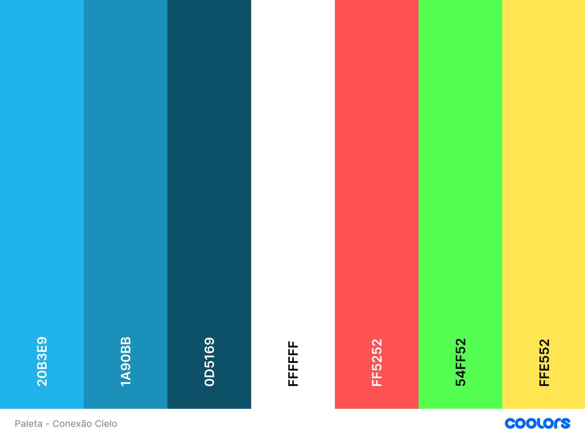
<p align = "center">Fonte: Figura criada pelos autores.</p>

### 3.3.5. Trilha sonora

No design de jogos, o áudio desempenha um papel muito além do mero apelo estético. Segundo Santos (2021), a sonoplastia e a trilha musical são pilares fundamentais para garantir a imersão do jogador, estabelecer a atmosfera adequada e fornecer feedback imediato sobre as ações realizadas na interface. No contexto do simulador educacional Conexão Cielo, a trilha sonora e os efeitos sonoros (SFX) foram projetados estrategicamente para guiar a atenção do Gerente de Negócios (GN), reforçar cognitivamente o resultado de suas escolhas (como os sons de sucesso ou falha na venda) e conferir uma identidade única a cada estabelecimento comercial visitado (padaria, quitanda, etc.).

A seguir, na Tabela 3.3.5.1, estão elencados os elementos sonoros e as músicas de fundo implementados no jogo, escolhidos e produzidos sob medida para atender às necessidades interativas e narrativas do projeto.

<p align = 'center'>Tabela 3.3.5.1 - Trilha sonora</p>

\# | Título | Ocorrência | Autoria | Áudio
--- | --- | --- | --- | ---
1 | Som do botão "Jogar" | Quando o botão "jogar" for clicado | Pixabay | <a href = "https://drive.google.com/file/d/1Z1K6I6P3IxxbyM1OI0llZZJAoRTceICg/view?usp=sharing"> Ouça o áudio clicando aqui!</a>
2 | Música principal do jogo da tela de mapa | Quando o jogador entrar na tela de seleção de mapa | Autoral | <a href = "https://drive.google.com/file/d/16BAPFuXoZX8L8PZM7iZIoYd7SxW81Ev6/view?usp=sharing">Ouça a música clicando aqui!</a>
3 | Som avançar diálogo | Ocorre quando o jogador clica para avançar diálogos nos cenários | Pixabay | <a href = "https://drive.google.com/file/d/1cppxu8pVYayMYHFeTojIt7pRwpJkm_t7/view?usp=sharing">Ouça o áudio clicando aqui!</a>
4 | Som de cenário bloqueado | Ocorre quando o jogador clica em um cenário que ele ainda não desbloqueou | Pixabay | <a href = "https://drive.google.com/file/d/1L1Yq_ep-Q4EPxAzqqWmVDEhaFfWlOgC8/view?usp=sharing">Ouça o áudio clicando aqui!</a>
5 | Som de seleção de mapa | Ocorre quando o jogador seleciona um mapa que está desbloqueado | Pixabay | <a href = "https://drive.google.com/file/d/1jr4JDkuc1gh91o51aWKBZGVLSqLFdc2S/view?usp=sharing">Ouça o áudio clicando aqui!</a>
6 | Música da padaria | Ocorre quando o jogador entra na padaria | Autoral | <a href = "https://drive.google.com/file/d/1C1fATleKX2paEb28rXV1pE9TlqZ75vgT/view?usp=sharing">Ouça a música clicando aqui!</a>
7 | Som de vitória | Ocorre quando o jogador consegue concluir a venda | Pixabay | <a href = "https://drive.google.com/file/d/1kRo4DUxqR1dPt0yZbhxL9MU3kk-4FZbV/view?usp=sharing">Ouça o áudio clicando aqui!</a>
8 | Som de derrota | Quando o jogador não consegue concluir a venda | Pixabay | <a href = "https://drive.google.com/file/d/1Jpgx-l0PtTVOI9Ub3J5EvnfziGI3fP8T/view?usp=sharing">Ouça o áudio clicando aqui!</a>
9 | Música da quitanda | Ocorre quando o jogador entra na quitanda | Autoral | <a href = "https://drive.google.com/file/d/1XMDDuv-4-QPn5oGlIeJ6eos15nDj1bMp/view?usp=sharing">Ouça a música clicando aqui!</a>
10 | Música do restaurante | Ocorre quando o jogador entra no restaurante | Autoral | <a href = "https://drive.google.com/file/d/15S0J_IlEH6S06KQ3Eedj5P8I_oKybIrY/view?usp=sharing">Ouça a música clicando aqui!</a>
11 | Música do posto | Ocorre quando o jogador entra no posto | Autoral | <a href = "https://drive.google.com/file/d/1rdI_gudatzL0FeVhH1d9GTnBKqfMZBTG/view?usp=sharing">Ouça a música clicando aqui!</a>

<p align = 'center'>Fonte: Tabela produzida pelos autores, com base em áudios do Pixabay e em gerações de faixas no Gemini.</p> 

## 3.4. Inventário e Bestiário 
Não aplicável ao modelo de jogo (Visual Novel educacional).

## 3.5. Gameflow (Diagrama de cenas) 
O diagrama de cenas (Figura 3.5.1) é uma ferramenta técnica essencial para o planejamento narrativo, atuando como um mapeamento visual da sequência, lógica e interconexões de uma obra.

<p align = 'center'><b> Figura 3.5.1 </b> - Diagrama de cenas</p>


<p align = "center">Fonte: Diagrama criado pelos autores.</p>

**Explicação sobre o gameflow:**
* **Tela de início:** A tela de início é simples, contando apenas o botão de jogar, botão de tutorial, o nome do jogo e uma cidade em formato pixel art de fundo.
<br>
* **Tela de tutorial:** A tela de tutorial conta com uma tela branca com elementos do jogo e textos explicando ao jogador como jogar.
<br>
* **Introdução Cielita:** A tela de introdução conta com a Cielita explicando ao jogador como se mover pelo mapa, dizendo seu objetivo e falando onde ele deve ir.
<br>
* **Mapa:** O mapa do jogo é um mapa grande que pode ser navegado com o jogador clicando e arrastando sobre ele, contém setas amarelas indicando ao jogador onde ele deve ir, um botão de ajuda que mostra a Cielita orientando onde o jogador deve ir, um indicador de reputação e inicialmente apenas a padaria desbloqueada.
<br>
* **Fase da padaria:** É a primeira fase do jogo e é a fase mais fácil do jogo, serve para o jogador se adaptar ao modelo do game. O padeiro é mais propício a ouvir a proposta do player então seus diálogos são mais brandos e a punição por errar não é tão grande na barra de satisfação. Todos os diálogos são adaptativos à resposta do jogador.
<br>
* **Fase da quitanda:** A fase da quitanda é uma fase intermediária do jogo e exige mais do jogador, exige que o jogador use técnicas de sondagem para entender o problema da Julie e escolha os diálogos corretos baseado no problema dela. Julie não é tão propícia a ouvir as propostas do jogador quanto o Osvaldo.
<br>
* **Fase do restaurante:** A fase do restaurante é uma fase intermediária do jogo e exige que o jogador use técnicas de sondagem para entender o problema do Txori e escolha os diálogos corretos baseado no problema dele. Txori já não é tão propício a ouvir as propostas do jogador quanto o Osvaldo.
<br>
* **Fase do posto:** A fase do posto é a última fase do jogo e não possui uma barra de satisfação igual as outras o jogador deve se basear apenas no feedback visual de sprites do José. O dono do posto não tem paciência para vendedores e está muito estressado com o seu negócio. É a fase que mais exige do jogador, é necessário um grande conhecimento de técnicas de sondagem para entender o problema e conhecimento sobre os produtos da Cielo para dar uma solução viável ao dono do posto.

## 3.6. Regras do jogo 
As regras do jogo definem como o jogador interage com o sistema: o que pode ou não fazer, quais são as condições de vitória e derrota e como ocorre a progressão. 

* **Seleção de fase no mapa:** O jogador navega pelo mapa e escolhe um estabelecimento disponível para iniciar uma interação.
<br>
* **Interação por diálogo:** Em cada etapa da conversa com o cliente, o jogador escolhe 1 entre 3 respostas possíveis.
<br>
* **Barra de satisfação:** Cada escolha altera a satisfação do cliente (respostas adequadas aumentam; inadequadas diminuem).
<br>
* **Condição de vitória:** Se o jogador atingir o nível necessário de satisfação no final da conversa, a venda é concluída com sucesso.
<br>
* **Condição de derrota:** Se a satisfação cair demais, a negociação falha e o cliente recusa a proposta.
<br>
* **Retorno ao mapa:** Ao final da negociação (com sucesso ou falha), o jogador volta para o mapa.
<br>
* **Progressão por reputação:** Vendas bem-sucedidas geram pontos de reputação, que são utilizados para desbloquear novos estabelecimentos e desafios mais complexos no mapa.

## 3.7. Mecânicas do jogo 

Esta seção detalha as formas de controle e interação do jogador com o sistema, descrevendo os comandos disponíveis (inputs) e o fluxo da experiência do usuário em cada etapa do jogo.

**Comandos Disponíveis e Interações:**
* **Mouse - Movimento (Hover):** Ao passar o cursor do mouse sobre botões interagíveis (ex: botão "Start") ou sobre opções de diálogo, o elemento sofre uma animação visual (leve aumento/diminuição de escala ou *highlight*). Isso fornece *feedback* visual imediato de que a área é clicável.
<br>
* **Mouse - Clique Esquerdo:**
    * **Telas de Menu (StartScene / Encerramento):** Aciona botões de navegação, como iniciar o jogo ("Start") ou retornar ao cenário urbano ("Voltar ao Mapa").

    * **Tela de Introdução (IntroScene) e Diálogos:** O jogador pode clicar em qualquer lugar da tela livre para avançar a leitura do texto dos NPCs.
    * **Seleção de Opções:** Nas fases de negociação (ex: BakeryScene), o clique é utilizado para passar os diálogos e escolher uma resposta das que são apresentadas na tela. O sistema de diálogo é dividido em três etapas principais, cada uma oferecendo três opções de resposta. Se o jogador fizer a escolha correta, ele avança para a próxima etapa. Caso erre, ele é direcionado para uma subetapa com apenas duas opções: uma permite recuperar uma parte da barra de satisfação, enquanto a outra resulta em uma perda ainda maior de pontos.
    * **Acesso a Cenas:** No mapa, o clique sobre a ilustração de um estabelecimento (ex: prédio da Padaria) funciona como um gatilho para carregar o respectivo cenário interno.
    <br>
* **Mouse - Clique e Arraste (Pan / Drag):** No cenário do mapa (MapScene), o jogador clica em uma área neutra e mantém o botão pressionado enquanto move o mouse. Isso movimenta a câmera do jogo, permitindo explorar a extensão da cidade e visualizar todos os estabelecimentos disponíveis.

**Combinações e Fluxo de Jogo (Core Loop):**
1.  **Navegação Inicial:** O jogador clica em "Start" $\rightarrow$ Avança as falas da introdução com cliques simples na tela $\rightarrow$ Chega à MapScene.
<br>
2.  **Exploração:** O jogador utiliza o *clique e arraste* para explorar a cidade $\rightarrow$ Localiza a primeira fase desbloqueada (Padaria) e clica para entrar.
<br>
3.  **Negociação:** O ciclo principal ocorre dentro do estabelecimento. O jogador lê o contexto $\rightarrow$ Clica para avançar a fala $\rightarrow$ Analisa as 3 respostas $\rightarrow$ Posiciona o mouse sobre a escolha desejada (verificando o *hover*) $\rightarrow$ Clica na resposta $\rightarrow$ O sistema calcula a ação e atualiza visualmente a **Barra de Satisfação** (canto superior direito) exibindo um *feedback* textual de acerto ou erro.
<br>
4.  **Encerramento e Loop:** Após o fim do diálogo, o jogo exibe o resultado final (Vitória ou Derrota). O jogador clica em "Voltar ao Mapa" $\rightarrow$ Retorna ao mapa com sua **Reputação** atualizada. Atingindo o limite necessário, um novo estabelecimento no mapa se torna clicável. Em qualquer momento da negociação, é possível clicar no botão de "Voltar" para abortar a missão e regressar ao mapa.

5. **Responsividade e Acesso Mobile:**
O sistema foi desenvolvido com foco em responsividade, permitindo que a experiência seja adaptada para diferentes tamanhos de tela, incluindo dispositivos móveis. Em smartphones e tablets, as interações são convertidas para o toque (touch), mantendo a mesma lógica dos comandos com mouse. A navegação, seleção de opções e progressão dos diálogos são realizadas por toques simples na tela, enquanto a exploração do mapa utiliza gestos de arraste. Dessa forma, o jogador pode acessar e jogar a aplicação de forma fluida tanto em desktop quanto em dispositivos móveis, ampliando o alcance e a acessibilidade do treinamento.

## 3.8. Implementação Matemática de Animação/Movimento 

Para a atribuição de uma movimentação bidimensional, foi decidido realizar a movimentação de um elemento gráfico. O elemento escolhido foi o balão que realiza o movimento de uma parábola na tela inicial do jogo, no arquivo startScene.js. Para a realização do movimento parabólico, foi definido que o Movimento Uniforme (MU), sem aceleração, ocorre no eixo X, enquanto o Movimento Uniformemente Variado (MUV), com aceleração, ocorre no eixo Y. Para efetuar os cálculos matemáticos, o movimento do eixo Y foi dividido em duas fases: fase de subida e fase de descida do balão. Vale ressaltar que, no Phaser, o eixo Y é invertido, ou seja, Y = 0 corresponde ao topo da tela, portanto, na fase de subida a aceleração é negativa e na fase de descida é positiva.

---

### Parâmetros do Modelo

O tempo total da animação foi definido como $T = 5s$, sendo esse o parâmetro central que rege todos os cálculos do movimento. Esse tempo é dividido igualmente entre as duas fases do MUV, resultando em $T/2 = 2{,}5s$ para a subida e $2{,}5s$ para a descida.

As posições inicial e final do balão foram definidas como:

- Posição inicial: $( x_i, y_i ) = (1024, 384)$
- Posição final: $( x_f, y_f ) = (0, 384)$

---

### Eixo X — Movimento Uniforme (MU)

Para percorrer o deslocamento $(x_f - x_i)$ em exatamente $T$ segundos com velocidade constante, a velocidade em X é calculada por:

```math
v_x = \frac{x_f - x_i}{T} = \frac{0 - 1024}{5} = -204{,}8 \text{ px/s}
```

O sinal negativo indica que o balão se move para a esquerda. A posição em X em função do tempo é dada por:

```math
x(t) = x_i + v_x \cdot t
```

---

### Eixo Y — Movimento Uniformemente Variado (MUV)

O MUV é aplicado em duas fases, ambas com velocidade inicial nula ($v_0 = 0$). A aceleração é calculada isolando $a$ na fórmula da posição $S = S_0 + \frac{1}{2} \cdot a \cdot t^2$, resultando em:

```math
a = \frac{2 \cdot (y_f - y_i)}{t^2}
```

**Fase 1 — Subida**, com $0 \leq t \leq T/2$: o balão parte de $y_i = 384$ e sobe até $y = 0$ em $2{,}5s$.

```math
a_{y1} = \frac{2 \cdot (0 - y_i)}{(T/2)^2} = \frac{2 \cdot (0 - 384)}{2{,}5^2} = -122{,}88 \text{ px/s}^2
```

```math
v_{y1}(t) = a_{y1} \cdot t
```

```math
y_1(t) = y_i + \frac{1}{2} \cdot a_{y1} \cdot t^2
```

**Fase 2 — Descida**, com $0 \leq t \leq T/2$, sendo $t$ reiniciado em zero ao início da fase: o balão parte de $y = 0$ e desce até $y_i = 384$ em $2{,}5s$.

```math
a_{y2} = \frac{2 \cdot (y_i - 0)}{(T/2)^2} = \frac{2 \cdot (384 - 0)}{2{,}5^2} = 122{,}88 \text{ px/s}^2
```

```math
v_{y2}(t) = a_{y2} \cdot t
```

```math
y_2(t) = \frac{1}{2} \cdot a_{y2} \cdot t^2
```

---

### Localização da Função no Código

A função `movimentoDoBalao` está implementada no arquivo `startScene.js`

# <a name="c4"></a>4. Desenvolvimento do Jogo

Nesta seção, é detalhado o processo de construção técnica e criativa do simulador, dividindo-o pelas etapas de desenvolvimento do projeto (sprints). Aqui, é apresentada a evolução do código, a implementação das interfaces e as funcionalidades que transformam o conceito em um artefato jogável. Cada subseção reflete o progresso da equipe em direção ao MVP (Produto Mínimo Viável).

## 4.1. Desenvolvimento preliminar do jogo 

Esta seção documenta o desenvolvimento preliminar do Conexão Cielo, registrando as decisões técnicas e de design tomadas ao longo da primeira etapa do projeto. O relato está organizado de forma a apresentar o conceito central do jogo, os objetivos definidos para a versão inicial, o escopo efetivamente entregue tanto em termos de interface quanto de implementação técnica, e as evidências visuais que comprovam o progresso alcançado. Também são apresentadas as telas planejadas para as próximas etapas, oferecendo uma visão do caminho que o desenvolvimento irá percorrer. O conjunto dessas informações permite acompanhar a evolução do projeto de maneira transparente e estruturada, conectando as decisões de produto com os resultados concretos obtidos em cada ciclo de desenvolvimento.

### 4.1.1 O que é o jogo

O jogo é um simulador de vendas em ambiente urbano, inspirado no formato de visual novel, no qual o jogador assume o papel de um Gerente de Negócios (GN) da Cielo. O objetivo principal é percorrer um mapa interativo, visitar estabelecimentos comerciais e converter potenciais clientes por meio de técnicas de negociação, gestão de objeções e conhecimento dos produtos da empresa. Este projeto foi desenvolvido com base em análise estratégica da empresa (Cielo, 2024; Cielo, 2026) e no contexto do mercado brasileiro de negócios.

### 4.1.2 Objetivo da Versão 1
A primeira versão do projeto teve como foco o desenvolvimento da estrutura base do jogo, contemplando: Tela de início, Tela explicativa (tutorial), Mapa interativo e Sistema básico de navegação entre telas. Essa etapa priorizou a construção do fluxo principal da aplicação.

### 4.1.3 Escopo Entregue – Interface

Na Sprint 1, foram implementadas as seguintes telas:
* **Tela 1 — Tela Inicial:** Interface contendo o botão Start, responsável por iniciar o jogo.
* **Tela 2 — Tutorial:** Tela explicativa apresentando as principais mecânicas e objetivos do jogo.
* **Tela 3 — Mapa:** Mapa interativo contendo um estabelecimento inicial (Padaria), disponível para seleção.
* **Tela 4 — Tela de Encerramento:** Tela final indicando o término da versão atual do jogo.

### 4.1.4 Escopo Técnico Entregue

Em termos de implementação, foram desenvolvidas as seguintes funcionalidades:
* Menu inicial com botão Start
* Sistema de navegação simples entre telas
* Estrutura do mapa interativo
* Transição básica entre cenas

### 4.1.5 Evidências – Prints de Tela

<p align = 'center'><b>Figura 4.1.5.1 </b> - Configurações do jogo</p>

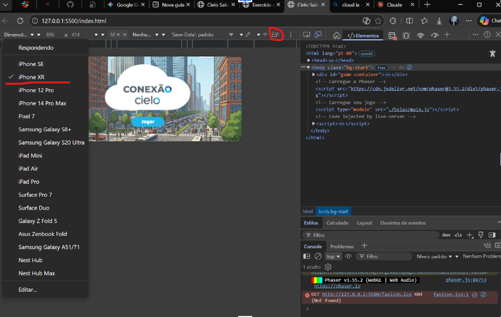
Descrição: Tela contendo definições gerais do sistema, incluindo parâmetros, ajustes e estrutura de layout.

<p align = 'center'><b>Figura 4.1.5.2 </b> - Tela Inicial (Layout)</p>

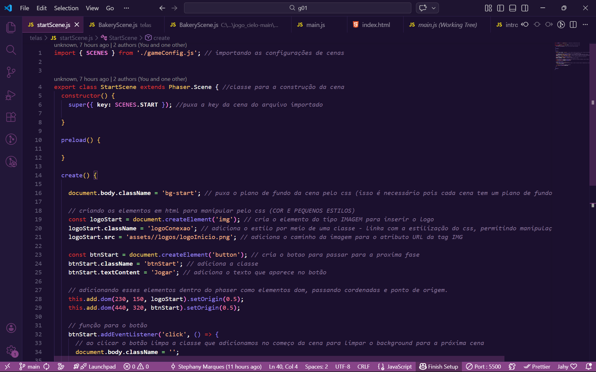

<p align = 'center'><b>Figura 4.1.5.3 </b> - Tela Inicial (Execução)</p>

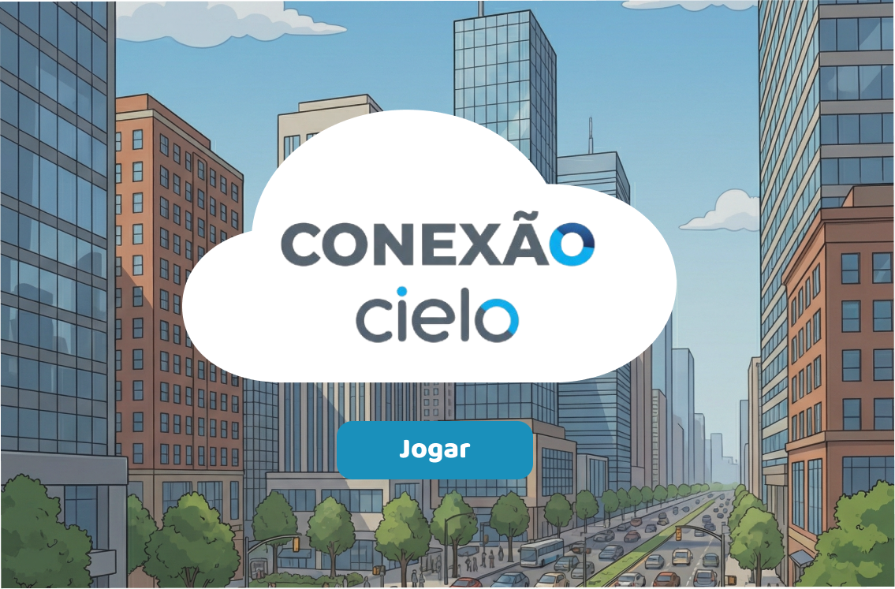

<p align = 'center'><b>Figura 4.1.5.4 </b> - Tela de Introdução (Layout)</p>


<p align = 'center'><b>Figura 4.1.5.5 </b> - Tela de Introdução (Execução)</p>


<p align = 'center'><b>Figura 4.1.5.6 </b> - Tela do Mapa (Layout)</p>

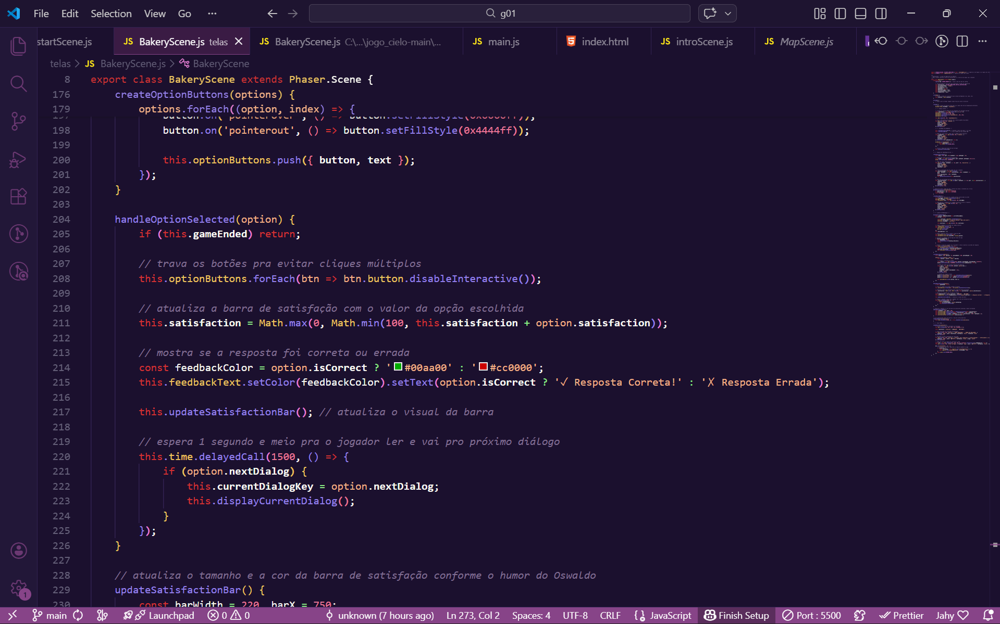

<p align = 'center'><b>Figura 4.1.5.7 </b> - Tela do Mapa (Execução)</p>

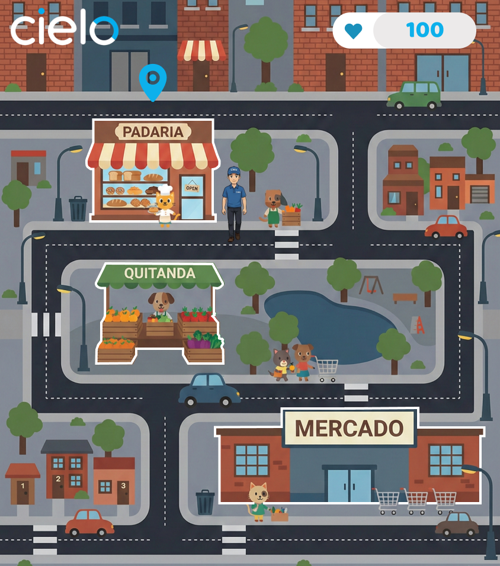

<p align = 'center'><b>Figura 4.1.5.8 </b> - Tela de Encerramento (Layout)</p>


<p align = 'center'><b>Figura 4.1.5.9 </b> - Tela de Encerramento (Execução)</p>


### 4.1.6 Telas Futuras 

<p align = 'center'><b>Figura 4.1.6.1 </b> - Cena Interna da Padaria (Layout)</p>

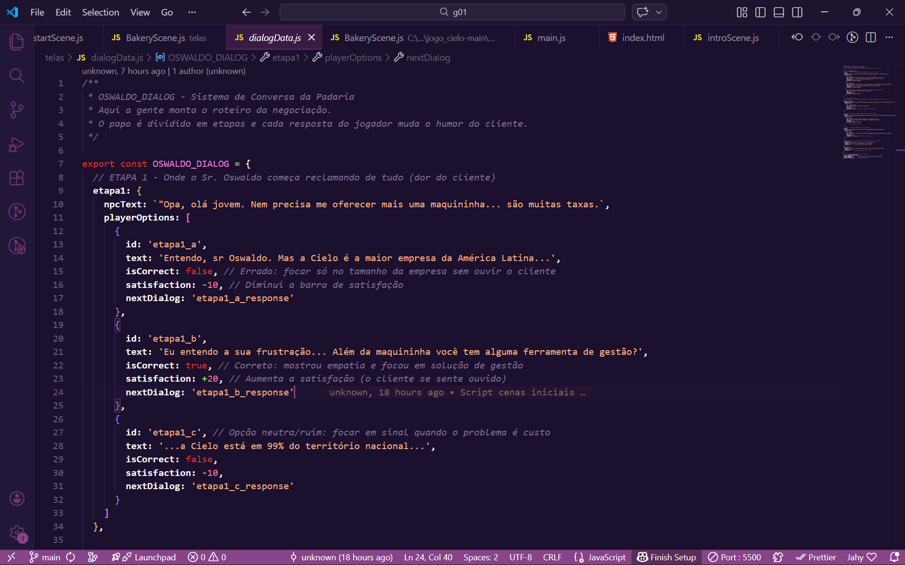

<p align = 'center'><b>Figura 4.1.6.2 </b> - Cena Interna da Padaria (Execução)</p>


<p align = 'center'><b>Figura 4.1.6.3 </b> - Estrutura dos Arquivos de Diálogo</p>


<p align = 'center'><b>Figura 4.1.6.4 </b> - Código de Conexão entre Cenas</p>


## 4.2. Desenvolvimento básico do jogo 

Esta seção documenta a segunda fase de construção do simulador, que marca a transição de uma estrutura visual preliminar para um ambiente interativo. O foco do desenvolvimento básico foi dar vida às mecânicas centrais do Conexão Cielo, transformando as telas navegáveis em um sistema de jogo funcional. A seguir, são detalhados os objetivos desta etapa, o escopo de interface e as implementações técnicas entregues — com destaque para a integração do primeiro cenário jogável (Padaria) e a estruturação da lógica de ramificação dos diálogos e da Barra de Satisfação. Além disso, são pontuadas as limitações desta versão, que serviram como direcionamento para os ciclos seguintes do projeto.

### 4.2.1 Objetivo da Versão 2
A segunda versão do projeto teve como foco a implementação das primeiras mecânicas jogáveis do sistema, transformando a estrutura inicial em uma experiência funcional. Nesta etapa foram integradas as principais telas do jogo, além da introdução do primeiro cenário jogável e do sistema inicial de diálogo com NPCs. Também foi iniciada a implementação da lógica da Barra de Satisfação do cliente.

### 4.2.2 Escopo Entregue – Interface
Na Sprint 2, foram implementadas e refinadas as seguintes telas:
* **Tela 1 — Menu Inicial:** Interface de entrada do jogo contendo o título e o botão de Start.
* **Tela 2 — Tela de Introdução (Tutorial):** Tela na qual a personagem Cielita apresenta instruções iniciais.
* **Tela 3 — Mapa Interativo:** Tela que permite ao jogador navegar pelo ambiente urbano. 
* **Tela 4 — Cenário da Padaria:** Primeiro ambiente jogável do sistema, onde o jogador pode interagir com o NPC Padeiro e iniciar o sistema de diálogo.

### 4.2.3 Escopo Técnico Entregue
Em termos de implementação, foram desenvolvidas as seguintes funcionalidades:
* Sistema funcional de transição entre cenas
* Integração entre menu inicial, tutorial, mapa e cenário jogável
* Sistema de colisão para entrada em estabelecimentos
* Implementação do cenário interno da Padaria
* Sistema inicial de diálogos com NPC
* Estrutura lógica da Barra de Satisfação do cliente
* Implementação de diálogos adaptativos baseados em escolhas

O sistema de diálogo foi estruturado em três etapas progressivas. Em cada etapa, as escolhas do jogador são verificadas por meio de uma condição lógica (`isCorrect`). Quando a escolha é considerada correta, ocorre um aumento na Barra de Satisfação do cliente.

### 4.2.4 Evidências – Prints de Código

<p align = 'center'><b>Figura 4.2.4.1 </b> - Código da Tela Inicial</p>


<p align = 'center'><b>Figura 4.2.4.2 </b> - Código da Tela de Introdução</p>

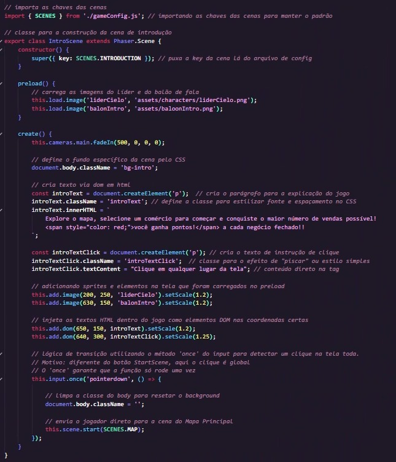

<p align = 'center'><b>Figura 4.2.4.3 </b> - Código da Tela de Mapa</p>

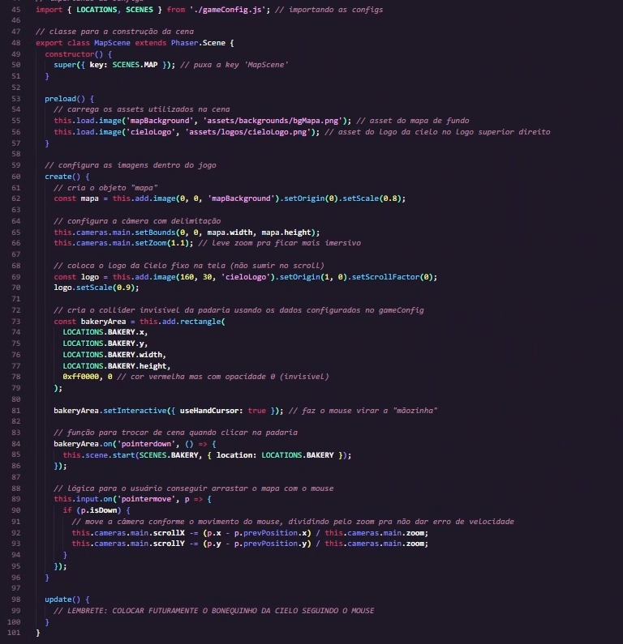

<p align = 'center'><b>Figura 4.2.4.4 </b> - Códigos do Cenário da Padaria</p>


<p align = 'center'><b>Figura 4.2.4.5 </b> - Códigos do Sistema de Diálogo</p>


### 4.2.5 Limitações Atuais
Nesta versão, algumas funcionalidades ainda não foram completamente implementadas:
* Sistema de redução da Barra de Satisfação em caso de escolhas incorretas
* Expansão do sistema de diálogos para outros estabelecimentos
* Implementação de novos cenários jogáveis
* Sistema de progressão baseado em reputação do jogador

## 4.3. Desenvolvimento intermediário do jogo 

Esta seção apresenta os avanços alcançados na terceira iteração do projeto, caracterizada pela expansão do universo do jogo e pelo amadurecimento de suas mecânicas principais. Com o alicerce funcional estabelecido na versão anterior, o desenvolvimento intermediário concentrou-se em diversificar os desafios de negociação oferecidos ao jogador. Abaixo, descreve-se a evolução do escopo técnico e visual da sprint, englobando a implementação de novos ambientes comerciais (Quitanda e Posto de Gasolina) e o refinamento definitivo do fluxo de diálogos e do cálculo da Barra de Satisfação do cliente, passos essenciais que aproximaram o simulador de seu Produto Mínimo Viável (MVP).

### 4.3.1 Objetivo da Versão 3
A terceira versão do projeto teve como foco a implementação da fase da Quitanda e da fase final do Posto de Gasolina. Além disso, foi desenvolvida a lógica da Barra de Satisfação do Cliente, responsável por medir o desempenho do jogador durante as interações de venda. Também foram realizadas correções no sistema de diálogos do jogo.

### 4.3.2 Escopo Entregue – Interface
* **Tela 1 — Menu Inicial:** Tela de entrada do jogo.
* **Tela 2 — Tela de Introdução (Tutorial):** Interface com instruções de Cielita.
* **Tela 3 — Mapa Interativo:** Permite acessar os cenários disponíveis.
* **Tela 4 — Cenário da Padaria:** Primeiro ambiente jogável.
* **Tela 5 — Cenário da Quitanda:** Segundo ambiente jogável, interação com a NPC Dona da Quitanda.
* **Tela 6 — Cenário do Posto de Gasolina:** Quarto ambiente jogável, interação com o NPC Dono do Posto.

### 4.3.3 Escopo Técnico Entregue
Em termos de implementação, foram desenvolvidas as seguintes funcionalidades:
* Sistema funcional da barra de satisfação do cliente
* Sistema de diálogo funcional 
* Implementação do cenário interno da Quitanda
* Implementação do cenário interno do Posto de Gasolina

A Barra de Satisfação do cliente foi implementada para representar visualmente o desempenho do jogador. Conforme o jogador realiza escolhas durante os diálogos, a barra é atualizada. O sistema de diálogos também foi aprimorado e corrigido para garantir o fluxo de desenvolvimento da negociação.

### 4.3.4 Evidências – Prints de Código

<p align = 'center'><b>Figura 4.3.4.1 </b> - Códigos do Cenário da Quitanda</p>

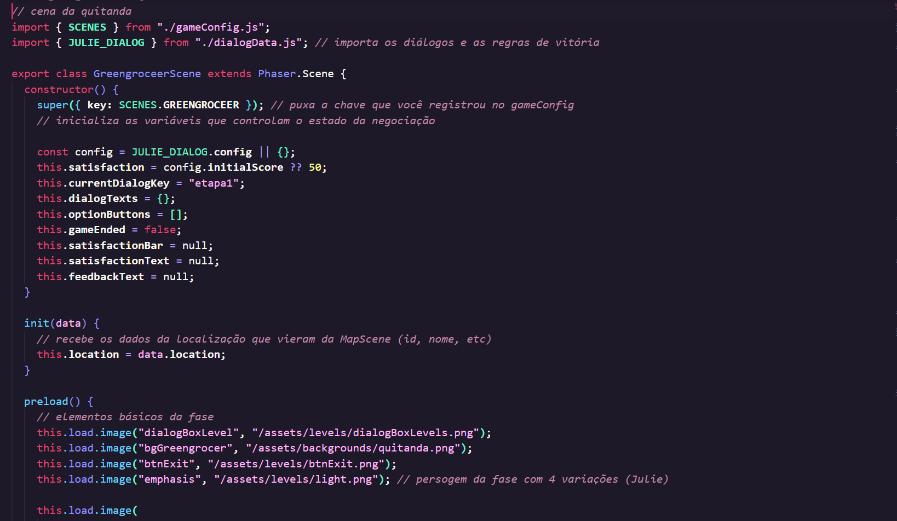 
<p align = "center">Fonte: Figura criada pelos autores.</p>

<p align = 'center'><b>Figura 4.3.4.2 </b> - Tela da Quitanda</p>

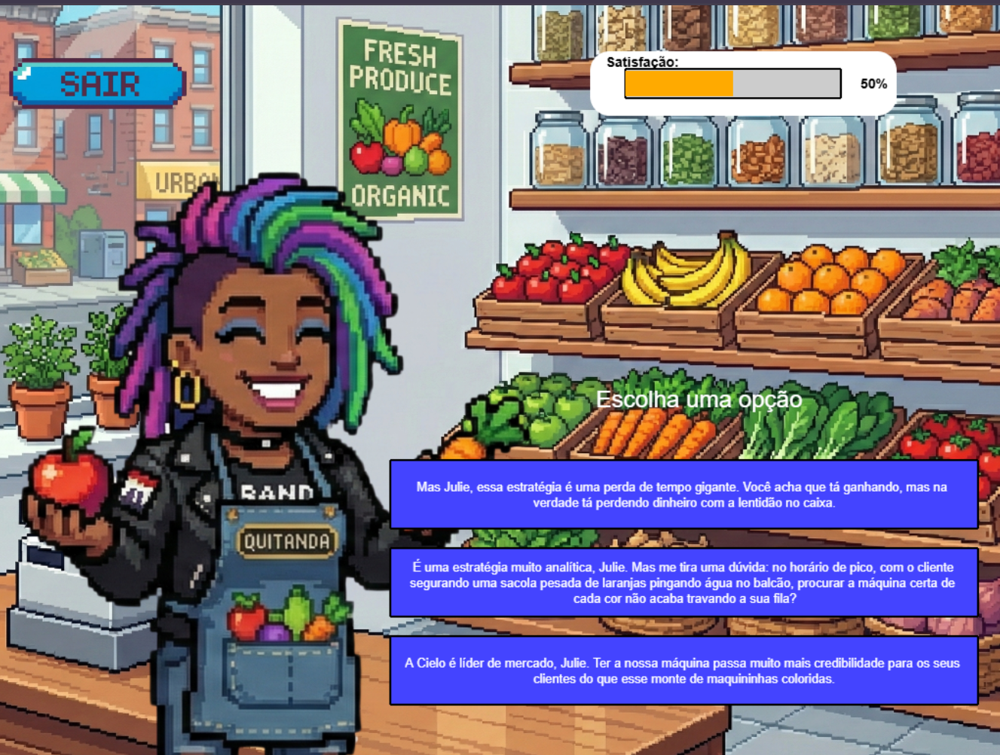 
<p align = "center">Fonte: Figura criada pelos autores.</p>

<p align = 'center'><b>Figura 4.3.4.3 </b> - Códigos do Cenário do Posto</p>


<p align = "center">Fonte: Figura criada pelos autores.</p>

<p align = 'center'><b>Figura 4.3.4.4 </b> - Tela do Posto</p>

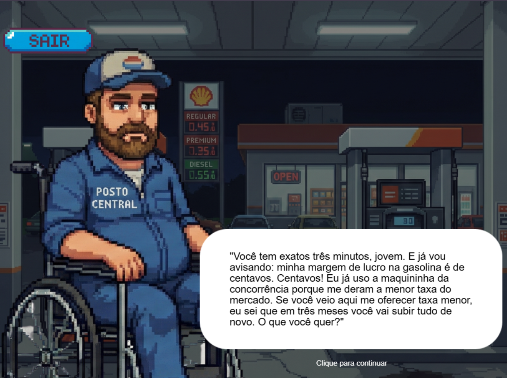 
<p align = "center">Fonte: Figura criada pelos autores.</p>

### 4.3.5 Limitações Atuais
Nesta versão, algumas funcionalidades ainda não foram completamente implementadas:
* Expansão do sistema de diálogos para os estabelecimentos restantes.
* Implementação completa dos cenários jogáveis pendentes.
* Sistema final de progressão baseado na reputação geral do jogador.

## 4.4. Desenvolvimento final do MVP

Na Sprint 4, foi finalizada a versão MVP do jogo, consolidando as principais funcionalidades propostas ao longo do projeto. O foco principal foi garantir uma experiência simples, funcional e alinhada à realidade dos vendedores da Cielo, permitindo que o jogador praticasse negociações por meio de simulações interativas.

O MVP conta com quatro fases distintas: padaria, quitanda, restaurante e posto de gasolina, cada uma representando diferentes contextos reais de venda enfrentados pelos Gerentes de Negócios. Cada fase possui um perfil de cliente específico, exigindo que o jogador adapte sua abordagem durante os diálogos para obter melhores resultados.

Como pode ser observado na Figura 4.4.1, o jogo apresenta uma interface inicial que permite ao usuário começar a jogar por meio de um botão interativo.

<p align = 'center'><b>Figura 4.4.1</b> - Tela inicial do jogo</p>

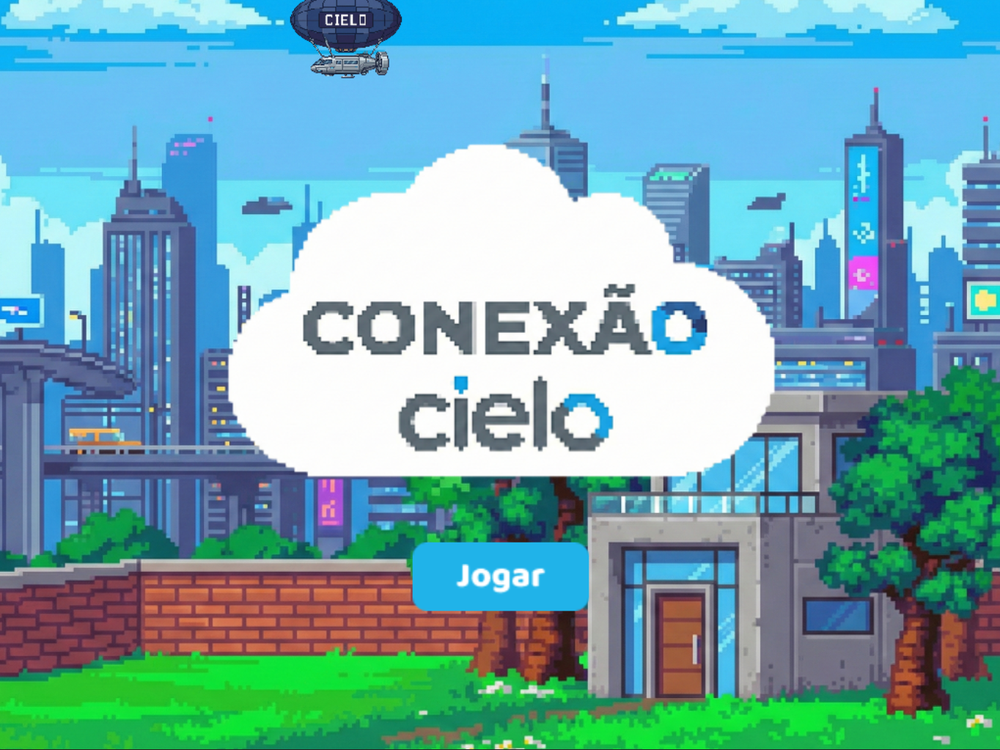
<p align = 'center'>Fonte: Material produzido pelos autores (2026)</p>


Ao iniciar o jogo, o usuário é recepcionado pela líder Cielita (Figura 4.4.2), que guia o GN pelo jogo, oferecendo as primeiras informações necessárias sobre as mecânicas e instigando-o a explorar o mapa.

<p align = 'center'><b>Figura 4.4.2</b> - Tela inicial do jogo</p>

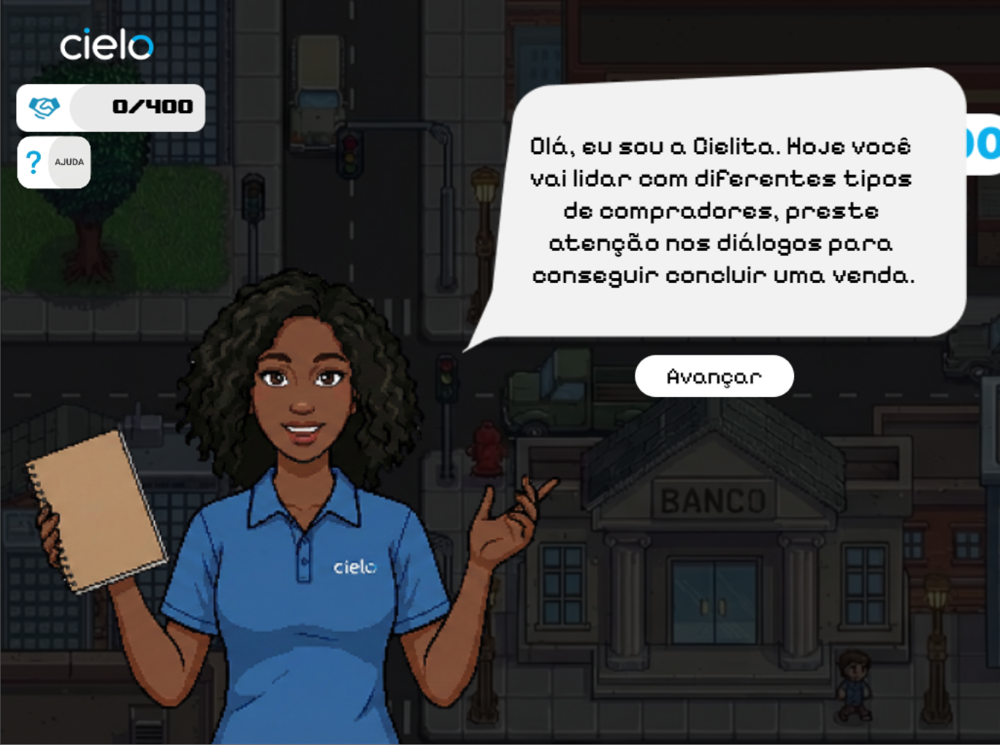

<p align = 'center'>Fonte: Material produzido pelos autores (2026)</p>

Após a introdução da Cielita, o jogador é liberado para explorar o mapa (Figura 4.4.3), onde encontra algumas fases ou estabelecimentos bloqueados por falta de reputação, mensagem que é exibida ao tentar acessar a fase (Figura 4.4.4).

<p align = 'center'><b>Figura 4.4.3</b> - Mapa do jogo (posição inicial)</p>

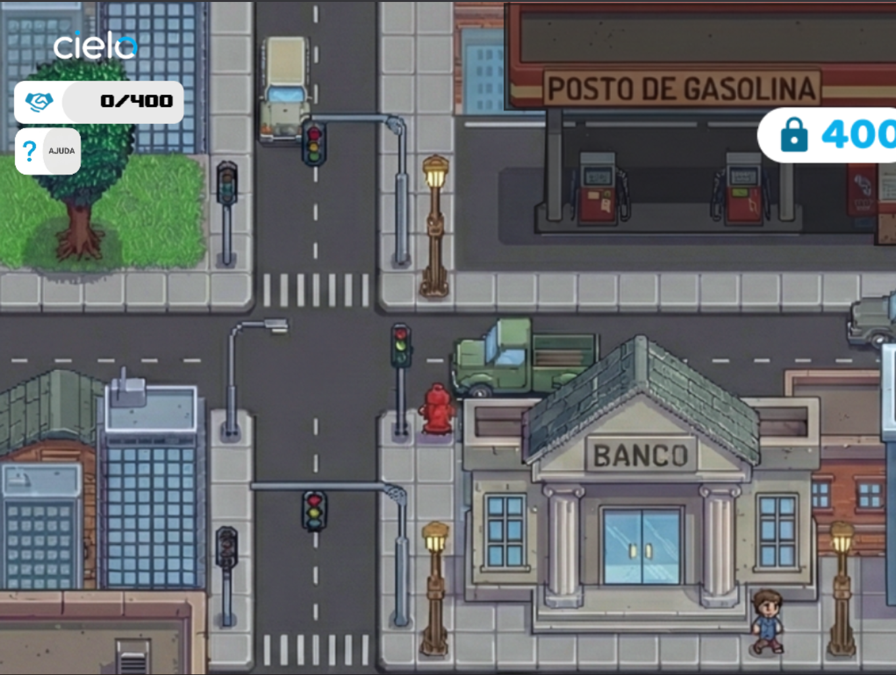
<p align = 'center'>Fonte: Material produzido pelos autores (2026)</p>

<p align = 'center'><b>Figura 4.4.4</b> - Fase bloqueada</p>

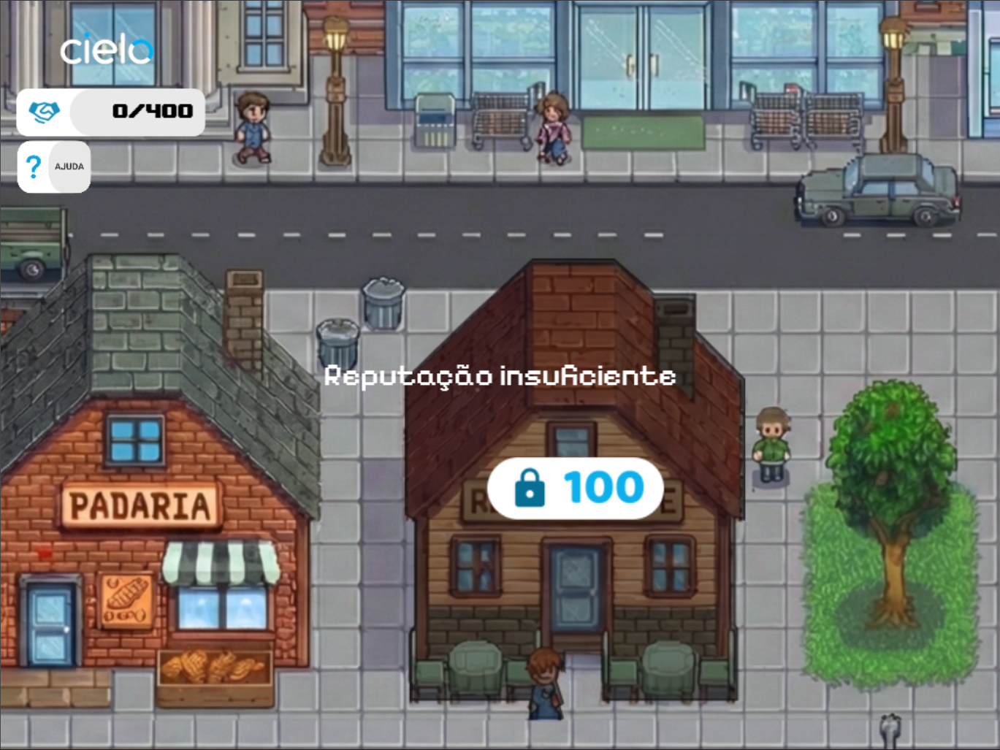

<p align = 'center'>Fonte: Material produzido pelos autores (2026)</p>


O usuário é orientado pela Cielita a explorar o mapa em busca da primeira e única fase desbloqueada, a Padaria. Ao selecionar a padaria no mapa, inicia-se o fluxo de diálogos com perguntas (Figuras 4.4.5 e 4.4.6), respostas e interações do gerente de negócios com Oswaldo, o padeiro, até que ele chegue ao final do fluxo. Caso finalize a fase com 50% ou mais na barra de satisfação, ele recebe uma mensagem de vitória (Figura 4.4.7) e soma 100 pontos de reputação ao seu placar. Caso contrário, é exibida uma mensagem de derrota (Figura 4.4.8), e ele pode voltar ao mapa e tentar novamente.

<p align = 'center'><b>Figura 4.4.5</b> - Fase da Padaria (diálogo)</p>

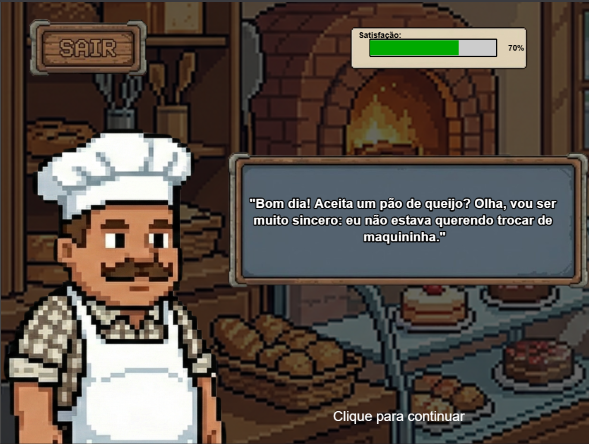

<p align = 'center'>Fonte: Material produzido pelos autores (2026)</p>

<p align = 'center'><b>Figura 4.4.6</b> - Fase da Padaria (opções)</p>

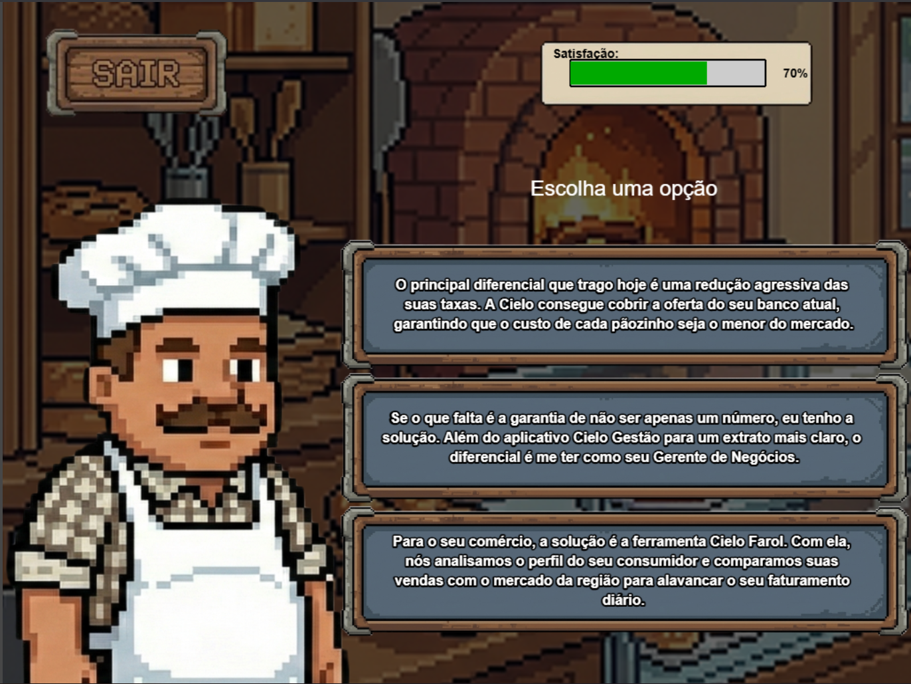

<p align = 'center'>Fonte: Material produzido pelos autores (2026)</p>

<p align = 'center'><b>Figura 4.4.7</b> - Tela de vitória das fases </p>


<p align = 'center'>Fonte: Material produzido pelos autores (2026)</p>


<p align = 'center'><b>Figura 4.4.8</b> - Tela de derrota das fases </p>


<p align = 'center'>Fonte: Material produzido pelos autores (2026)</p>


Em seguida, o jogador acessa as fases desbloqueadas com a vitória na padaria: o restaurante (Figura 4.4.9) e a quitanda (Figura 4.4.10). Ele fica livre para escolher qual fase deseja jogar. Além disso, não é permitido rejogar uma fase após a vitória, para evitar acúmulo indevido de pontuação (Figura 4.4.11).
Todas as fases seguem a mesma estrutura, com exceção da fase do posto de gasolina: diálogos, barra de reputação e telas de vitória e derrota. Como as duas fases intermediárias são de nível médio, é necessária uma satisfação de 65% ou mais.


<p align = 'center'><b>Figura 4.4.9</b> - Fase do Restaurante</p>

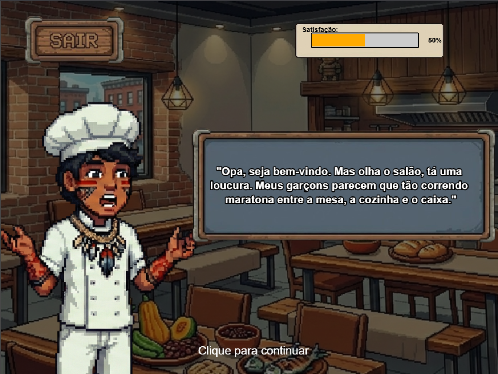

<p align = 'center'>Fonte: Material produzido pelos autores (2026)</p>

<p align = 'center'><b>Figura 4.4.10</b> - Fase da Quitanda</p>


<p align = 'center'>Fonte: Material produzido pelos autores (2026)</p>

<p align = 'center'><b>Figura 4.4.11</b> - Bloqueio de fase já concluída</p>


<p align = 'center'>Fonte: Material produzido pelos autores (2026)</p>

Com a conclusão das duas fases, o usuário acumula 400 pontos de reputação, o suficiente para desbloquear a fase final, o posto de gasolina (Figura 4.4.12). O posto é a fase final e também a mais difícil; para concluí-la, é necessária uma satisfação de 75% ou mais. Além disso, o jogador só sabe se acertou a resposta por meio das expressões de José, o NPC do posto, que fica feliz com uma resposta correta (Figura 4.4.13) e bravo diante de respostas incorretas (Figura 4.4.14). A mecânica de expressões acontece em todas as fases; entretanto, apenas na fase do posto ela é usada como uma das mecânicas principais.

<p align = 'center'><b>Figura 4.4.12</b> - Fase do Posto de Gasolina</p>

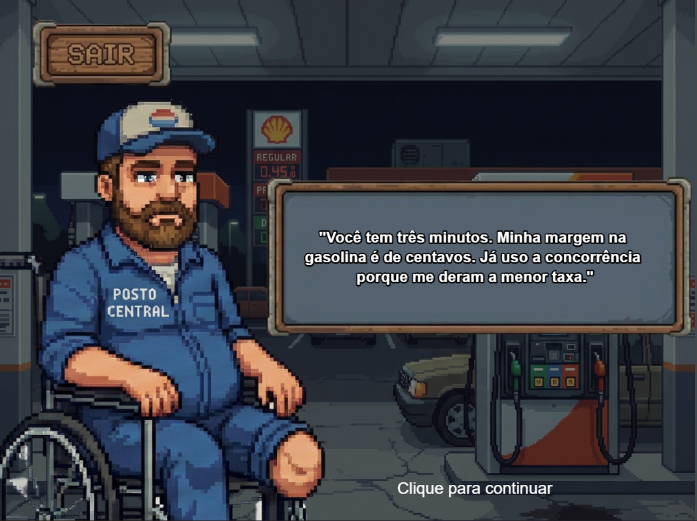

<p align = 'center'>Fonte: Material produzido pelos autores (2026)</p>

<p align = 'center'><b>Figura 4.4.13</b> - NPC do posto feliz como feedback</p>


<p align = 'center'>Fonte: Material produzido pelos autores (2026)</p>

<p align = 'center'><b>Figura 4.4.14</b> - NPC do posto bravo como feedback</p>

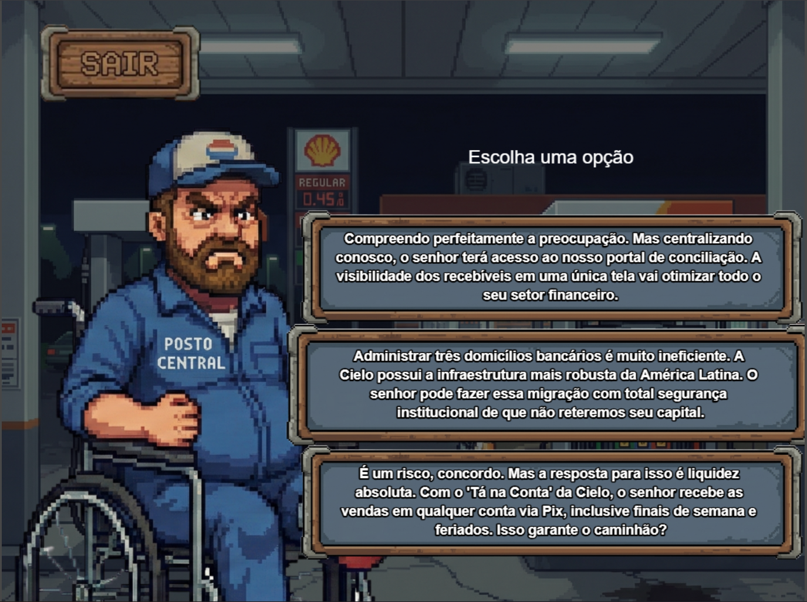

<p align = 'center'>Fonte: Material produzido pelos autores (2026)</p>

Por fim, ao finalizar a fase do posto, o jogador é encaminhado para a tela final, em que a Cielita aparece mais uma vez parabenizando o usuário por ter concluído o jogo e lhe entrega um certificado (Figura 4.4.15). Além disso, ela reforça a ideia de que os NPCs se tornaram parceiros do jogador. Depois de um tempo, ela desaparece e aparecem todos os NPCs juntos, comemorando, além da opção de jogar novamente, apagando o progresso feito e salvo (Figura 4.4.16).

<p align = 'center'><b>Figura 4.4.15</b> - Cielita parabenizando pela conclusão do jogo</p>


<p align = 'center'>Fonte: Material produzido pelos autores (2026)</p>

<p align = 'center'><b>Figura 4.4.16</b> - Cena final do jogo</p>


<p align = 'center'>Fonte: Material produzido pelos autores (2026)</p>

Ao longo dessa etapa, foram realizados testes para garantir o funcionamento adequado do jogo em diferentes situações, incluindo a validação das entradas do usuário e o tratamento de possíveis erros, como interações inválidas. Após os testes, o projeto foi organizado e disponibilizado em repositório Git, com commits descritivos, e preparado para implantação na plataforma indicada.

As principais dificuldades encontradas estiveram relacionadas à implementação da lógica de diálogos ramificados, o que exigiu atenção para manter a coerência das interações e dos impactos das escolhas. Como próximos passos, pretende-se aprimorar os elementos visuais, adicionar novos cenários e perfis de clientes, além de incluir trilha sonora e expandir as mecânicas de progressão, tornando a experiência mais completa e imersiva.

## 4.5. Revisão do MVP 

Após a realização dos playtests com usuários reais (detalhados na seção 5.2), foram identificados pontos de melhoria essenciais para o refinamento do jogo com base nos feedbacks coletados. O foco principal desta revisão foi aprimorar a clareza das instruções, a usabilidade da navegação no mapa e o fluxo de interação, solucionando as principais dificuldades apontadas pelos testadores.

Para sanar esses problemas, foram implementadas as seguintes mudanças na interface e no gameflow:

- <b> Adição do Botão e Tela "Como Jogar": </b> Para mitigar a dificuldade na compreensão das mecânicas iniciais, foi adicionado um botão "Como jogar" (Figura 4.5.1) diretamente na tela inicial. Ele direciona o jogador a uma tela explicativa (Figura 4.5.2) que detalha como explorar o mapa (clicando e arrastando), a progressão e desbloqueio das fases (níveis fácil, médio e difícil) e o funcionamento da barra de satisfação dos NPCs durante os diálogos.

<br>

<p align = 'center'><b>Figura 4.5.1</b> - Nova tela inicial com botão "Como jogar"</p>


<p align = 'center'>Fonte: Material produzido pelos autores (2026)</p>

<br>
<p align = 'center'><b>Figura 4.5.2</b> - Tela de instruções "Como Jogar"</p>


<p align = 'center'>Fonte: Material produzido pelos autores (2026)</p>
<br> 

- <b> Confirmações de Entrada e Saída: </b> Para evitar cliques acidentais e melhorar o controle da navegação, foram incluídos modais de confirmação claros ao tentar acessar um estabelecimento ("Deseja entrar em Padaria?") (Figura 4.5.3) e ao tentar sair de uma fase em andamento ("Deseja mesmo sair da Fase?") (Figura 4.5.4).
<br>

<p align = 'center'><b>Figura 4.5.3</b> - Telas de confirmação de acesso das fases </p>


<p align = 'center'>Fonte: Material produzido pelos autores (2026)</p>
<br>

<p align = 'center'><b>Figura 4.5.4</b> - Telas de confirmação de saída das fases </p>


<p align = 'center'>Fonte: Material produzido pelos autores (2026)</p>

<br>

- <b> Feedback Final de Venda Refinado: </b> As telas de conclusão de fase foram ajustadas visualmente para apresentar mensagens mais diretas de "VENDA NÃO REALIZADA" (Figura 4.5.6)ou "VENDA CONCLUÍDA!" (Figura 4.5.5), instruindo o jogador a tentar novamente ou parabenizando-o pela conquista do cliente (como o padeiro Oswaldo), mantendo o padrão do botão de retornar ao mapa.

<br>
<p align = 'center'><b>Figura 4.5.5</b> - Feedbacks de conclusão de venda</p>


<p align = 'center'>Fonte: Material produzido pelos autores (2026)</p>

<br>

<p align = 'center'><b>Figura 4.5.6</b> - Feedbacks de derrota de venda</p>


<p align = 'center'>Fonte: Material produzido pelos autores (2026)</p>

<br>

Para aprimorar o engajamento e a imersão logo nos primeiros momentos de jogo, a fala introdutória da assistente virtual Cielita (Figura 4.5.7 e figura 4.5.8) foi completamente reformulada. Agora, ela não apenas dá as boas-vindas ao usuário, mas atua como um verdadeiro tutorial narrativo integrado. Em sua nova introdução, Cielita contextualiza de forma mais clara o papel do jogador como um novo Gerente de Negócios da Cielo, explica a mecânica de satisfação dos clientes e o orienta explicitamente a interagir com o primeiro objetivo disponível no mapa (a Padaria). Essa mudança no roteiro inicial foi implementada para sanar a dificuldade de compreensão das regras apontada nos playtests, garantindo que o jogador inicie sua jornada com total domínio sobre suas metas e se sinta acompanhado durante toda a experiência de aprendizagem.
<br>

<p align = 'center'><b>Figura 4.5.7</b> - Primeira parte do diálogo de introdução da Cielita</p>


<p align = 'center'>Fonte: Material produzido pelos autores (2026)</p>

<br>

<p align = 'center'><b>Figura 4.5.8</b> - Seguunda parte do diálogo de introdução da Cielita </p>


<p align = 'center'>Fonte: Material produzido pelos autores (2026)</p>
<br> 

- <b> Aprimoramento do Tutorial e Navegação no Mapa: </b> O guia interativo com a personagem Cielita foi expandido. Agora, ela acompanha o progresso do GN diretamente na tela do mapa com balões de diálogo mais explicativos. Além disso, ela indica qual é o próximo objetivo (ex: "Agora você pode ir para o Posto de Gasolina. TOque na área do Posto do mapa" (Figura 4.5.9)) - ao clicar no botão de "ajuda" - e avisa com clareza quando novos estabelecimentos (Quitanda, Restaurante, Posto de Gasolina) são liberados (Figura 4.5.10) conforme o jogador acumula reputação. 

<p align = 'center'><b>Figura 4.5.9</b> - Cielita guiando o jogador pelo mapa</p>


<p align = 'center'>Fonte: Material produzido pelos autores (2026)</p>
<br> 

<p align = 'center'><b>Figura 4.5.10</b> - Cielita ao desbloquear novas fases</p>


<p align = 'center'>Fonte: Material produzido pelos autores (2026)</p>
<br> 

## 4.5.1. Evidências Técnicas das Implementações

Para garantir que as propostas de melhoria listadas no plano de ação (seção 5.2.3) fossem aplicadas de forma robusta e livre de bugs, a equipe de desenvolvimento aplicou lógicas específicas no código (salvaguardas e lógicas de estado). A seguir, estão detalhadas as implementações técnicas:

- <b> Menu Inicial e Cena de Tutorial:</b> O botão "Como Jogar" foi implementado na StartScene com gatilhos de interação visual (aumento de escala no hover) e efeitos sonoros, redirecionando o jogador para uma nova cena dedicada (HowToPlay) (Figura 4.5.1.1). Essa cena carrega o asset gráfico com as instruções e gerencia o retorno seguro ao menu inicial (Figura 4.5.1.2).

<p align = 'center'><b>Figura 4.5.1.1</b> - Código do botão de integração da cena "Como Jogar"</p>


<p align = 'center'>Fonte: Material produzido pelos autores (2026)</p>

<br>

<p align = 'center'><b>Figura 4.5.1.2</b> - Código do tela "Como Jogar"</p>


<p align = 'center'>Fonte: Material produzido pelos autores (2026)</p>

<br>

- <b>Prevenção de Cliques Acidentais e Avanço Rápido (Salvaguardas): </b> Um dos maiores problemas observados foi o avanço acidental de diálogos (jogadores clicando muito rápido). Para corrigir isso, foi implementado um sistema de cooldown (delay mínimo de 700ms entre cliques) na função canClickDialog() (Figura 4.5.1.3). Além disso, salvaguardas simples, como o bloqueio da interação com o mapa enquanto a introdução está ativa (if (introActive) return;), foram adicionadas (Figura 4.5.1.4).

<p align = 'center'><b>Figura 4.5.1.3</b> - Implementação de Delay nos diálogos</p>


<p align = 'center'>Fonte: Material produzido pelos autores (2026)</p>

<br>

<p align = 'center'><b>Figura 4.5.1.4</b> - Implementação de Salvaguardas</p>


<p align = 'center'>Fonte: Material produzido pelos autores (2026)</p>

<br>

- <b> Modais de Confirmação (Entrada e Saída):</b> Para evitar que os jogadores entrem ou saiam de fases acidentalmente, foram criadas caixas de diálogo sobrepostas (overlays). As funções showConfirmationDialog (para entrada) (Figura 4.5.1.5) e showExitConfirmation (para saída) (Figura 4.5.1.6) geram retângulos interativos com botões de "Sim/Entrar" e "Cancelar", impedindo cliques nos elementos do cenário enquanto o modal estiver ativo.

<p align = 'center'><b>Figura 4.5.1.5</b> - Lógica de renderização das caixas de entrada nas fases </p>


<p align = 'center'>Fonte: Material produzido pelos autores (2026)</p>

<br>

<p align = 'center'><b>Figura 4.5.1.6</b> - Lógica de renderização das caixas de entrada nas fases </p>


<p align = 'center'>Fonte: Material produzido pelos autores (2026)</p>

<br>

- <b> Feedback Visual e Progressão na Tela de Fim de Fase: </b> A função showEndScreen centralizou o gerenciamento do resultado da negociação. Com base na variável isSuccess, o código define a cor de fundo (verde para sucesso, vermelho para falha), adiciona um botão de voltar e um retangulo branco de fundo (Figura 4.5.1.7).

<p align = 'center'><b>Figura 4.5.1.7</b> - Lógica da tela de Vitória/Derrota </p>


<p align = 'center'>Fonte: Material produzido pelos autores (2026)</p>

<br>

- <b> Guias Visuais no Mapa (Setas e Textos Dinâmicos):</b> Para mitigar a dificuldade de navegação e localização de objetivos, o sistema do mapa foi aprimorado. O código agora possui uma função dinâmica para os balões de fala da Cielita (Figura 4.5.1.9) (getHelpMessage e getCompletionMessage), que avalia as fases já concluídas no GAME_STATE e orienta o jogador para o próximo passo correto. Além disso, foi implementado um sistema de renderização gráfica de setas indicativas no mapa (Figura 4.5.1.8), apontando sempre para os estabelecimentos recomendados ou recém-desbloqueados, calculando o ângulo e a posição em relação à câmera do jogador.

<p align = 'center'><b>Figura 4.5.1.8</b> - Lógica da renderização de setas-guia </p>


<p align = 'center'>Fonte: Material produzido pelos autores (2026)</p>

<br>

<p align = 'center'><b>Figura 4.5.1.9</b> - Lógica de textos dinâmicos da Cielita </p>


<p align = 'center'>Fonte: Material produzido pelos autores (2026)</p>

<br>

Em suma, as alterações visuais e mecânicas detalhadas nesta seção, aliadas às suas respectivas implementações e salvaguardas técnicas, resolveram com sucesso as principais dores de usabilidade levantadas durante os testes de jogabilidade. Com essas melhorias, o Produto Mínimo Viável (MVP) atinge o nível de estabilidade necessário, mitigando frustrações técnicas e garantindo uma curva de aprendizado suave. Dessa forma, o simulador entrega uma experiência fluida, intuitiva e engajadora, cumprindo seu objetivo de capacitar os Gerentes de Negócios da Cielo de maneira eficiente e consolidando a entrega final desta etapa de desenvolvimento.

# <a name="c5"></a>5. Testes

Nesta seção, são apresentados os processos de validação e verificação realizados para atestar o correto funcionamento do simulador educacional. O objetivo dessas validações é garantir a Qualidade de Software (QA - Quality Assurance), certificando-se de que o jogo está em total alinhamento estrutural e lógico com os requisitos funcionais e não funcionais previamente mapeados no escopo do projeto.


## 5.1. Casos de Teste 

Em Engenharia de Software, segundo Pressman (2016), um Caso de Teste (Test Case) é um cenário documentado e estruturado que define um conjunto de condições prévias, ações a serem executadas e os resultados esperados para validar se uma funcionalidade específica do sistema está operando da maneira correta.

De acordo com Sommerville (2018), o uso de casos de teste é fundamental para padronizar as avaliações do software, permitindo que qualquer desenvolvedor ou testador replique o mesmo cenário em busca de falhas (bugs), gargalos de usabilidade ou quebras lógicas no código. Eles funcionam como um roteiro de aprovação: se o resultado obtido após a ação (pós-condição) for idêntico ao resultado esperado, a funcionalidade é considerada validada.

Os casos de teste listados na Tabela 5.1.1 abaixo foram projetados para serem executados de forma iterativa em diferentes momentos do desenvolvimento. Eles têm como foco principal verificar o funcionamento isolado e a integração coesa entre as mecânicas essenciais do jogo: navegação de interfaces, renderização do mapa, sistema interativo de diálogo, lógica de cálculo da barra de satisfação e o sistema de progressão por reputação.
<p align = 'center'><b>Tabela 5.1.1 </b> - Casos de teste do jogo</p>

| ID | Pré-condição | Descrição do teste (Ação) | Pós-condição (Resultado Esperado) |
|:---|:---|:---|:---|
| 1 | Jogo executado no navegador. | Verificar a proporção da tela durante a navegação entre menus e o mapa. | Imagens, diálogos e textos são renderizados corretamente, sem distorções, mantendo a proporção visual. |
| 2 | Jogo aberto na tela inicial (StartScene). | Clicar no botão "Como jogar". | O sistema transiciona para a tela de introdução do tutorial (howToPlay). |
| 3 | Jogo aberto na tela de tutorial (howToPlay). | Clicar no botão "Voltar". | O sistema transiciona para a tela inicial (StartScene). |
| 4 | Jogo aberto na tela inicial (StartScene). | Clicar no botão "Jogar". | O sistema transiciona para o overlay da Cielita (mapScene). |
| 5 | Overlay da Cielita ativo na tela. | Clicar no botão "Avançar". | O sistema avança para o próximo diálogo da Cielita. |
| 6 | Overlay da Cielita ativo na tela. | Clicar no botão "Avançar". | O sistema transiciona para a tela do mapa urbano (MapScene). |
| 7 | Tela do mapa (MapScene) ativa na tela. | Clicar no botão "Ajuda" disponível na interface. | O sistema exibe o overlay da Cielita com instruções ou diálogos de ajuda. |
| 8 | Tela do mapa (MapScene) ativa na tela. | Clicar sobre o local da padaria no mapa do jogo. | O sistema exibe um overlay de confirmação com a mensagem "Deseja entrar em Padaria?" e os botões "Entrar" e "Cancelar". |
| 9 | Overlay de confirmação da padaria ativo na tela. | Clicar no botão "Entrar". | O sistema carrega e exibe o cenário da padaria (bakeryScene). |
| 10 | Overlay de confirmação da padaria ativo na tela. | Clicar no botão "Cancelar". | O sistema fecha o overlay e retorna para a tela do mapa (MapScene), sem iniciar a fase. |
| 11 | Cena da padaria (bakeryScene) ativa durante a fase. | Clicar no botão "Sair" disponível na interface. | O sistema exibe um overlay de confirmação com a mensagem "Deseja mesmo sair da fase?" e os botões "Sim" e "Cancelar". |
| 12 | Overlay de confirmação de saída ativo na tela. | Clicar no botão "Sim". | O sistema encerra a fase atual e retorna para a tela do mapa (MapScene). |
| 13 | Overlay de confirmação de saída ativo na tela. | Clicar no botão "Cancelar". | O sistema fecha o overlay e retorna para a cena da padaria (bakeryScene), mantendo o estado atual da fase. |
| 14 | Cena da padaria (bakeryScene) ativa com cliente em atendimento e opções de diálogo visíveis. | Clicar em uma das opções de diálogo apresentadas ao jogador. | A barra de satisfação do cliente é atualizada na interface, aumentando em caso de resposta correta ou diminuindo em caso de resposta incorreta. |
| 15 | Cena da padaria (bakeryScene) com diálogo finalizado e barra de satisfação definida. | Aguardar o encerramento do diálogo de vendas. | O sistema exibe um overlay de resultado (vitória ou derrota), de acordo com o valor final da barra de satisfação. |
| 16 | Overlay de resultado (vitória ou derrota) ativo na tela. | Clicar no botão "Sair". | O sistema fecha o overlay e retorna para a tela do mapa (MapScene). |
| 17 | Fase da padaria concluída com vitória. | Retornar ao mapa após sair da fase. | O sistema libera o acesso às fases do restaurante (restaurantScene) e da quitanda (greengrocerScene). |
| 18 | Tela do mapa (MapScene) com fases liberadas. | Clicar sobre o local do restaurante no mapa. | O sistema exibe um overlay de confirmação com os botões "Entrar" e "Cancelar". |
| 19 | Overlay de confirmação do restaurante ativo na tela. | Clicar no botão "Entrar". | O sistema carrega e exibe o cenário do restaurante (restaurantScene). |
| 20 | Tela do mapa (MapScene) com fases liberadas. | Clicar sobre o local da quitanda no mapa. | O sistema exibe um overlay de confirmação com os botões "Entrar" e "Cancelar". |
| 21 | Overlay de confirmação da quitanda ativo na tela. | Clicar no botão "Entrar". | O sistema carrega e exibe o cenário da quitanda (greengrocerScene). |
| 22 | Fases da padaria, restaurante e quitanda concluídas com vitória. | Retornar ao mapa após concluir a última fase. | O sistema libera o acesso à fase do posto (gasStationScene) no mapa. |
| 23 | Tela do mapa (MapScene) com a fase do posto liberada. | Clicar sobre o local do posto no mapa. | O sistema exibe um overlay de confirmação com os botões "Entrar" e "Cancelar". |
| 24 | Overlay de confirmação do posto ativo na tela. | Clicar no botão "Entrar". | O sistema carrega e exibe o cenário do posto (gasStationScene). |
| 25 | Overlay de confirmação do posto ativo na tela. | Clicar no botão "Cancelar". | O sistema fecha o overlay e retorna para a tela do mapa (MapScene), sem iniciar a fase. |
| 26 | Nem todas as fases anteriores concluídas. | Verificar o acesso ao posto no mapa. | A fase do posto permanece bloqueada e não interativa. |
| 27 | Tela do mapa (MapScene) com fases ainda bloqueadas. | Clicar sobre um comércio que ainda não foi liberado. | O sistema exibe uma mensagem informando "Reputação insuficiente" e não permite o acesso à fase. |
| 28 | Mensagem de bloqueio exibida na tela. | Aguardar ou fechar a mensagem. | A mensagem desaparece e o jogador permanece na tela do mapa (MapScene), sem iniciar a fase. |
| 29 | Fase do posto (gasStationScene) concluída com vitória. | Clicar no botão "Sair" no overlay de resultado. | O sistema transiciona para a tela de vitória final (endScene). |
| 30 | Tela de vitória final (endScene) ativa na tela. | Verificar os elementos da interface. | A tela exibe mensagem de vitória final e um botão "Jogar novamente". |
| 31 | Tela de vitória final (endScene) ativa na tela. | Clicar no botão "Jogar novamente". | O sistema retorna para a tela inicial (StartScene) e reinicia o progresso do jogo. |

**Observação:**  
As fases bakeryScene, restaurantScene, greengrocerScene e gasStationScene utilizam as mesmas mecânicas, incluindo:
- Sistema de diálogo com cliente  
- Barra de satisfação  
- Overlay de resultado (vitória/derrota)  
- Botão de saída com confirmação  

Portanto, os casos de teste 11 a 16 se aplicam igualmente a todas essas fases.


O botão "Ajuda" está disponível em qualquer momento na tela do mapa (MapScene), permitindo ao jogador reabrir o overlay da Cielita sempre que necessário.


<p align = "center">Fonte: Tabela criada pelos autores.</p>

Os casos de teste descritos acima cobrem os principais fluxos do jogo, desde a navegação entre telas até a lógica de progressão por reputação, garantindo que cada camada da experiência do jogador funcione de forma isolada e integrada. A execução iterativa desses testes ao longo do desenvolvimento permite identificar e corrigir falhas com antecedência, assegurando que o produto final entregue uma experiência estável, coerente e alinhada aos objetivos pedagógicos do Conexão Cielo. À medida que novas funcionalidades forem incorporadas ao jogo, novos casos de teste deverão ser documentados e adicionados a esta tabela, mantendo o processo de validação atualizado e consistente com o crescimento do sistema.

## 5.2. Testes de jogabilidade (playtests) 
Os testes de jogabilidade (playtests) são métodos de avaliação nos quais usuários reais interagem diretamente com o jogo, com o objetivo de identificar problemas de usabilidade, compreender a experiência do jogador e avaliar a eficácia das mecânicas propostas.

De acordo com Fullerton (2018), os playtests constituem uma etapa essencial no desenvolvimento de jogos, pois permitem avaliar a experiência do jogador a partir de sua interação direta com o sistema. A autora destaca que a observação do comportamento real dos jogadores possibilita identificar problemas de usabilidade, compreender como as mecânicas são interpretadas e ajustar decisões de design com base em evidências empíricas, em vez de suposições da equipe de desenvolvimento.

No contexto deste projeto, os testes de jogabilidade são especialmente importantes, pois permitem verificar se o jogo está alinhado ao público-alvo definido, identificar falhas na navegação, na comunicação de objetivos e na compreensão das mecânicas, além de orientar melhorias que tornem a experiência mais intuitiva, acessível e envolvente.

### 5.2.1 Registros de testes

Para a realização dos testes de jogabilidade, foi adotada a metodologia de testes de guerrilha, caracterizada pela aplicação rápida e prática com usuários reais, sem a necessidade de um ambiente altamente controlado ou de instruções detalhadas.

Os testes ocorreram em ambiente controlado (sala de aula), durante a Sprint 5 do desenvolvimento do projeto, correspondente à etapa final de validação da experiência do usuário. Todas as sessões foram realizadas em computadores do tipo notebook, com o uso de fones de ouvido, garantindo maior imersão e padronização das condições de teste entre os participantes.

Cada sessão foi conduzida em duplas, nas quais um integrante da equipe foi responsável por apresentar o jogo ao participante, enquanto o outro registrava observações sobre o comportamento, as dificuldades e as interações do jogador ao longo da experiência.

Os participantes não receberam instruções detalhadas sobre como jogar, sendo apenas contextualizados quanto ao propósito geral do jogo. Essa abordagem permitiu observar como os usuários compreendiam as mecânicas de forma natural, evidenciando possíveis falhas de usabilidade e comunicação.

Os testes foram realizados com um total de 11 participantes, incluindo estudantes universitários e professores, com diferentes níveis de experiência prévia com jogos digitais. Essa diversidade de perfis possibilitou avaliar tanto a experiência de jogadores casuais quanto de usuários sem familiaridade com jogos.

Abaixo, a distribuição demográfica e o nível de experiência dos testadores:

<p align="center"><b>Figura 5.2.1.1</b> - Distribuição por Gênero</p>

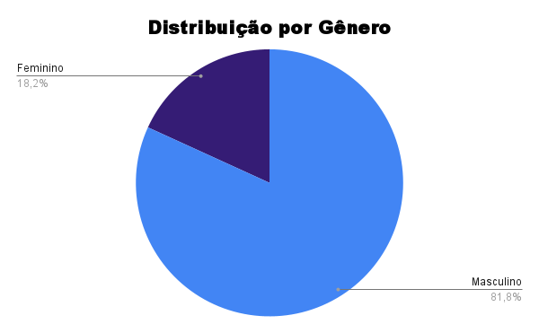 
<p align="center">Fonte: Elaborado pelos autores.</p>

<p align="center"><b>Figura 5.2.1.2</b> - Faixa Etária</p>

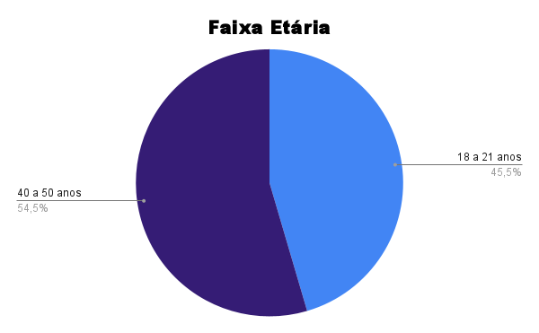 
<p align="center">Fonte: Elaborado pelos autores.</p>

<p align="center"><b>Figura 5.2.1.3</b> - Nível de Experiência Prévia</p>

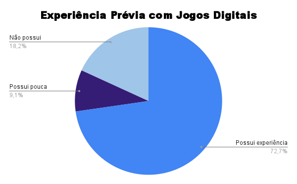 
<p align="center">Fonte: Elaborado pelos autores.</p>

Cada sessão teve duração média entre 10 e 20 minutos, incluindo o tempo de interação com o jogo e um breve momento de coleta de feedback após a experiência. Essa abordagem possibilitou a obtenção de dados qualitativos relevantes para a identificação de problemas e direcionamento de melhorias no jogo.


#### 5.2.1.1. Registros Individuais 

Nesta subseção, são apresentados os registros individuais dos testes de jogabilidade, organizados em formato de tabelas.

As tabelas contemplam informações relacionadas à experiência prévia dos jogadores, à compreensão das mecânicas, à progressão no jogo, às dificuldades encontradas e à percepção geral da experiência. Durante os testes, também foram observados comportamentos específicos dos participantes, como hesitação, tentativa e erro, leitura (ou não) dos diálogos e formas de interação com o mapa e os elementos do jogo, permitindo uma análise mais aprofundada da experiência do usuário.

<p align="center"><b>Tabela 5.2.1.1</b> - Registros dos testes de jogabilidade</p>

---

### Tester 1

| Campo | Resposta |
|------|--------|
| Nome | Arthur |
| Gênero | Masculino |
| Faixa etária | 18–21 anos |
| Já possuía experiência prévia com jogos? | Sim, possui experiência com jogos digitais |
| Conseguiu iniciar o jogo? | Sim, começou o jogo sem dificuldade e foi direto para a primeira interação disponível |
| Entendeu as regras e mecânicas do jogo? | Entendeu as mecânicas principais ao mexer nos diálogos e na movimentação, mas ficou mais no básico e não explorou muito além disso |
| Conseguiu progredir no jogo? | Sim, conseguiu avançar nas etapas sem precisar de ajuda |
| Apresentou dificuldades? | Ficou alguns segundos parado depois da fase da padaria porque pulou diálogos importantes e acabou não entendendo muito bem qual era o próximo objetivo |
| Que nota deu ao jogo? | 7.0 |
| O que gostou no jogo? | Gostou do visual do jogo e das interações com os personagens |
| O que poderia melhorar no jogo? | Aumentar o tempo para ler os diálogos e melhorar a resposta dos comandos |

---

### Tester 2

| Campo | Resposta |
|------|--------|
| Nome | Bernando |
| Gênero | Masculino |
| Faixa etária | 18–21 anos |
| Já possuía experiência prévia com jogos? | Sim, possui experiência com jogos digitais |
| Conseguiu iniciar o jogo? | Sim, começou o jogo sem dificuldades aparentes |
| Entendeu as regras e mecânicas do jogo? | Teve dificuldade no começo para entender a movimentação, clicando em lugares que não eram interativos antes de perceber que precisava arrastar |
| Conseguiu progredir no jogo? | Sim, conseguiu avançar depois de um tempo se adaptando na base da tentativa e erro |
| Apresentou dificuldades? | Demorou para identificar os pontos interativos do mapa e acabou explorando caminhos errados antes de seguir em frente |
| Que nota deu ao jogo? | 8.0 |
| O que gostou no jogo? | Achou o jogo simples, acessível e fácil de entender no geral |
| O que poderia melhorar no jogo? | Deixar as instruções iniciais mais claras e reduzir a necessidade de tentativa e erro para entender as ações |

---

### Tester 3

| Campo | Resposta |
|------|--------|
| Nome | Carlos |
| Gênero | Masculino |
| Faixa etária | 18–21 anos |
| Já possuía experiência prévia com jogos? | Sim, possui experiência com jogos digitais |
| Conseguiu iniciar o jogo? | Sim, começou o jogo sem dificuldades e explorou o mapa com iniciativa |
| Entendeu as regras e mecânicas do jogo? | Entendeu bem todas as mecânicas e usou os recursos do jogo de forma natural, sem precisar ficar testando várias vezes |
| Conseguiu progredir no jogo? | Sim, conseguiu concluir o jogo com fluidez |
| Apresentou dificuldades? | Não teve dificuldades relevantes e se adaptou bem à proposta do jogo |
| Que nota deu ao jogo? | 9.0 |
| O que gostou no jogo? | Gostou da fluidez da jogabilidade e de como a interação parece intuitiva |
| O que poderia melhorar no jogo? | Melhorar a visibilidade e a identificação das fases no mapa |

---

### Tester 4

| Campo | Resposta |
|------|--------|
| Nome | Davi |
| Gênero | Masculino |
| Faixa etária | 40-50 anos |
| Já possuía experiência prévia com jogos? | Sim, possui experiência com jogos digitais |
| Conseguiu iniciar o jogo? | Sim, começou o jogo normalmente |
| Entendeu as regras e mecânicas do jogo? | Entendeu as mecânicas testando as interações até descobrir como tudo funcionava |
| Conseguiu progredir no jogo? | Sim, conseguiu avançar nas etapas propostas |
| Apresentou dificuldades? | Voltou para áreas que já tinha visitado antes de achar o caminho certo, mostrando certa dificuldade para se orientar no mapa |
| Que nota deu ao jogo? | 8.0 |
| O que gostou no jogo? | Gostou do sistema de diálogos no estilo point-and-click |
| O que poderia melhorar no jogo? | Melhorar a navegação e a orientação dentro do mapa |

---

### Tester 5

| Campo | Resposta |
|------|--------|
| Nome | Elena |
| Gênero | Feminino |
| Faixa etária | 40-50 anos |
| Já possuía experiência prévia com jogos? | Não possui experiência com jogos digitais |
| Conseguiu iniciar o jogo? | Sim, começou o jogo sem dificuldades técnicas |
| Entendeu as regras e mecânicas do jogo? | Teve dificuldade no começo para entender como explorar o mapa, mostrando hesitação e precisando testar algumas vezes |
| Conseguiu progredir no jogo? | Não conseguiu concluir o jogo |
| Apresentou dificuldades? | Teve dificuldade para identificar os objetivos e os caminhos disponíveis, o que atrapalhou bastante sua progressão |
| Que nota deu ao jogo? | 9.0 |
| O que gostou no jogo? | Gostou da interação com o ambiente e da dinâmica dos diálogos |
| O que poderia melhorar no jogo? | Melhorar a explicação inicial das mecânicas e da navegação |

---

### Tester 6

| Campo | Resposta |
|------|--------|
| Nome | Fernando |
| Gênero | Masculino |
| Faixa etária | 18–21 anos |
| Já possuía experiência prévia com jogos? | Sim, possui experiência com jogos digitais |
| Conseguiu iniciar o jogo? | Sim, começou o jogo normalmente |
| Entendeu as regras e mecânicas do jogo? | Entendeu rápido as mecânicas e mostrou domínio da interação desde o começo |
| Conseguiu progredir no jogo? | Sim, conseguiu concluir o jogo de forma fluida |
| Apresentou dificuldades? | Não apresentou dificuldades relevantes e manteve consistência na navegação e nas interações |
| Que nota deu ao jogo? | 9.0 |
| O que gostou no jogo? | Gostou da fluidez da jogabilidade e da progressão entre as fases |
| O que poderia melhorar no jogo? | Melhorar a indicação dos objetivos e dos caminhos a seguir |

---

### Tester 7

| Campo | Resposta |
|------|--------|
| Nome | Gabriel |
| Gênero | Masculino |
| Faixa etária | 18–21 anos |
| Já possuía experiência prévia com jogos? | Sim, possui experiência com jogos digitais |
| Conseguiu iniciar o jogo? | Sim, começou o jogo sem dificuldades |
| Entendeu as regras e mecânicas do jogo? | Entendeu as mecânicas depois de um curto período inicial de exploração |
| Conseguiu progredir no jogo? | Sim, conseguiu avançar no jogo |
| Apresentou dificuldades? | Passou por áreas desnecessárias antes de encontrar o caminho certo, mostrando uma leve dificuldade de orientação |
| Que nota deu ao jogo? | 8.0 |
| O que gostou no jogo? | Gostou da movimentação e da estrutura do mapa |
| O que poderia melhorar no jogo? | Melhorar o destaque das fases disponíveis no mapa |

---

### Tester 8

| Campo | Resposta |
|------|--------|
| Nome | Heitor |
| Gênero | Masculino |
| Faixa etária | 40-50 anos |
| Já possuía experiência prévia com jogos? | Sim, possui experiência com jogos digitais |
| Conseguiu iniciar o jogo? | Sim, começou o jogo normalmente |
| Entendeu as regras e mecânicas do jogo? | Entendeu o funcionamento geral logo nas primeiras interações |
| Conseguiu progredir no jogo? | Sim, conseguiu avançar nas etapas propostas |
| Apresentou dificuldades? | Não apresentou dificuldades relevantes e teve uma experiência estável |
| Que nota deu ao jogo? | 8.0 |
| O que gostou no jogo? | Gostou do feedback sonoro durante as interações |
| O que poderia melhorar no jogo? | Melhorar as instruções iniciais para facilitar a adaptação |

---

### Tester 9

| Campo | Resposta |
|------|--------|
| Nome | Igor |
| Gênero | Masculino |
| Faixa etária | 40-50 anos |
| Já possuía experiência prévia com jogos? | Sim, possui experiência com diferentes gêneros, incluindo RPG |
| Conseguiu iniciar o jogo? | Sim, começou o jogo sem dificuldades |
| Entendeu as regras e mecânicas do jogo? | Entendeu rapidamente todas as mecânicas propostas |
| Conseguiu progredir no jogo? | Sim, conseguiu avançar e concluir o jogo |
| Apresentou dificuldades? | Precisou de várias tentativas na fase final, o que mostra um aumento de dificuldade nessa parte |
| Que nota deu ao jogo? | 9.0 |
| O que gostou no jogo? | Gostou da interatividade e do nível de engajamento |
| O que poderia melhorar no jogo? | Não apontou melhorias relevantes |

---

### Tester 10

| Campo | Resposta |
|------|--------|
| Nome | Joana |
| Gênero | Feminino |
| Faixa etária | 40–50 anos |
| Já possuía experiência prévia com jogos? | Possui pouca experiência com jogos digitais |
| Conseguiu iniciar o jogo? | Sim, começou o jogo sem dificuldades técnicas |
| Entendeu as regras e mecânicas do jogo? | Não entendeu bem a navegação no mapa e teve dificuldade para interpretar as ações disponíveis |
| Conseguiu progredir no jogo? | Sim, conseguiu avançar nas etapas |
| Apresentou dificuldades? | Clicou muito rápido, ignorou diálogos importantes e teve dificuldade para localizar pontos do mapa, o que atrapalhou o entendimento da progressão |
| Que nota deu ao jogo? | 8.0 |
| O que gostou no jogo? | Gostou da gamificação e da variedade de desafios |
| O que poderia melhorar no jogo? | Melhorar a navegação no mapa e a clareza das instruções |

---

### Tester 11

| Campo | Resposta |
|------|--------|
| Nome | Kassio |
| Gênero | Masculino |
| Faixa etária | 40–50 anos |
| Já possuía experiência prévia com jogos? | Não possui experiência com jogos digitais |
| Conseguiu iniciar o jogo? | Sim, começou o jogo sem dificuldades técnicas |
| Entendeu as regras e mecânicas do jogo? | Entendeu só parte das mecânicas e teve dificuldade para explorar o mapa e entender os objetivos |
| Conseguiu progredir no jogo? | Sim, conseguiu avançar no jogo |
| Apresentou dificuldades? | Pulou diálogos, quase saiu do jogo sem querer e não entendeu direito qual era a condição de vitória, mostrando falha na comunicação dos objetivos |
| Que nota deu ao jogo? | 7.0 |
| O que gostou no jogo? | Gostou do visual e da organização do jogo |
| O que poderia melhorar no jogo? | Reduzir a quantidade de texto e melhorar a navegação e a identificação das fases |

<p align="center">Fonte: Elaborado pelos autores.</p>


Os registros apresentados evidenciam padrões consistentes no comportamento dos participantes, especialmente em relação à navegação no mapa, à compreensão dos objetivos e à interação com os diálogos.

Esses resultados qualitativos servem como base para a análise quantitativa apresentada na subseção seguinte, permitindo a consolidação dos principais problemas identificados durante os testes.

 
#### 5.2.1.2. Análise Quantitativa 

Com base nos dados coletados durante os testes de jogabilidade, foi realizada uma análise quantitativa com o objetivo de identificar padrões recorrentes no comportamento dos participantes.

Considerando o total de 11 jogadores avaliados, foram levantadas as principais dificuldades observadas durante a interação com o jogo, permitindo a quantificação dos problemas mais frequentes.

Os resultados indicam que:

- 45% dos participantes apresentaram dificuldades relacionadas à navegação no mapa;
- 36% dos participantes tiveram problemas na compreensão dos objetivos do jogo;
- 36% dos participantes ignoraram ou não leram completamente os diálogos;
- 27% dos participantes demonstraram dificuldades na identificação de caminhos ou fases disponíveis;
- 18% dos participantes apresentaram dificuldades relacionadas à compreensão das mecânicas;
- 18% dos participantes não apresentaram dificuldades relevantes durante a experiência.

Esses dados evidenciam que a navegação no mapa e a comunicação das informações (especialmente por meio de diálogos) são os principais pontos de atenção identificados nos testes.


A Figura 5.2.1.2 apresenta a distribuição percentual das principais dificuldades observadas nos testes de jogabilidade.


<p align="center"><b>Figura 5.2.1.4</b> - Principais dificuldades identificadas nos testes de jogabilidade</p>

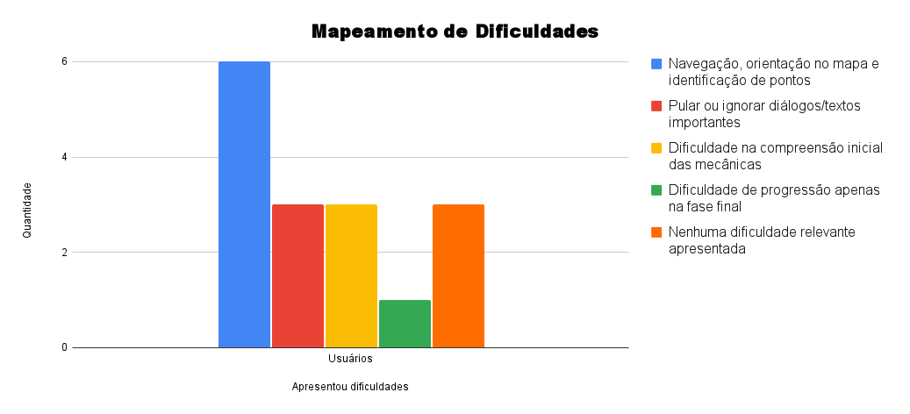


<p align="center">Fonte: Elaborado pelos autores.</p>


Observa-se que os problemas mais recorrentes estão diretamente relacionados à navegação no mapa e à comunicação das informações ao jogador, indicando a necessidade de melhorias nesses aspectos para tornar a experiência mais intuitiva.

Apesar dos atritos mapeados, a avaliação geral do simulador foi altamente positiva. A Figura 5.2.1.5 ilustra a distribuição das notas atribuídas pelos participantes ao final da experiência, variando de 7.0 a 9.0.

<p align="center"><b>Figura 5.2.1.5</b> - Distribuição de notas nos testes de jogabilidade</p>

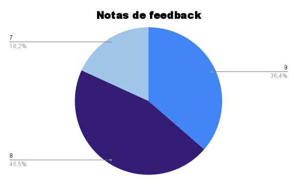
<p align="center">Fonte: Elaborado pelos autores.</p>

#### 5.2.1.3. Síntese dos Resultados
A partir da análise qualitativa e quantitativa dos testes de jogabilidade, foi possível identificar padrões consistentes no comportamento dos participantes, permitindo uma análise aprofundada e baseada em evidências do comportamento dos jogadores durante a interação com o sistema.

De modo geral, o jogo apresenta boa acessibilidade inicial, uma vez que a maioria dos participantes conseguiu iniciar e progredir nas primeiras etapas sem dificuldades significativas. Além disso, jogadores com maior experiência prévia demonstraram rápida adaptação às mecânicas, interagindo de forma fluida e autônoma.

Entretanto, foram identificados problemas recorrentes que impactam diretamente a experiência. O principal ponto crítico está relacionado à navegação no mapa, identificado em 45% dos participantes. Muitos jogadores demonstraram incerteza ao tentar identificar caminhos, localizar objetivos e compreender quais ações deveriam ser realizadas em cada etapa.

Outro aspecto relevante refere-se à comunicação das informações. Observou-se que 36% dos participantes apresentaram dificuldades relacionadas à leitura de diálogos e à compreensão dos objetivos. Em diversos casos, os jogadores não leram ou não absorveram completamente as informações, comprometendo sua progressão.

Além disso, 27% dos participantes tiveram dificuldade na identificação de caminhos no mapa, enquanto 18% apresentaram dificuldades na compreensão das mecânicas do jogo. Esse comportamento indica que parte da experiência ainda não está totalmente intuitiva, especialmente para jogadores com menor familiaridade com jogos digitais.

Adicionalmente, apenas 18% dos participantes não apresentaram dificuldades relevantes, reforçando a necessidade de melhorias em aspectos fundamentais da interação.

Por outro lado, o design visual, a proposta de gamificação e a estrutura geral do jogo foram bem avaliados, contribuindo positivamente para o engajamento dos participantes.

Dessa forma, conclui-se que o jogo possui uma base sólida e boa aceitação inicial. No entanto, os dados evidenciam que problemas de navegação no mapa (45%), compreensão dos objetivos (36%) e leitura de diálogos (36%) impactam diretamente a experiência do usuário.

O aprimoramento desses aspectos, aliado à melhoria na identificação de caminhos (27%) e na clareza das mecânicas (18%), tende a tornar a experiência mais intuitiva, acessível e alinhada ao público-alvo. Esses achados fundamentam diretamente as propostas de melhoria apresentadas na seção seguinte, orientando a evolução do jogo com base em evidências obtidas nos testes.

### 5.2.2 Melhorias


Com base nos resultados obtidos nos testes de jogabilidade, foram identificados problemas recorrentes que impactam diretamente a experiência do usuário. A análise qualitativa e quantitativa permitiu não apenas reconhecer essas falhas, mas também compreender suas causas e efeitos na interação dos jogadores com o jogo.

A seguir, são apresentados os principais problemas identificados, acompanhados de suas respectivas propostas de melhoria.

A Figura 5.2.2.1 sintetiza as principais categorias de sugestões levantadas de forma quantitativa pelos usuários durante as sessões:

<p align="center"><b>Figura 5.2.2.1</b> - Sugestões de melhorias indicadas pelos usuários</p>

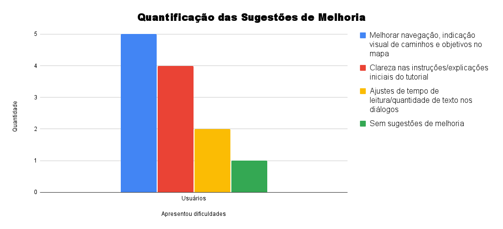
<p align="center">Fonte: Elaborado pelos autores.</p>

#### Problema 1: Dificuldade na navegação do mapa (45%)

**Descrição:**  
Uma parcela significativa dos participantes apresentou dificuldades na navegação do mapa, demonstrando incerteza ao tentar identificar caminhos, localizar objetivos e compreender quais ações deveriam ser realizadas. Em diversos casos, os jogadores exploraram áreas desnecessárias, retornaram a locais já visitados ou ficaram parados sem saber como prosseguir.

**Impacto na experiência:**  
Esse problema compromete diretamente a progressão do jogador, gerando frustração, perda de fluidez e dependência de tentativa e erro.

**Propostas de melhoria:**  
 
- Destacar visualmente os pontos interativos do mapa;  
- Implementar um sistema de orientação ou dica contextual;  


---

#### Problema 2: Falhas na comunicação dos objetivos (36%)

**Descrição:**  
Parte dos jogadores apresentou dificuldade em compreender claramente os objetivos do jogo, especialmente após interações com diálogos. Em alguns casos, a falta de clareza resultou em indecisão ou ações aleatórias.

**Impacto na experiência:**  
A ausência de objetivos claros prejudica a tomada de decisão do jogador e reduz o engajamento com a proposta do jogo.

**Propostas de melhoria:**  
- Reforçar os objetivos após diálogos importantes;  
- Inserir um sistema de missão ou objetivo visível na interface;  

- Simplificar e tornar mais diretas as instruções apresentadas.

---

#### Problema 3: Baixa leitura ou assimilação dos diálogos (36%)

**Descrição:**  
Observou-se que diversos jogadores ignoraram ou não leram completamente os diálogos, clicando rapidamente e perdendo informações importantes para a progressão.

**Impacto na experiência:**  
Esse comportamento compromete a compreensão das mecânicas e dos objetivos, afetando diretamente a continuidade do jogo.

**Propostas de melhoria:**  
 
  
- Inserir pausas ou limitações para avanço rápido de textos;  
- Adicionar dublagem ao jogo 

---

#### Problema 4: Dificuldade na identificação de caminhos e fases (27%)

**Descrição:**  
Parte dos participantes apresentou dificuldade em identificar quais caminhos estavam disponíveis ou quais fases estavam liberadas, demonstrando incerteza durante a exploração.

**Impacto na experiência:**  
Esse problema gera confusão e contribui para uma navegação pouco eficiente, aumentando o tempo de adaptação do jogador.

**Propostas de melhoria:**  
- Indicar claramente quais fases estão desbloqueadas;  
- Utilizar cores, ícones ou animações para diferenciar estados (bloqueado/desbloqueado);  
- Melhorar a organização visual do mapa;  


---

#### Problema 5: Dificuldade na compreensão das mecânicas (18%)

**Descrição:**  
Alguns jogadores, principalmente os menos experientes, apresentaram dificuldade em compreender determinadas mecânicas do jogo, especialmente no início da experiência.

**Impacto na experiência:**  
A falta de entendimento inicial pode gerar insegurança e aumentar a dependência de tentativa e erro.

**Propostas de melhoria:**  
- Inserir um tutorial inicial na fase da padaria;  


---


As propostas apresentadas têm como foco principal melhorar a clareza da comunicação com o jogador, facilitar a navegação no mapa e tornar a experiência mais intuitiva, especialmente para usuários com menor familiaridade com jogos digitais.

De modo geral, as melhorias concentram-se em três pilares principais:

- **Orientação do jogador:** melhorias na navegação, identificação de caminhos e clareza de objetivos;  
- **Comunicação das informações:** ajustes em diálogos, instruções e feedbacks;  
- **Acessibilidade e usabilidade:** redução de complexidade inicial e melhor introdução às mecânicas.

A implementação dessas melhorias tende a reduzir as dificuldades identificadas nos testes, aumentar o engajamento dos jogadores e tornar a experiência mais fluida e alinhada ao público-alvo do projeto.


### 5.2.3. Plano de Implementação das Melhorias

Com base nos problemas identificados durante os testes de jogabilidade, foi elaborado um plano de implementação contendo ajustes específicos no jogo. 

As ações propostas foram organizadas por categoria, de acordo com seu impacto na experiência do usuário e nos aspectos de interface, navegação, comunicação e aprendizado.


#### Interface e Feedback Visual

- Melhorar o design das telas de vitória e derrota;  
- Ajustar o posicionamento dos elementos “clique para continuar” na fase do restaurante;  
- Ajustar o posicionamento dos elementos “resposta certa/resposta errada” nas fases do restaurante e da quitanda;  
- Ajustar o tamanho das sprites do personagem José;  
- Adicionar indicação visual de que o jogador deve refazer a fase ao perder;  


#### Navegação e Fluxo de Jogo

- Adicionar botão de confirmação ao iniciar fases;  
- Implementar tela de confirmação ao sair da fase;  
- Garantir que a tela de vitória ou derrota só seja exibida após uma interação adicional do jogador;  


#### Comunicação e Diálogos

- Inserir apresentação inicial da personagem Cielita, contextualizando o jogo;  
- Garantir que a personagem Cielita apareça corretamente no início do jogo;  
- Ajustar diálogos da Cielita, especialmente na liberação da fase da quitanda;  
- Remover opções redundantes de diálogo (“apresentar solução final”, “finalizar negociação” e “continuar ouvindo”);  
- Adicionar delay para impedir avanço acidental dos diálogos;  
- Aumentar o tempo de exibição da cena final;  


#### Tutorial e Aprendizado

- Inserir tutorial inicial com instruções claras de movimentação;  
- Adicionar tela explicativa das dinâmicas básicas na fase da padaria;  


#### Feedback Sonoro

- Adicionar efeito sonoro ao clicar no botão de ajuda;  


As melhorias propostas focam principalmente na clareza das informações, na organização da interface e na prevenção de erros de interação por parte do jogador.

Essas alterações visam reduzir as dificuldades identificadas nos testes, especialmente aquelas relacionadas à navegação no mapa, à compreensão dos objetivos e à leitura dos diálogos, contribuindo para uma experiência mais fluida, intuitiva e alinhada ao público-alvo.

Além disso, a implementação dessas melhorias será fundamental para a validação futura do jogo em novos ciclos de testes, permitindo a evolução contínua da experiência com base no comportamento real dos usuários.

# <a name="c6"></a>6. Conclusões e trabalhos futuros

Esta seção encerra a documentação do projeto, sintetizando os resultados alcançados em relação aos objetivos iniciais da Cielo e projetando a escalabilidade da solução para ciclos de desenvolvimento posteriores.

## 6.1. Conclusão 

O desenvolvimento da **Conexão Cielo** atingiu o objetivo primordial: converter um treinamento teórico e geograficamente limitado em uma experiência prática, gamificada e acessível. Ao longo das sprints, a solução evoluiu de uma análise estratégica do setor de treinamento da Cielo para uma *Visual Novel* interativa, desenhada para ambientar o Gerente de Negócios (GN) em cenários reais de negociação.

A implementação da **Barra de Satisfação**, dos **Feedbacks Visuais** e da mecânica de **Sondagem** permite que o jogador exercite não apenas o conhecimento técnico do portfólio (como a maquininha LIO ou soluções digitais oferecidas), mas também competências comportamentais, como a inteligência emocional e a escuta ativa. O projeto garante que colaboradores em qualquer um dos 99% dos municípios brasileiros cobertos pela companhia recebam a mesma qualidade de capacitação técnica, mitigando as dores de insegurança e falta de prática identificadas no Canvas de Proposta de Valor.

## 6.2. Trabalhos futuros

Apesar da solidez do MVP atual, o ecossistema de pagamentos é dinâmico e o projeto foi arquitetado para ser expansível. Para as próximas etapas de evolução do software, propõem-se os seguintes pontos:

*   **Expansão da Biblioteca de Fases:** Aumentar a quantidade de cenários disponíveis, mapeando situações específicas enfrentadas pelos GNs no dia a dia (como clínicas médicas ou grandes redes de varejo). O objetivo é cobrir o máximo de casos reais e 100% do portfólio de produtos Cielo, servindo como uma ferramenta de consulta prática para o vendedor.
*   **Imersão via Dublagem e Sonorização:** Adicionar vozes aos NPCs (clientes) e à Cielita para aumentar a imersão e o realismo das simulações. A dublagem permite que o GN treine a percepção da entonação e o "clima" da conversa, tornando o ambiente seguro de treinamento ainda mais próximo da realidade das ruas.
*   **Aprimoramento do Sistema de Feedback:** Implementar um relatório detalhado ao final de cada fase. Em vez de apresentar apenas a pontuação geral, o sistema fornecerá feedbacks específicos para cada escolha feita, tornando mais prático e pedagógico o entendimento das decisões do usuário durante a jornada.


# <a name="c7"></a>7. Referências 
As referências apresentadas neste documento reúnem os materiais que fundamentaram as decisões de design, narrativa, mecânicas e estética do Conexão Cielo. Jogos, artigos, documentações técnicas e recursos visuais foram consultados ao longo do desenvolvimento com o objetivo de embasar as escolhas criativas e garantir que o produto final fosse ao mesmo tempo inovador e coerente com boas práticas já consolidadas no mercado de jogos educacionais e de treinamento corporativo.
## 7.1. Fundamentação Teórica e Acadêmica

Boller, S., & Kapp, K. M. (2018). *Jogar para aprender: tudo o que você precisa saber sobre o design de jogos de aprendizagem eficazes*. DVS. <br>

Carvalho, M. M. (2018). *Fundamentos em gestão de projetos: construindo competências para gerenciar projetos* (5. ed.). Atlas. https://integrada.minhabiblioteca.com.br/books/9788597018950 <br>

Doran, G. T. (1981). There's a S.M.A.R.T. way to write management's goals and objectives. *Management Review, 70*(11), 35–36. <br>

Fullerton, T. (2018). *Game design workshop: A playcentric approach to creating innovative games* (4. ed.). CRC Press. <br>

Humphrey, A. S. (1960). *SWOT Analysis for management consulting*. Stanford Research Institute. <br>

Osterwalder, A., Pigneur, Y., Bernarda, G., & Smith, A. (2014). *Value proposition design: Como construir propostas de valor inovadoras*. HSM Editora. <br>

Porter, M. E. (1980). *Competitive strategy: Techniques for analyzing industries and competitors*. Free Press. <br>

Pressman, R. S. (2016). *Engenharia de software* (8. ed.). AMGH. https://integrada.minhabiblioteca.com.br/books/9788580555349 <br>

Santos, M. H. dos. (2021). *Fundamentos de jogos digitais: Game design, game engine e level design*. Platos Soluções Educacionais. https://integrada.minhabiblioteca.com.br/books/9786589881919 <br>

Sommerville, I. (2018). *Engenharia de software* (9. ed.). Pearson Education do Brasil. <br>

## 7.2. Pesquisa e Contexto da Indústria de Pagamentos

Abecs. (2024). *Balanço do Setor de Meios Eletrônicos de Pagamento – 2023*. Recuperado de https://abecs.org.br/storage/sector_balances/24/01KH6F7ASSZ4ST9T6R0515EC2E.pdf <br>

CNN Brasil. (2023). *Cielo tem soluções digitais para todos os tamanhos e tipos de negócios*. Recuperado de https://www.cnnbrasil.com.br/branded-content/nacional/cielo-tem-solucoes-digitais-para-todos-os-tamanhos-e-tipos-de-negocios/ <br>

Edrone. (2024). *Dados do e-commerce no Brasil*. Recuperado de https://edrone.me/pt/blog/dados-ecommerce-brasil <br>

Febraban. (2025). *Pesquisa Febraban de Tecnologia Bancária*. Federação Brasileira de Bancos. Recuperado de https://portal.febraban.org.br/ <br>

Fenacon. (2025, 14 de janeiro). *Digitalização recorde: Pequenos negócios no Brasil atingem nível histórico em 2025*. Recuperado de https://fenacon.org.br/noticias/digitalizacao-recorde-pequenos-negocios-no-brasil-atingem-nivel-historico-em-2025/ <br>

Finsiders Brasil. (2023, 22 de maio). *Guerra das maquininhas de cartão já era; agora a briga é por tecnologia*. Recuperado de https://finsidersbrasil.com.br/pagamentos/guerra-das-maquininhas-de-cartao-ja-era-agora-a-briga-e-por-tecnologia/ <br>

G1. (2025, 1 de setembro). *Como as fintechs mudaram o sistema financeiro no Brasil*. Globo. Recuperado de https://g1.globo.com/economia/noticia/2025/09/01/como-as-fintechs-mudaram-o-sistema-financeiro-no-brasil.ghtml <br>

IDinheiro. (2024). *Máquina de cartão com menor taxa no débito*. Recuperado de https://www.idinheiro.com.br/negocios/maquina-cartao-menor-taxa-debito/ <br>

Instituto Propague. (2023). *O mercado de adquirência no Brasil: Concorrência e inovação*. Recuperado de https://institutopropague.org/ <br>

InvestNews. (2023). *Destronada nas maquininhas, Cielo luta para se manter relevante na era do Pix*. Recuperado de https://investnews.com.br/negocios/destronada-nas-maquininhas-cielo-luta-para-se-manter-relevante-na-era-do-pix/ <br>

Mazzoco, P. (2022, 11 de fevereiro). *Guerra das maquininhas cobra preço alto e ações da Cielo não param de cair*. InfoMoney. Recuperado de https://www.infomoney.com.br/negocios/guerra-das-maquininhas-cobra-preco-alto-e-acoes-da-cielo-nao-param-de-cair/ <br>

## 7.3. Conformidades Legais e Regulamentações

Sebrae. (s.d.). *Lei Geral de Proteção de Dados (LGPD)*. Portal Sebrae. Recuperado de https://sebrae.com.br/sites/PortalSebrae/LGPD <br>

Zoop. (s.d.). *Como adequar sua empresa à LGPD*. Zoop Blog. Recuperado de https://www.zoop.com.br/blog/regulamentacao/como-adequar-lgpd <br>

Zoop. (s.d.). *Panorama dos meios de pagamento no Brasil*. Zoop Blog. Recuperado de https://www.zoop.com.br/blog/pagamento/meios-de-pagamento-no-brasil <br>

## 7.4. Documentação Corporativa e Interna

Cielo. (s.d.). *E-commerce: Nossas soluções*. Recuperado de https://www.cielo.com.br/ <br>

Cielo. (s.d.). *Estratégia e vantagens competitivas*. Relacionamento com Investidores. Recuperado de https://ri.cielo.com.br/sobre-a-cielo/estrategia-e-vantagens-competitivas/ <br>

Cielo. (2023). *Demonstrações Financeiras 2022* [Relatório Financeiro]. Recuperado de https://filemanager-cdn.mziq.com.br/published/4d1ebe73-b068-4443-992a-3d72d573238c/696185c4-d779-4b63-bd45-dbad2f9c4dd9_df_ifrs_completa_ri.pdf <br>

Cielo. (2024). *Relatório de Resultados* [Documento de Relacionamento com Investidores]. Recuperado de https://api.mziq.com/mzfilemanager/v2/d/4d1ebe73-b068-4443-992a-3d72d573238c/5ab9a1ba-b7f2-64ab-4a37-ecd3ad8b6a6a?origin=2 <br>

Cielo. (2025). *Fatores de risco*. Relacionamento com Investidores. Recuperado de https://ri.cielo.com.br/servicos-ri/fatores-de-risco/ <br>

Cielo. (2026). *TAPI_2026 - Jogo Digital_Cielo* [Documento de escopo de projeto interno]. Inteli. <br>

## 7.5. Referências Corporativas de Treinamento e Desenvolvimento

Deloitte. (2020). *Treinamento e desenvolvimento corporativo: Melhores práticas globais*. Deloitte Consulting. <br>

McKinsey & Company. (2019). *Os caminhos da aprendizagem corporativa no século XXI*. McKinsey & Company. <br>

## 7.6. Ferramentas de Desenvolvimento

Phaser. (s.d.). *Phaser - HTML5 Game Framework*. Recuperado de https://phaser.io/ <br>

Figma. (s.d.). *Figma - Design Collaboration Platform*. Recuperado de https://www.figma.com/ <br>

Google Gemini. (s.d.). *Gemini - AI-Powered Content Generation*. Recuperado de https://gemini.google.com/ <br>

Google Drive. (s.d.). *Google Drive - Cloud Storage and File Hosting*. Recuperado de https://www.google.com/drive/ <br>

Pixabay. (s.d.). *Pixabay - Royalty-Free Media Resources*. Recuperado de https://pixabay.com/ <br>

## 7.7. Inspirações Artísticas e de Gameplay

Coffee Talk. (2020). Desenvolvido por Toge Productions. *Coffee Talk*. [Game Digital]. Disponível em plataformas de distribuição digital. <br>

Amor Doce. (2015). Desenvolvido por Beemoov. *Amor Doce*. [Game Digital]. Disponível em plataformas móveis e web. <br>

## 7.8. Recursos e Assets de Terceiros

Pixabay Audio Collection. (s.d.). *Royalty-Free Sound Effects and Music*. Repositório de efeitos sonoros licenciados para uso em projetos comerciais e educacionais. Utilizado em: botões interativos, feedback sonoro de vitória/derrota, sons de seleção e cenários bloqueados. <br>

Música Autoral. (2026). *Trilhas Sonoras Originais do Projeto Conexão Cielo*. Composições originais criadas especificamente para o jogo, incluindo temáticas para padaria, quitanda, restaurante e posto de gasolina. Geradas com suporte de ferramentas de síntese de áudio (Gemini e DAWs variadas). <br>

Pixel Art Assets. (2026). *Design Visual em Pixel Art do Projeto*. Todos os assets gráficos do projeto (personagens, ambientes, interface) foram desenvolvidos internamente pela equipe Blue Codes, seguindo a paleta de cores oficial (Figura 3.3.4.1) e mantendo coerência visual em pixel art 2D. <br>

# <a name="c8"></a>Anexos

*Não há anexos para esta versão.*
