# GDD - Game Design Document - Módulo 1 - Inteli


## Blue Codes

#### Bruno Calenda, Enzo Ferreira, Guilherme Fraga, Laura Tosar, Lucas Delmirio, Marco Tulio Vieira, Matteus Haikal, Stephany Marques.


## Sumário

[1. Introdução](#c1)
[2. Visão Geral do Jogo](#c2)
[3. Game Design](#c3)
[4. Desenvolvimento do jogo](#c4)
[5. Casos de Teste](#c5)
[6. Conclusões e trabalhos futuros](#c6)
[7. Referências](#c7)
[Anexos](#c8)

<br>


# <a name="c1"></a>1. Introdução (sprints 1 a 4)

Esta seção contextualiza o projeto desenvolvido para a Cielo no âmbito do Módulo 1 do Inteli. O projeto consiste na criação de um jogo educacional voltado à capacitação de Gerentes de Negócios (GNs), utilizando mecânicas de simulação e narrativa interativa para fixar conhecimentos sobre o portfólio de produtos e técnicas de atendimento da companhia.

O documento a seguir detalha desde a análise estratégica do setor de pagamentos até as especificações técnicas de funcionamento do jogo, servindo como guia para o desenvolvimento e futura manutenção do software.

## 1.1. Plano Estratégico do Projeto
O Plano Estratégico estabelece a fundação do projeto, alinhando as necessidades da Cielo com as mecânicas de jogo propostas. Ele analisa o cenário competitivo através do modelo de Porter e da matriz SWOT, garantindo que o jogo não seja apenas divertido, mas uma ferramenta de negócio eficiente para a integração e treinamento de novos colaboradores.

### 1.1.1. Contexto da indústria (sprint 2)

A Cielo atua no altamente competitivo setor de adquirência brasileiro, mercado marcado pela rápida digitalização. Seu modelo de negócio evoluiu da simples captura em terminais físicos para um ecossistema financeiro multicanal, englobando e-commerce, APIs e soluções antifraude (Cielo, s.d.). Enfrentando fortes concorrentes como Stone, PagSeguro, Rede e Getnet (Instituto Propague, 2023), o setor lida com a comoditização das taxas transacionais. Assim, a tendência do mercado é focar na expansão do Pix, Open Finance e na monetização via serviços de valor agregado, como softwares de gestão e crédito (Febraban, 2025).

#### 1.1.1.1. Modelo de 5 Forças de Porter (sprint 2)
As 5 Forças de Porter são uma ferramenta clássica de estratégia de negócios utilizada para analisar o cenário competitivo de uma empresa. Criado por Michael Porter, o modelo ajuda a entender o nível de atratividade de um setor ao avaliar cinco fatores fundamentais que determinam a lucratividade e a posição de mercado de um negócio. Abaixo, apresento a aplicação prática desse framework para o cenário da nossa empresa:

<p align = 'center'><b>Figura 1.1.1.1 </b> - 5 Forças de Porter</p>

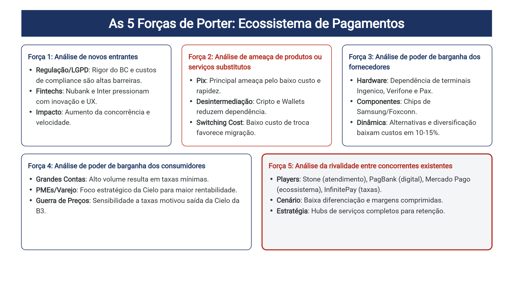
<p align = 'center'>Fonte: Material produzido pelos autores (2026)</p>


**Força 1: Ameaça de Novos Entrantes no Mercado de Serviços de Pagamento**
1. Principais Obstáculos para Novos Entrantes
Regulamentação rigorosa do Banco Central: O setor no Brasil apresenta um elevado nível de supervisão. Para operar formalmente, novas instituições precisam de autorização prévia, o que exige o cumprimento de requisitos legais, operacionais e financeiros, demandando tempo e elevados investimentos iniciais.

Proteção de dados e exigências da LGPD: A conformidade com a Lei Geral de Proteção de Dados exige que as instituições garantam a segurança e integridade das informações. Isso demanda altos investimentos em tecnologia, infraestrutura de segurança e governança de dados.

2. Impacto Potencial na Indústria
Aumento da concorrência pelas Fintechs: O crescimento de empresas como Nubank e Banco Inter impactou diretamente as instituições tradicionais, especialmente no processamento de pagamentos instantâneos (Pix), resultando em maior velocidade e redução de taxas para o consumidor.

Inovação acelerada: Novos entrantes trazem modelos digitais nativos, pressionando as empresas estabelecidas a investir em digitalização, experiência do usuário (UX) e novos produtos financeiros para acompanhar o dinamismo do setor.

**Força 2: Ameaça de Produtos ou Serviços Substitutos**
1. Cenário de Vulnerabilidade Estratégica
Digitalização e Meios de Pagamento: A análise revela um cenário de risco elevado impulsionado pelo Pix, criptomoedas e carteiras digitais. Essas alternativas oferecem melhor relação custo-benefício, reduzindo as taxas para lojistas e otimizando a conveniência para o consumidor final.

Desintermediação Financeira: As criptomoedas utilizam a tecnologia blockchain para eliminar a necessidade de adquirentes tradicionais, enquanto as carteiras digitais permitem que o fluxo financeiro ocorra fora do ecossistema das credenciadoras convencionais.

2. Avaliação de Impacto e Barreiras Culturais
Classificação de Risco: A ameaça é classificada como Alta, dado o baixíssimo custo de troca (switching cost) para usuários e lojistas. O Pix, especificamente, apresenta taxas de aceitação próximas a zero, desafiando a rentabilidade das transações de débito.

Resiliência de Métodos Tradicionais: Apesar da inovação, boletos bancários (para grandes transações) e o uso de cédulas físicas (em ambientes menos urbanizados) ainda coexistem como forças resilientes devido a barreiras culturais e de infraestrutura física.

**Força 3: Poder de Barganha dos Fornecedores**
1. Principais Fornecedores da Indústria
Hardware e Terminais POS: O fornecimento de máquinas de cartão é dominado por players globais como Ingenico (Worldline), Verifone e Pax Technology.

Componentes e Infraestrutura: Empresas como Samsung, Foxconn (semicondutores), Huawei e Totvs (software e conectividade) compõem a cadeia essencial para a montagem e integração dos sistemas de pagamento.

2. Avaliação do Poder de Barganha
Nível de Poder: O poder de barganha é considerado Moderado a Baixo. Embora existam poucos players dominantes em terminais POS, a existência de alternativas e importações chinesas reduz a dependência, permitindo negociações de preços.

Impacto na Indústria: A dinâmica favorece a competitividade. Com a regulação do Banco Central fomentando o Open Banking, o poder dos fornecedores tende a diminuir, auxiliando adquirentes como a Cielo na redução de despesas operacionais.

**Força 4: Poder de Barganha dos Consumidores (Clientes)**
1. Segmentação da Base de Clientes
Grandes Contas: Redes varejistas e companhias aéreas. Possuem alto volume financeiro, mas operam com margens de lucro muito apertadas.

Varejo (PMEs): Foco estratégico da indústria devido à maior rentabilidade.

Empreendedores e Autônomos: Profissionais liberais e MEIs que buscam soluções simplificadas.

2. Avaliação do Poder de Barganha e Estratégia
Nível de Poder: Classificado como Alto. O baixo custo de troca e a forte concorrência (Stone, PagBank, Rede) tornam os varejistas altamente sensíveis a preço.

Resposta da Indústria: Para reter clientes, as empresas deixaram de ser meras processadoras de pagamentos para oferecer ecossistemas completos (contas digitais e gestão), visando aumentar o custo de saída e diminuir o poder de barganha do lojista.

**Força 5: Rivalidade entre Concorrentes Existentes**
1. Principais Concorrentes e Diferenciais
Stone e PagBank: Focam no atendimento próximo ao varejo e na baixa burocracia para microempreendedores, utilizando estratégias de preços competitivos e inclusão financeira.

Mercado Pago e Nubank: Utilizam seus ecossistemas digitais e bases massivas de usuários para expandir a atuação no e-commerce e em serviços financeiros online.

InfinitePay: Atua com foco em taxas agressivas para MEIs, contribuindo para a compressão das margens no setor.

2. Dinâmica de Mercado e Rentabilidade
Estrutura do Setor: O mercado é estruturado e regulado, com alta complexidade operacional. O crédito parcelado é o segmento de maior rentabilidade (devido à antecipação de recebíveis), enquanto o débito apresenta margens cada vez mais reduzidas.

Ambiente Competitivo: A rivalidade é intensa, marcada por pressão sobre preços e baixa diferenciação nos serviços básicos, forçando as adquirentes a buscar novas fontes de receita além da simples captura de transações.

### 1.1.2. Análise SWOT (sprint 2)

A análise SWOT (acrônimo para Strengths, Weaknesses, Opportunities and Threats) constitui uma ferramenta fundamental para o planejamento estratégico da Cielo S.A., permitindo uma avaliação integrada entre suas competências internas e as variáveis do ambiente macroeconômico. Este diagnóstico é essencial para compreender como a organização pode alavancar suas forças operacionais para mitigar fraquezas e se posicionar frente aos desafios de um mercado em constante disrupção tecnológica (Cielo, 2025).

No âmbito interno, a análise foca nos recursos e capacidades que conferem à Cielo sua posição de liderança, bem como nas limitações que podem comprometer sua eficiência. Externamente, o mapeamento identifica as tendências do setor de pagamentos que representam oportunidades de expansão ou ameaças à sustentabilidade do modelo de negócio tradicional de adquirência. A seguir, apresenta-se a matriz detalhada, sintetizando os pilares que orientam a tomada de decisão estratégica da companhia.

<p align = 'center'><b>Figura 1.1.2 </b> - Análise SWOT Cielo</p>


<p align = "center">Fonte: Modelo criado por Albert S. Humphrey (1960). Adaptação feita pelos autores (2026).</p>

## Strengths:
A seção de forças identifica os pontos positivos internos de uma organização que oferecem vantagem competitiva frente ao mercado. No caso da Cielo, nota-se que a empresa possui uma sólida liderança de mercado, sendo a maior adquirente do país, o que é reforçado por sua boa reputação consolidada junto aos consumidores brasileiros. Além disso, a companhia se destaca por oferecer diversas soluções de pagamento e gestão aos compradores, contando com o suporte de vendedores altamente treinados e motivados, o que garante uma abordagem comercial eficaz e um atendimento qualificado.

* Liderança de mercado;
* Boa reputação no mercado brasileiro;
* Oferece diversas soluções aos compradores;
* Vendedores altamente treinados e motivados.

## Weaknesses:
A seção de fraquezas identifica os pontos falhos internos que podem comprometer o desempenho e a competitividade de uma organização. No caso da Cielo, nota-se que a empresa possui uma vulnerabilidade perante a alta concorrência, já que sua estrutura robusta dificulta uma resposta ágil às novas fintechs. Além disso, a companhia é altamente dependente do mercado brasileiro, o que concentra seus riscos em uma única economia, e enfrenta resistência pelo alto valor de suas taxas em comparação a modelos de negócio mais enxutos, dificultando a retenção de clientes que buscam menores custos operacionais.

* Alta concorrência no mercado brasileiro;
* Altamente dependente do mercado brasileiro;
* Alto valor de taxas.

## Opportunities:
A seção de oportunidades analisa os fatores externos positivos que podem ser explorados para o crescimento e a vantagem competitiva de uma organização. No caso da Cielo, nota-se que a empresa possui à sua disposição o grande mercado brasileiro, que oferece uma base massiva de clientes em potencial para suas soluções de pagamento. Além disso, o crescimento da digitalização dos negócios abre portas para a oferta de novos serviços tecnológicos, tendência que é reforçada pela expansão contínua do e-commerce brasileiro, exigindo da companhia soluções cada vez mais integradas e eficientes para o comércio eletrônico.

* Grande mercado brasileiro;
* Crescimento da digitalização dos negócios;
* Crescimento no e-commerce brasileiro.

## Threats:
A seção de ameaças identifica os fatores externos que podem representar riscos significativos para a continuidade e o crescimento de uma organização. No caso da Cielo, nota-se que a empresa está exposta ao risco tributário do sistema brasileiro, onde mudanças na legislação podem impactar diretamente suas margens de lucro. Além disso, a companhia enfrenta uma competição já alta e em constante crescimento, com a entrada agressiva de novos participantes no setor de pagamentos. Por fim, as rápidas mudanças tecnológicas de mercado exigem constantes investimentos em inovação para evitar que seus serviços se tornem obsoletos perante novas soluções disruptivas.

* Risco tributário do sistema brasileiro;
* Competição já alta em crescimento;
* Mudanças tecnológicas de mercado.

### 1.1.3. Missão / Visão / Valores (sprint 2)

A base estratégica da Blue Codes é consolidada pelo tripé Missão, Visão e Valores, que atua como o alicerce fundamental para todas as nossas operações e decisões tecnológicas. A Missão define o nosso propósito imediato e a razão de existir da empresa no mercado atual, enquanto a Visão estabelece as nossas aspirações de longo prazo e o patamar de inovação que pretendemos alcançar no futuro. Complementando essa estrutura, os Valores representam os princípios éticos e os comportamentos inegociáveis que moldam a nossa cultura interna e o padrão de entrega aos nossos clientes. Juntos, esses pilares garantem que a Blue Codes mantenha uma direção clara, promovendo a coerência entre a excelência técnica e o impacto positivo que desejamos gerar no ecossistema digital.

* **Missão:** Levar equidade no ensino aos vendedores da Cielo, promovendo uma forma de aprendizagem simples, autônoma e igualitária para todos.
* **Visão:** Ser a principal plataforma gamificada de capacitação para vendedores da Cielo, tornando o aprendizado acessível, contínuo e transformador em todo o Brasil.
* **Valores:** Inclusão e equidade no acesso ao conhecimento, simplicidade e autonomia no aprendizado, inovação, colaboração e desenvolvimento contínuo das pessoas.

### 1.1.4. Proposta de Valor (sprint 4)

Segundo Osterwalder et al. (2014), o Canvas de Proposta de Valor é uma ferramenta visual estruturada para garantir o alinhamento perfeito entre as necessidades do cliente e a solução desenvolvida. Aplicando esse modelo ao escopo do projeto, o Perfil do Cliente detalha as tarefas diárias dos Gerentes de Negócios (GNs), que consistem em realizar o atendimento, conhecer profundamente os produtos da Cielo e efetuar vendas. Durante essas atividades, as principais dores enfrentadas são a insegurança no momento da venda, a falta de prática e o fato de os treinamentos tradicionais serem cansativos. Como contrapartida, os ganhos esperados pelos GNs são o aumento do engajamento, a melhoria no desempenho comercial e o desenvolvimento de habilidades de negociação.

Do lado da Proposta de Valor, o produto oferecido é um jogo de simulação de vendas com diálogos diretos entre vendedor e cliente. Como aliviadores de dores, a solução foca em reduzir a insegurança nas negociações e transformar a teoria em prática através da simulação. Os criadores de ganhos atuam proporcionando um treinamento mais dinâmico, facilitando a fixação do conteúdo e, consequentemente, melhorando os resultados de vendas. Esse alinhamento busca transformar a capacitação em um processo mais eficiente e menos exaustivo para a força de vendas (CIELO, 2023).

<p align = 'center'><b>Figura 1.1.4 </b> - Canvas Da Proposta de Valor</p>

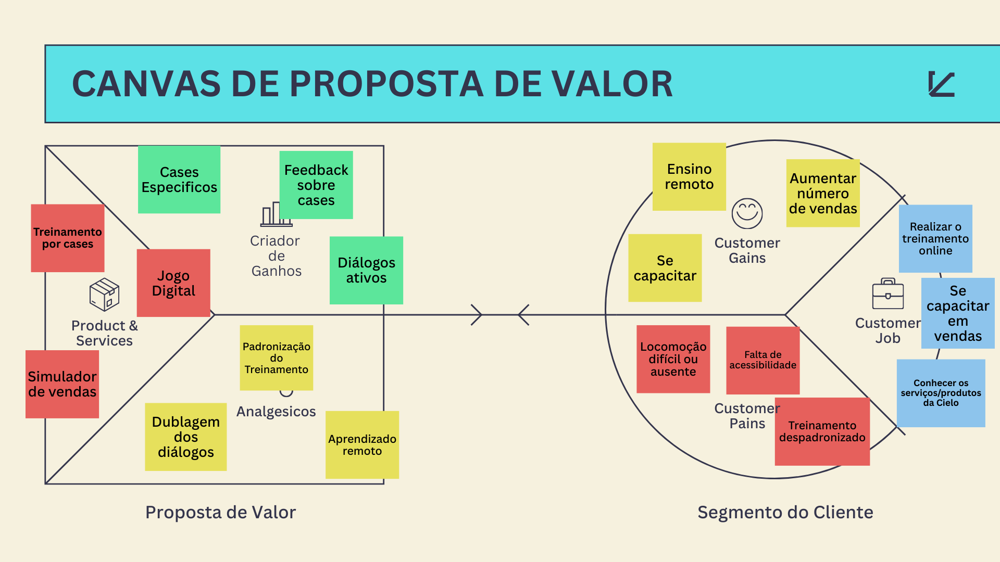
<p align = 'center'>Fonte: Material produzido pelos autores (2026)</p>

### 1.1.5. Descrição da Solução Desenvolvida (sprint 4)

O cenário atual de capacitação dos novos Gerentes de Negócios (GNs) da Cielo consiste em uma etapa de onboarding teórico online (focada em produtos e técnicas de vendas), seguida por sessões presenciais de dinâmicas e jogos educativos de tabuleiro. O grande desafio desse modelo reside na capilaridade da própria empresa: como a Cielo está presente em 99% dos municípios brasileiros (Cielo, 2023), existe uma imensa dispersão geográfica de sua força de vendas. Devido a barreiras logísticas e financeiras de deslocamento, muitos futuros vendedores não conseguem participar dessas dinâmicas presenciais, gerando uma desigualdade na qualidade e na fixação do treinamento prático entre as diferentes regiões do país.

Para resolver esse gargalo de escalabilidade, a equipe Blue Codes desenvolveu um Simulador Digital de Vendas. Trata-se de um jogo virtual web-based, acessível diretamente por navegadores comuns (como Chrome, Safari e Edge), dispensando instalações complexas. Com mecânicas de mapa urbano e narrativa no estilo Visual Novel, o jogador assume o papel de um GN da Cielo e precisa visitar diferentes estabelecimentos comerciais. O núcleo da solução baseia-se na interação imersiva com personagens (donos de negócios), onde o jogador deve conduzir diálogos, contornar objeções reais e utilizar o portfólio da empresa para convencer o cliente a fechar negócio.

O jogo será implementado como a etapa prática e final do onboarding. Após concluírem o curso teórico e adquirirem a bagagem técnica sobre os produtos, os GNs acessarão a plataforma de forma autônoma para testar seus conhecimentos em diversas fases e cenários narrativos exclusivos. A literatura especializada reforça a eficácia dessa abordagem: segundo Boller e Kapp (2018), o design de jogos de aprendizagem é ideal para o ambiente corporativo por fornecer aos colaboradores um "ambiente seguro" para explorar regras, testar hipóteses, falhar sem consequências reais e tentar novamente, transformando a teoria em prática de maneira muito mais retentiva.

Dessa forma, a implementação do simulador garante uma série de benefícios estratégicos e operacionais para a Cielo. O principal deles é a equidade e a democratização do ensino, assegurando que todos os GNs, independentemente de estarem em grandes capitais ou no interior, tenham acesso à mesma experiência de alta qualidade. Além disso, a solução viabiliza a escalabilidade logística ao eliminar os custos de envio de materiais físicos e de locomoção de turmas. Por fim, ao vivenciar simulações realistas, o colaborador desenvolve o pensamento crítico, treinando a inteligência emocional, a leitura de perfil de cliente e a tomada de decisão sob pressão de forma totalmente engajadora.

### 1.1.6. Matriz de Riscos e Oportunidades (sprint 4)

A Matriz de Riscos apresentada a seguir, fundamentada nas diretrizes de gestão de projetos de Carvalho (2018), tem como objetivo mapear, avaliar e propor planos de ação para os eventos incertos que podem impactar o desenvolvimento do simulador educacional. Em gerenciamento de projetos, o conceito de risco abrange tanto eventos negativos (ameaças) quanto eventos positivos (oportunidades).

Para essa análise, adotou-se uma metodologia de priorização que cruza a Probabilidade de ocorrência de cada evento com o seu respectivo Impacto no projeto, classificando-os em níveis de severidade (Baixo, Médio e Alto). Essa estruturação estratégica permite à equipe não apenas antecipar vulnerabilidades técnicas e operacionais (garantindo ações de mitigação e resposta), mas também identificar cenários favoráveis (garantindo ações de potencialização e exploração) para assegurar a melhor entrega possível do Produto Mínimo Viável (MVP).

<p align = 'center'><b>Figura 1.1.6.1 </b> - Matriz de riscos e oportunidades </p>

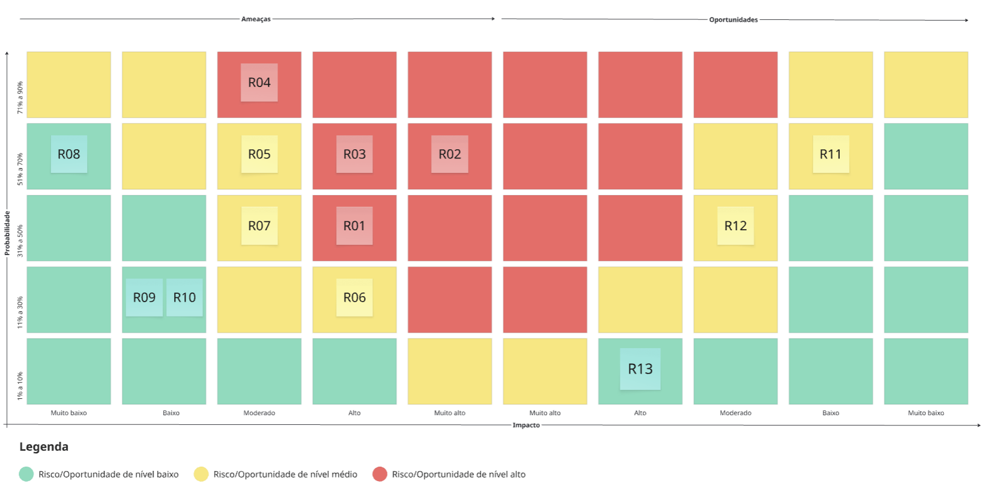
<p align = 'center'>Fonte: Material produzido pelos autores (2026)</p>

Conforme ilustrado na matriz e detalhado na Tabela 1.1.6.1 a seguir, os eventos do projeto foram divididos em duas categorias estratégicas: os riscos/ameaças (identificados de R01 a R10), com foco em neutralizar impactos negativos, e as oportunidades (identificadas de R11 a R13), com foco em maximizar o engajamento, a acessibilidade e a qualidade do código.

<p align = 'center'><b>Tabela 1.1.6.1 </b> - Descrição dos riscos e oportunidades do projeto </p>

| Risco | Descrição |Probabilidade | Impacto | Nível de Risco | Plano de Ação e Resposta | Responsável |
|----|----|-----|-----|--|---|---|
| R01 - Incoerência no impacto das escolhas | [Ameaça] A pontuação da Barra de Satisfação não refletir o peso real da resposta, frustrando o jogador. | 31% a 50% | Alto | Alto | Realizar testes de mesa (playtests) com usuários reais para calibrar os pesos e, caso o feedback aponte desbalanceamento, ajustar os multiplicadores diretamente no código. | Lucas Delmirio |
| R02 - Aumento de escopo não controlado (Scope Creep) | [Ameaça] Tentar adicionar mini-games complexos, animações muito elaboradas ou múltiplos finais que fujam da proposta linear do MVP. | 51% a 70% | Muito alto | Alto |Focar estritamente na entrega dos requisitos obrigatórios, movendo sumariamente quaisquer ideias secundárias para um backlog de trabalhos futuros. | Bruno Calenda |
| R03 - Incompatibilidade de hardware |[Ameaça] Lentidão ao renderizar o jogo no navegador em dispositivos mais antigos. | 51% a 70% | Alto | Alto | Otimizar os assets de pixel art e fazer testes de estresse, desativando animações secundárias do jogo se a taxa de quadros cair muito. | Guilherme Ludovico |
| R04 - Curva de aprendizado da interface |[Ameaça] Dificuldade do público não-gamer com mecânicas de navegação. | 71% a 90% | Moderado | Alto | Incluir instruções detalhadas no tutorial inicial com a Cielita e disponibilizar um botão de ajuda fixo na interface para suporte contínuo. | Enzo Ferreira |
| R05 - Fechamento acidental do navegador | [Ameaça] O usuário fechar a aba sem querer e perder a negociação em andamento. | 51% a 70% | Moderado | Médio |Implementar salvamento local (localStorage) do progresso contínuo e exibir um alerta nativo do navegador caso o usuário tente fechar a aba acidentalmente. | Matteus Haikal |
| R06 - Desatualização do portfólio (Conteúdo Hardcoded) | [Ameaça] Mudanças nos produtos da Cielo tornarem as respostas do jogo defasadas. | 11% a 30% | Alto | Médio | Manter os diálogos isolados em arquivos externos na arquitetura e documentar o padrão de formatação para que a própria equipe da Cielo possa atualizar os textos facilmente no futuro. | Stephany Marques | 
| R07 - Problemas de legibilidade e UX |[Ameaça] Tipografia pequena ou com baixo contraste. | 31% a 50% | Moderado | Médio | Seguir heurísticas de acessibilidade para garantir alto contraste e criar uma configuração nativa para o usuário aumentar o tamanho da fonte se necessário.| Laura Tosar |
| R08 - Inconsistências e erros de digitação nos artefatos | [Ameaça] Falhas ortográficas no GDD e nos diálogos, ou falta de padronização/comentários no código-fonte. | 51% a 70% | Muito baixo | Baixo | Estabelecer revisão por pares (peer review) antes da entrega dos artefatos e realizar correções em formato de hotfix assim que qualquer falha for detectada. | Guilherme Ludovico |
| R09 - Bloqueio automático de áudio pelo navegador |[Ameaça] Políticas do Chrome/Edge silenciarem o jogo até o primeiro clique. | 11% a 30% | Baixo | Baixo | Implementar tratamento de erro (catch) na função de autoplay e disponibilizar um botão para ativar o som manualmente, conforme estipulado no RF14. | Marco Túlio |
| R10 - Falhas em periféricos de entrada do usuário | [Ameaça] Mouse com defeito de duplo-clique ou tela touch pouco responsiva.| 11% a 30% | Baixo | Baixo | Ampliar a área de clique (hitbox) e o espaçamento vertical dos botões, além de implementar atalhos de teclado (setas e Enter) como método de entrada alternativo. | Lucas Delmirio |  
| R11 - Justiça no impacto das escolhas | [Oportunidade] A barra de satisfação refletir com alta precisão a realidade, gerando engajamento. | 51% a 70% | Baixo | Médio | Coletar informações de negociação com jogadores capacitados para refinar o modelo e usar essa precisão mecânica como um grande case de sucesso do simulador. | Lucas Delmirio |
| R12 - Salvaguardas de acessibilidade | [Oportunidade] O código apresentar salvaguardas robustas que tornem o jogo altamente acessível. | 31% a 50% | Moderado | Médio | Mapear os casos de uso extremos dos usuários para identificar as melhores práticas e destacar essa acessibilidade superior como um diferencial tecnológico na entrega. | Lucas Delmirio |
| R13 - Refinamento do Essencial do Projeto | [Oportunidade] Garantir que o MVP seja sólido e funcional, eliminando qualquer ruído visual ou mecânico que não contribua diretamente para o objetivo principal do projeto. | 60% a 70% | Moderado | Médio | Proibir a entrada de qualquer funcionalidade não listada como obrigatória no documento inicial, utilizando o tempo economizado no cronograma para realizar testes e polimentos adicionais. | Bruno Calenda |

<p align = 'center'>Fonte: Material produzido pelos autores (2026)</p>


### 1.1.7. Objetivos, Metas e Indicadores (sprint 4)

A definição de objetivos, metas e indicadores é essencial para mensurar a efetividade da solução gamificada desenvolvida para a Cielo, garantindo o alinhamento com as estratégias de capacitação e desempenho comercial da companhia. O objetivo geral do projeto é aprimorar a qualificação técnica dos Gerentes de Negócios (GNs), elevando a eficiência nas negociações e o engajamento nos treinamentos corporativos sobre o portfólio de produtos. Para que os resultados sejam específicos, mensuráveis, atingíveis, relevantes e temporais, estabeleceram-se metas SMART focadas em três pilares: capacitação, eficiência e engajamento, seguindo a metodologia de gestão de desempenho proposta por Doran (1981).

No pilar de capacitação técnica, a meta é aumentar a taxa de sucesso nas simulações de vendas de 60% para 80% em até 3 meses após a implementação. Quanto à eficiência operacional, busca-se reduzir o tempo médio de treinamento de 20 horas para 14 horas em até 6 meses, utilizando metodologias de microlearning para combater a complexidade do setor de adquirência. Já para o engajamento, a meta é alcançar 80% de adesão voluntária dos vendedores ativos à plataforma no primeiro semestre de operação, visando mitigar os desafios de retenção e atualização destacados nos relatórios de governança da Cielo (2023).

A mensuração desses resultados será feita através de indicadores-chave de desempenho (KPIs), como a taxa de conclusão de módulos, o score médio nas simulações de acertos, o nível de satisfação interno (NPS de capacitação) e o tempo de rampa dos novos gerentes registrado no CRM. Essas métricas permitem avaliar se a solução contribui para a performance comercial e o fortalecimento competitivo da empresa frente à crescente concorrência no mercado de pagamentos. As definições desta seção baseiam-se no modelo SMART proposto por Doran (1981), em princípios de gamificação aplicados à aprendizagem corporativa, conforme discutido por Karl M. Kapp, e em boas práticas de treinamento e desenvolvimento amplamente adotadas por organizações como Deloitte e McKinsey & Company.

## 1.2. Requisitos do Projeto (sprints 1 e 2)

Esta seção apresenta os requisitos funcionais (Tabela 1.2.1) e os requisitos não funcionais (Tabela 1.2.2) definidos nas Sprints 1 e 2 do projeto, contemplando as principais funcionalidades implementadas e as diretrizes técnicas que orientam o desenvolvimento do jogo.

<p align = 'center'><b>Tabela 1.2.1 </b> - Requisitos Funcionais do Sistema</p>

| Nº | Requisitos Funcionais |
|----|------------------------|
| RF01 | O sistema deve direcionar o usuário para o cenário de navegação (mapa) e permitir a escolha de fases por meio de clique. |
| RF02 | O sistema deve possuir um botão para confirmar a escolha da fase, apresentando feedback visual da ação ao usuário. |
| RF03 | O sistema deve iniciar cada fase com um diálogo de boas-vindas e um tutorial introdutório sobre os produtos da Cielo. |
| RF04 | O sistema deve apresentar um diálogo de conduta de vendas específico para cada fase. |
| RF05 | O sistema deve apresentar múltiplas opções de resposta em momentos estratégicos do diálogo, sendo que cada escolha deve alterar o rumo da conversa e impactar diretamente a métrica de satisfação do cliente. |
| RF06 | O sistema deve disponibilizar diferentes produtos da Cielo como alternativas de venda, sendo que a escolha correta deve aumentar a satisfação do cliente e a escolha inadequada deve reduzi-la. |
| RF07 | O sistema deve possuir uma métrica visível de “Satisfação do Cliente”, representada por uma barra ou indicador numérico, que aumente ou diminua de acordo com as escolhas realizadas pelo usuário durante a fase. |
| RF08 | Na fase do posto, o sistema não deve exibir a métrica de “Satisfação do Cliente”.|
| RF09 | O sistema deve associar cada fase a um perfil de cliente com nível inicial de satisfação e comportamento específico, influenciando a variação da métrica de satisfação conforme as decisões tomadas pelo usuário. |
| RF010 | O sistema deve calcular uma pontuação final com base na satisfação do cliente, nas escolhas realizadas e no tempo de conclusão da fase, fornecendo feedback educativo ao jogador ao término da fase. |
| RF11 | O sistema deve possuir uma métrica de reputação geral do jogador, que aumente conforme fases sejam concluídas com sucesso. |
| RF12 | O sistema deve desbloquear novas fases ou desafios com base no nível de reputação acumulado pelo jogador. |
| RF13 | O sistema deve possuir um botão “Voltar ao menu principal”, permitindo o retorno ao menu durante a fase. |
| RF14 | O sistema deve possuir um menu de configurações que permita ao usuário ajustar o volume do som, ativar ou desativar música e efeitos sonoros e retornar ao menu principal. |
| RF15 | O sistema deve possuir uma segunda opção durante o diálogo para "Sondar" o cliente, obtendo novas informações para auxiliar durante a simulação de vendas. |
| RF16 | O sistema deve possuir diversas fases com diferentes modalidades, abordando diversas situações reais dos GNs da Cielo. |

<p align = "center">Fonte: Tabela criada pelos autores.</p>
<br>

<p align = 'center'><b>Tabela 1.2.2 </b> - Requisitos Não Funcionais do Sistema</p>

| Nº | Requisitos Não Funcionais |
|----|----------------------------|
| RNF01 | O sistema deve apresentar interface intuitiva, com organização visual clara e elementos de fácil compreensão para o usuário. |
| RNF02 | O sistema deve ser responsivo, garantindo funcionamento adequado em navegadores de diferentes dispositivos e resoluções de tela. |
| RNF03 | O sistema deve possuir design gráfico em 2D (pixel art), com layout limpo, animações fluidas e boa legibilidade dos elementos visuais. |
| RNF04 | O sistema deve permitir a personalização da cor do personagem pelo usuário. |
| RNF05 | O sistema deve disponibilizar opções de personagens representando diferentes gêneros para escolha do usuário. |
| RNF06 | O sistema deve possuir design diversificado e representativo em relação aos NPCs (clientes). |
| RNF07 | O sistema deve utilizar tipografia adequada e em alto contraste (ou relevo) para facilitar a leitura e o entendimento do público-alvo. |

<p align = "center">Fonte: Tabela criada pelos autores.</p>

## 1.3. Público-alvo do Projeto (sprint 2)

O público-alvo do projeto é composto pelos futuros Gerentes de Negócios (GNs) que participam do programa de treinamento da Cielo e já foram aprovados no processo seletivo, o que demonstra engajamento e predisposição para o aprendizado de técnicas de vendas. Trata-se de um grupo com média de 44 anos de idade, formado por homens e mulheres distribuídos por todo o Brasil, atuando predominantemente fora dos grandes centros urbanos no modelo de vendas porta a porta. Em relação à escolaridade, a maioria possui ensino médio completo, havendo também um percentual significativo com graduação incompleta e uma minoria com ensino superior completo.

A escolha desse público como foco do jogo justifica-se, principalmente, pela barreira geográfica enfrentada por esses profissionais. Como estão espalhados por diferentes regiões do país, muitas vezes distantes dos grandes centros, o uso de um artefato digital promove maior equidade no processo de ensino, permitindo que simulem negociações e conheçam os produtos da Cielo sem a necessidade de deslocamento para treinamentos presenciais.

Considerando o perfil etário e a rotina de trabalho externa, esse público não possui, em sua maioria, experiência prévia significativa com jogos digitais. Suas preferências digitais tendem a ser mais utilitárias ou voltadas ao entretenimento casual, como jogos simples de celular, especialmente puzzles, além do uso frequente de redes sociais. Diante desse contexto e da diversidade de níveis de escolaridade, o jogo deve apresentar uma curva de aprendizado suave, sem exigir reflexos rápidos ou comandos complexos. Por esse motivo, optou-se pelo gênero Visual Novel (simulador de conversas), que se aproxima da dinâmica de leitura e interação presente em aplicativos de mensagens já familiares ao público, concentrando o desafio na tomada de decisões estratégicas de vendas, e não na habilidade motora do jogador.

# <a name="c2"></a>2. Visão Geral do Jogo (sprint 2)

Nesta seção, apresentamos como o jogo funciona e o que ele pretende entregar. O projeto foi criado para ser uma ferramenta de aprendizado prática, que mistura diversão com o treinamento do dia a dia. A ideia é oferecer um espaço onde o usuário possa treinar suas habilidades de venda através de situações reais, transformando o conteúdo teórico em uma experiência interativa e envolvente.

## 2.1. Objetivos do Jogo (sprint 2)

O jogo tem como objetivo padronizar, fortalecer e aprimorar as habilidades de vendas dos Gerentes de Negócios (GN), com foco especial nos profissionais que não possuem acesso ao treinamento presencial da Cielo. Por meio de simulações de negociação com comerciantes, o jogador tem a oportunidade de praticar técnicas de abordagem, identificação de necessidades do cliente e apresentação das soluções de pagamento oferecidas pela empresa.

A vitória em cada fase ocorre quando o jogador consegue conduzir a conversa de forma estratégica e atingir o nível necessário na barra de satisfação do cliente. Durante os diálogos, o jogador deve escolher entre diferentes opções de resposta, sendo que decisões adequadas aumentam a satisfação do cliente e aproximam a negociação de uma venda concluída. Caso o jogador faça escolhas inadequadas repetidamente, a satisfação diminui e a negociação pode falhar.

O jogo é composto por fases principais, cada uma representando um tipo de estabelecimento comercial encontrado no cotidiano dos Gerentes de Negócios da Cielo: padaria, quitanda, restaurante, posto de gasolina, entre outros. Cada fase apresenta um perfil de cliente diferente e desafios específicos de negociação.

O sistema de progresso ocorre de forma linear entre as fases. Inicialmente, o jogador tem acesso apenas à fase da padaria. Após concluir essa etapa com sucesso, novas fases são desbloqueadas gradualmente, permitindo que o jogador enfrente situações de venda cada vez mais complexas.

A reputação do jogador é representada dentro de cada fase pela barra de satisfação do cliente. Esse indicador reflete o desempenho do jogador durante a conversa e determina o sucesso ou fracasso da negociação. Dessa forma, o jogo incentiva o aprendizado progressivo, estimulando o jogador a melhorar suas decisões de venda para avançar no treinamento.

## 2.2. Características do Jogo (sprint 2)

### 2.2.1. Gênero do Jogo (sprint 2)

O jogo se enquadra no gênero Visual Novel, caracterizado pela condução da narrativa por meio de diálogos interativos e escolhas realizadas pelo jogador. Nesse tipo de jogo, a progressão ocorre principalmente através da leitura de textos e da tomada de decisões que influenciam o desenvolvimento da história e o resultado das interações com os personagens. Diferentemente de jogos focados em reflexos ou ações rápidas, as Visual Novels priorizam a narrativa, o desenvolvimento de personagens e a tomada de decisões estratégicas durante conversas.

A escolha desse gênero está diretamente relacionada ao objetivo educacional do projeto. Como o jogo simula situações reais de negociação enfrentadas por Gerentes de Negócios da Cielo, o formato de diálogos interativos permite representar conversas de venda de forma realista. Assim, o jogador pode analisar o comportamento do cliente, escolher diferentes abordagens e observar as consequências de suas decisões, transformando o processo de aprendizagem em uma experiência prática e interativa.

### 2.2.2. Plataforma do Jogo (sprint 2)

* **Dispositivos:** Desktop (PC/Mac), smartphones (Android/iOS) e tablets, otimizado para telas touch e mouse/teclado.
* **Sistemas:** Navegadores web compatíveis como Chrome, Firefox, Safari e Edge (HTML5/WebGL para jogabilidade fluida sem downloads).

### 2.2.3. Número de jogadores (sprint 2)

O jogo possui mecânica *single player*, sendo projetado para a participação de apenas um jogador por vez. Nesse contexto, o jogador assume o papel de um Gerente de Negócios (GN) da Cielo em primeira pessoa, tomando decisões durante as simulações de vendas e conduzindo os diálogos com os clientes.

### 2.2.4. Títulos semelhantes e inspirações (sprint 2)

O desenvolvimento do jogo foi inspirado principalmente em títulos do gênero Visual Novel, como *Coffee Talk* e *Amor Doce*, que utilizam diálogos interativos como principal mecânica de progressão. Em *Coffee Talk*, o jogador interage com diferentes personagens em um ambiente fixo, ouvindo suas histórias e tomando decisões que influenciam o rumo das conversas. Essa dinâmica influenciou diretamente a proposta do projeto, que também utiliza interações baseadas em diálogo para conduzir a experiência do jogador. Assim como nesse jogo, a narrativa e as escolhas realizadas durante as conversas possuem impacto no resultado final da interação.

Outra inspiração foi *Amor Doce*, conhecido por seu sistema de escolhas durante diálogos que alteram o desenvolvimento da história e a relação entre os personagens. Esse elemento foi adaptado para o contexto do projeto, no qual as decisões do jogador influenciam o nível de satisfação do cliente durante as negociações. Apesar dessas semelhanças estruturais, o jogo desenvolvido possui um propósito distinto: enquanto os títulos citados possuem foco narrativo e de entretenimento, o projeto busca aplicar essas mecânicas em um contexto educacional, simulando situações reais de vendas enfrentadas pelos Gerentes de Negócios da Cielo.

### 2.2.5. Tempo estimado de jogo (sprint 5)
*Pendente para a próxima sprint.*

# <a name="c3"></a>3. Game Design (sprints 2 e 3)
Esta seção apresenta a estrutura completa do Game Design do projeto, desenvolvida na Sprint 2. São descritos os elementos narrativos, mecânicos e estruturais que compõem a experiência do jogador, incluindo enredo, personagens, mundo do jogo, progressão entre fases, regras e mecânicas.

## 3.1. Enredo do Jogo (sprints 2 e 3)

### 3.1.1 Contexto
O jogo se passa em uma cidade grande e moderna, composta por diversos estabelecimentos comerciais, como padarias, restaurantes, farmácias, quitandas, supermercados e postos de combustível. Nesse cenário, o jogador assume o papel de um novo Gerente de Negócios (GN) da Cielo.

Ao iniciar sua jornada, o personagem recebe orientações da Cielita, assistente virtual da empresa, que apresenta o funcionamento básico do jogo e os objetivos principais. O jogador é responsável por visitar comerciantes locais e oferecer soluções de pagamento adequadas às necessidades de cada negócio.

### 3.1.2 Desenvolvimento
Ao explorar o mapa da cidade, o jogador interage com diferentes NPCs (descritos na seção 3.2), cada um representando um tipo de empreendimento e possuindo características, desafios e perfis específicos. Durante as negociações, o jogador deve analisar as necessidades de cada cliente e escolher as melhores respostas em diálogos estratégicos. Cada decisão impacta diretamente no interesse do cliente e no sucesso da venda. Conforme realiza vendas bem-sucedidas, o jogador aumenta sua reputação na cidade, desbloqueando novos estabelecimentos e enfrentando desafios mais complexos.

### 3.1.3 Conflito
O principal conflito do jogo está na dificuldade de convencer os empreendedores a adotarem as soluções da Cielo. Alguns clientes apresentam resistência, dúvidas ou experiências negativas com empresas concorrentes. Escolhas inadequadas durante as negociações podem resultar na perda da venda, redução da reputação e maior dificuldade em futuras interações.

### 3.1.4 Resolução
A progressão narrativa culmina quando o jogador se torna um Gerente de Negócios experiente, conquistando a confiança dos comerciantes e expandindo a presença da Cielo na cidade. Nesse estágio, o jogador demonstra domínio das mecânicas de negociação, tomada de decisão estratégica e gestão de relacionamento com clientes.

## 3.2. Personagens (sprints 2 e 3)

### 3.2.1. Controláveis
Como o projeto segue a premissa de uma Visual Novel, optou-se por não utilizar um personagem visível em tela. Essa escolha permite que o jogador assuma diretamente o papel do protagonista (em primeira pessoa), promovendo uma imersão total onde ele se sente o verdadeiro centro da narrativa e das decisões.

### 3.2.2. Non-Playable Characters (NPC)
Os NPCs (Non-Playable Characters) representam os estabelecimentos comerciais e os clientes. Cada NPC possui identidade visual própria, personalidade implícita e função específica no gameplay, contribuindo para a ambientação, progressão e dinâmica econômica do jogo.

#### 3.2.2.1 Padeiro
<p align = 'center'><b>Figura 3.2.2.1 </b> - Ficha do personagem NPC Padeiro</p>


<p align = "center">Fonte: Figura criada pelos autores.</p>

**Descrição visual:** Personagem masculino, 44 anos, com bigode e expressão facial simpática. Utiliza chapéu tradicional de padeiro e avental branco, segurando um pão como elemento simbólico de sua atividade comercial.

#### 3.2.2.2 Chef de Cozinha
<p align = 'center'><b>Figura 3.2.2.2 </b> - Ficha do personagem NPC Chef de Cozinha</p>


<p align = "center">Fonte: Figura criada pelos autores.</p>

**Descrição visual:** Personagem masculino, 22 anos, trajando uniforme branco de chef e chapéu de cozinha. Segura um prato de comida, simbolizando sua função dentro do sistema econômico do jogo.

#### 3.2.2.3 Quitandeira
<p align = 'center'><b>Figura 3.2.2.3 </b> - Ficha do personagem NPC Quitandeira</p>

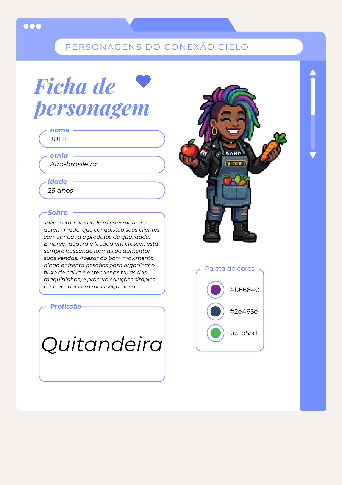
<p align = "center">Fonte: Figura criada pelos autores.</p>

**Descrição visual:** Personagem feminina, 29 anos, com cabelo em tons vibrantes e coloridos. Utiliza jaqueta escura e avental, segurando frutas e legumes que reforçam sua identidade comercial.

#### 3.2.2.4 Farmacêutica
<p align = 'center'><b>Figura 3.2.2.4 </b> - Ficha do personagem NPC Farmacêutica</p>

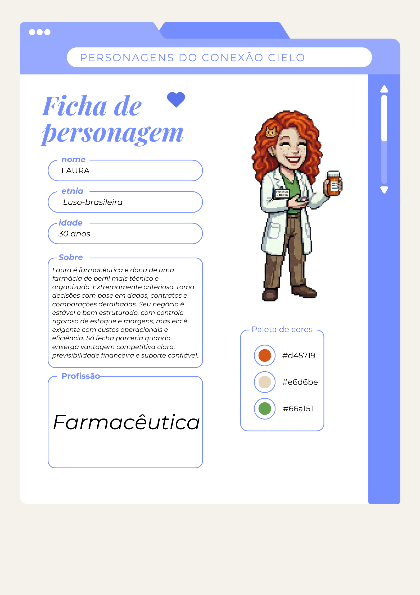
<p align = "center">Fonte: Figura criada pelos autores.</p>

**Descrição visual:** Personagem feminina, 30 anos, com cabelos ruivos longos e volumosos. Utiliza jaleco branco e segura um frasco de medicamento, representando sua função no sistema comercial do jogo.

#### 3.2.2.5 Dono do Posto
<p align = 'center'><b>Figura 3.2.2.5 </b> - Ficha do personagem NPC Dono do Posto</p>

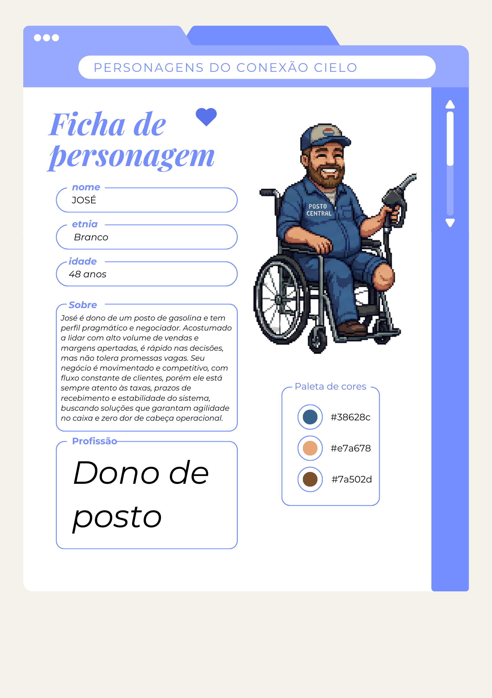
<p align = "center">Fonte: Figura criada pelos autores.</p>

**Descrição visual:** Personagem masculino, 48 anos, com barba cheia e utilizando boné. Traja uniforme azul de posto de combustível e utiliza cadeira de rodas. Segura uma bomba de combustível como elemento representativo de sua atividade comercial.

### 3.2.3. Diversidade e Representatividade dos Personagens
O jogo foi desenvolvido no formato de visual novel, em que o usuário assume o papel de Gerente de Negócios (GN) da Cielo. A ausência de um protagonista com identidade fixa amplia a identificação do público-alvo, permitindo que qualquer vendedor possa se enxergar na narrativa.

As demais personagens representam os clientes com os quais o jogador deve interagir durante suas tentativas de venda, como: chefe de cozinha indígena, farmacêutica ruiva, dona de quitanda negra, dono de posto de gasolina cadeirante e uma mulher de idade, dona de banco. Essa construção de personagens traz consigo a diversidade étnica, de gênero e de condições físicas, com o intuito de representar a realidade brasileira, que possui forte diversidade cultural e racial. Portanto, os perfis apresentados refletem, ainda que de forma representativa, a pluralidade existente no ambiente econômico brasileiro.

O impacto esperado dessa escolha é positivo em três dimensões principais: promove identificação e realismo, já que os vendedores reconhecem perfis semelhantes aos que encontram em sua rotina profissional; amplia a inclusão e a representatividade ao apresentar diferentes grupos sociais em posições de protagonismo econômico; e fortalece a proposta comercial ao transmitir que os produtos da Cielo atendem a negócios diversos, independentemente do perfil do empreendedor.

## 3.3. Mundo do jogo (sprints 2 e 3)

### 3.3.1. Locações Principais e/ou Mapas (sprints 2 e 3)
Todo o design visual do jogo é desenvolvido em pixel art. O mapa principal (Figura 3.3.3.1) apresenta uma estética urbana, caracterizada por elementos como ruas e veículos, sendo a navegação realizada sob uma perspectiva top-down (visão superior). Cada estabelecimento comercial possui uma identidade visual única, alinhada à sua temática. Além disso, ao acessar um comércio, a câmera transita do mapa externo para uma visão interna do respectivo ambiente.

<p align = 'center'><b>Figura 3.3.1.1 </b> - Mapa Principal do jogo</p>


<p align = "center">Fonte: Figura criada pelos autores.</p>

<p align = 'center'><b>Tabela 3.3.3.1 </b> - Descrição das cenas/fases do jogo</p>

| Fase | Descrição do Ambiente Interno | Imagem do Ambiente |
| :---- | :---- | :---- |
| Padaria | Ambiente interno e acolhedor de uma padaria em pixel art. O local exibe prateleiras repletas de pães e sacos de farinha, um balcão com expositor de vidro refrigerado para bolos e doces, e um forno de tijolos com fogo aceso ao fundo. | |
| Quitanda | Interior de uma loja de produtos frescos em pixel art. Apresenta um balcão de atendimento à esquerda e diversas prateleiras de madeira à direita, exibindo cestos organizados com frutas, hortaliças, legumes e potes de vidro. |  |
| Restaurante | Cenário aconchegante de um restaurante rústico em pixel art. O ambiente conta com paredes de tijolos aparentes, mesas de madeira fartas com alimentos (peixes, milho, grãos e pães) e uma cozinha aberta com um forno a lenha aceso. | |
| Posto de gasolina | Cenário em pixel art retratando um posto de combustível no período noturno, com destaque para duas bombas de abastecimento em primeiro plano, carros estacionados na pista e uma loja de conveniência iluminada ao fundo. |  |
| Farmácia | Interior de uma farmácia em pixel art com iluminação clara. O ambiente possui um longo balcão de madeira com um computador de caixa, além de prateleiras organizadas no fundo repletas de frascos e caixas de medicamentos. |  |

<p align = "center">Fonte: Tabela criada pelos autores.</p>

### 3.3.2. Navegação pelo mundo (sprints 2 e 3)
O jogo apresenta um sistema de navegação por mapa por meio do qual o usuário pode selecionar uma fase para jogar. A navegação entre as fases obedece a um sistema de progressão condicional, de modo que cada fase só é desbloqueada após a conclusão de uma etapa anterior. 

<p align = 'center'><b>Tabela 3.3.2.1 </b> - Fluxo de desbloqueio/dificuldade do jogo</p>

| Fase | Condição de Acesso / Desbloqueio |
| :---- | :---- |
| Padaria  | Fase Inicial. |
| Quitanda | Concluir a fase da Padaria. |
| Restaurante | Concluir a fase da Padaria. |
| Farmácia | Concluir a fase da Padaria. |
| Posto de gasolina | Concluir as fases da Quitanda, Farmácia e Restaurante. |

<p align = "center">Fonte: Tabela criada pelos autores.</p>

### 3.3.3. Condições climáticas e temporais (sprints 2 e 3)
*Não aplicável ao escopo atual do projeto.*

### 3.3.4. Concept Art (sprint 2)
Como parte do desenvolvimento da Concept Art, a Figura 3.3.4.1 ilustra a paleta de cores oficial. Este guia serve como referência fundamental para a criação de todos os assets gráficos, assegurando uma unidade visual em todo o universo do jogo.

<p align = 'center'><b>Figura 3.3.4.1 </b> - Paleta de cores do jogo</p>


<p align = "center">Fonte: Figura criada pelos autores.</p>

### 3.3.5. Trilha sonora (sprint 4)

No design de jogos, o áudio desempenha um papel muito além do mero apelo estético. Segundo Santos (2021), a sonoplastia e a trilha musical são pilares fundamentais para garantir a imersão do jogador, estabelecer a atmosfera adequada e fornecer feedback imediato sobre as ações realizadas na interface. No contexto do simulador educacional Conexão Cielo, a trilha sonora e os efeitos sonoros (SFX) foram projetados estrategicamente para guiar a atenção do Gerente de Negócios (GN), reforçar cognitivamente o resultado de suas escolhas (como os sons de sucesso ou falha na venda) e conferir uma identidade única a cada estabelecimento comercial visitado (padaria, quitanda, etc.).

A seguir, na tabela (3.3.5.1), estão elencados os elementos sonoros e as músicas de fundo implementadas no jogo, escolhidos e produzidos sob medida para atender às necessidades interativas e narrativas do projeto.

<p align = 'center'>Tabela 3.3.5.1 - Trilha sonora</p>

\# | Título | Ocorrência | Autoria | Áudio
--- | --- | --- | --- | ---
1 | Som do botão "Jogar" | Quando o botão "jogar" for clicado | Pixabay | <a href = "https://drive.google.com/file/d/1Z1K6I6P3IxxbyM1OI0llZZJAoRTceICg/view?usp=sharing"> Ouça o áudio clicando aqui!</a>
2 | Música principal do jogo da tela de mapa | Quando o jogador entrar na tela de seleção de mapa | Autoral | <a href = "https://drive.google.com/file/d/16BAPFuXoZX8L8PZM7iZIoYd7SxW81Ev6/view?usp=sharing">Ouça a música clicando aqui!</a>
3 | Som avançar diálogo | Ocorre quando o jogador clica para avançar diálogos nos cenários | Pixabay | <a href = "https://drive.google.com/file/d/1cppxu8pVYayMYHFeTojIt7pRwpJkm_t7/view?usp=sharing">Ouça o áudio clicando aqui!</a>
4 | Som de cenário bloqueado | Ocorre quando o jogador clica em um cenário que ele ainda não desbloqueou | Pixabay | <a href = "https://drive.google.com/file/d/1L1Yq_ep-Q4EPxAzqqWmVDEhaFfWlOgC8/view?usp=sharing">Ouça o áudio clicando aqui!</a>
5 | Som de seleção de mapa | Ocorre quando o jogador seleciona um mapa que está desbloqueado | Pixabay | <a href = "https://drive.google.com/file/d/1jr4JDkuc1gh91o51aWKBZGVLSqLFdc2S/view?usp=sharing">Ouça o áudio clicando aqui!</a>
6 | Música da padaria | Ocorre quando o jogador entra na padaria | Autoral | <a href = "https://drive.google.com/file/d/1C1fATleKX2paEb28rXV1pE9TlqZ75vgT/view?usp=sharing">Ouça a música clicando aqui!</a>
7 | Som de vitória | Ocorre quando o jogador consegue concluir a venda | Pixabay | <a href = "https://drive.google.com/file/d/1kRo4DUxqR1dPt0yZbhxL9MU3kk-4FZbV/view?usp=sharing">Ouça o áudio clicando aqui!</a>
8 | Som de derrota | Quando o jogador não consegue concluir a venda | Pixabay | <a href = "https://drive.google.com/file/d/1Jpgx-l0PtTVOI9Ub3J5EvnfziGI3fP8T/view?usp=sharing">Ouça o áudio clicando aqui!</a>
9 | Música da quitanda | Ocorre quando o jogador entra na quitanda | Autoral | <a href = "https://drive.google.com/file/d/1XMDDuv-4-QPn5oGlIeJ6eos15nDj1bMp/view?usp=sharing">Ouça a música clicando aqui!</a>
10 | Música do restaurante | Ocorre quando o jogador entra no restaurante | Autoral | <a href = "https://drive.google.com/file/d/15S0J_IlEH6S06KQ3Eedj5P8I_oKybIrY/view?usp=sharing">Ouça a música clicando aqui!</a>
11 | Música do posto | Ocorre quando o jogador entra no posto | Autoral | <a href = "https://drive.google.com/file/d/1rdI_gudatzL0FeVhH1d9GTnBKqfMZBTG/view?usp=sharing">Ouça a música clicando aqui!</a>

<p align = 'center'>Fonte: Tabela produzido pelos autores do projeto Conexão Cielo (2026), com base em áudios de Pixabay e gerações de tracks do Gemini.</p> <br>

## 3.4. Inventário e Bestiário (sprint 3)
*Não aplicável ao modelo de jogo (Visual Novel educacional).*

## 3.5. Gameflow (Diagrama de cenas) (sprint 2)
O diagrama de cenas (Figura 3.5.1) é uma ferramenta técnica essencial para o planejamento narrativo, atuando como um mapeamento visual da sequência, lógica e interconexões de uma obra.

<p align = 'center'><b> Figura 3.5.1 </b> - Diagrama de cenas</p>


<p align = "center">Fonte: Diagrama criado pelos autores.</p>

**Explicação sobre o gameflow:**
* **Tela de início:** A tela de início é simples, contando apenas com um botão de jogar, o nome do jogo e uma cidade em formato pixel art de fundo.
* **Tela de introdução:** A tela de introdução conta com a personagem Cielita explicando ao jogador como jogar o jogo, o jogador pode clicar em qualquer lugar para trocar de tela e começar o jogo.
* **Mapa:** O mapa do jogo é um mapa grande que pode ser navegado com o jogador clicando e arrastando sobre ele, contém vários ambientes onde o jogador pode clicar em cima e ser transportado para a "fase" correspondente.
* **Fase Base (ex: Padaria):** A primeira fase do jogo é introdutória, ensinando como completar uma venda e sobre o sistema de satisfação do comprador. Todos os diálogos são adaptativos à resposta do jogador e ao seu nível de satisfação.

## 3.6. Regras do jogo (sprint 3)
As regras do jogo definem como o jogador interage com o sistema: o que pode ou não fazer, quais são as condições de vitória e derrota e como ocorre a progressão. 

* **Seleção de fase no mapa:** O jogador navega pelo mapa e escolhe um estabelecimento disponível para iniciar uma interação.
* **Interação por diálogo:** Em cada etapa da conversa com o cliente, o jogador escolhe 1 entre 3 respostas possíveis.
* **Barra de satisfação:** Cada escolha altera a satisfação do cliente (respostas adequadas aumentam; inadequadas diminuem).
* **Condição de vitória:** Se o jogador atingir o nível necessário de satisfação no final da conversa, a venda é concluída com sucesso.
* **Condição de derrota:** Se a satisfação cair demais, a negociação falha e o cliente recusa a proposta.
* **Retorno ao mapa:** Ao final da negociação (com sucesso ou falha), o jogador volta para o mapa.
* **Progressão por reputação:** Vendas bem-sucedidas geram pontos de reputação, que são utilizados para desbloquear novos estabelecimentos e desafios mais complexos no mapa.

## 3.7. Mecânicas do jogo (sprint 3)

Esta seção detalha as formas de controle e interação do jogador com o sistema, descrevendo os comandos disponíveis (inputs) e o fluxo da experiência do usuário em cada etapa do jogo.

**Comandos Disponíveis e Interações:**
* **Mouse - Movimento (Hover):** Ao passar o cursor do mouse sobre botões interagíveis (ex: botão "Start") ou sobre opções de diálogo, o elemento sofre uma animação visual (leve aumento/diminuição de escala ou *highlight*). Isso fornece *feedback* visual imediato de que a área é clicável.
* **Mouse - Clique Esquerdo:**
    * **Telas de Menu (StartScene / Encerramento):** Aciona botões de navegação, como iniciar o jogo ("Start") ou retornar ao cenário urbano ("Voltar ao Mapa").
    * **Tela de Introdução (IntroScene) e Diálogos:** O jogador pode clicar em qualquer lugar da tela livre para avançar a leitura do texto dos NPCs.
    * **Seleção de Opções:** Nas fases de negociação (ex: BakeryScene), o clique é utilizado para passar os diálogos e escolher uma resposta das que são apresentadas na tela. O sistema de diálogo é dividido em três etapas principais, cada uma oferecendo três opções de resposta. Se o jogador fizer a escolha correta, ele avança para a próxima etapa. Caso erre, ele é direcionado para uma subetapa com apenas duas opções: uma permite recuperar uma parte da barra de satisfação, enquanto a outra resulta em uma perda ainda maior de pontos.
    * **Acesso a Cenas:** No mapa, o clique sobre a ilustração de um estabelecimento (ex: prédio da Padaria) funciona como um gatilho para carregar o respectivo cenário interno.
* **Mouse - Clique e Arraste (Pan / Drag):** No cenário do mapa (MapScene), o jogador clica em uma área neutra e mantém o botão pressionado enquanto move o mouse. Isso movimenta a câmera do jogo, permitindo explorar a extensão da cidade e visualizar todos os estabelecimentos disponíveis.

**Combinações e Fluxo de Jogo (Core Loop):**
1.  **Navegação Inicial:** O jogador clica em "Start" $\rightarrow$ Avança as falas da introdução com cliques simples na tela $\rightarrow$ Chega à MapScene.
2.  **Exploração:** O jogador utiliza o *clique e arraste* para explorar a cidade $\rightarrow$ Localiza a primeira fase desbloqueada (Padaria) e clica para entrar.
3.  **Negociação:** O ciclo principal ocorre dentro do estabelecimento. O jogador lê o contexto $\rightarrow$ Clica para avançar a fala $\rightarrow$ Analisa as 3 respostas $\rightarrow$ Posiciona o mouse sobre a escolha desejada (verificando o *hover*) $\rightarrow$ Clica na resposta $\rightarrow$ O sistema calcula a ação e atualiza visualmente a **Barra de Satisfação** (canto superior direito) exibindo um *feedback* textual de acerto ou erro.
4.  **Encerramento e Loop:** Após o fim do diálogo, o jogo exibe o resultado final (Vitória ou Derrota). O jogador clica em "Voltar ao Mapa" $\rightarrow$ Retorna ao mapa com sua **Reputação** atualizada. Atingindo o limite necessário, um novo estabelecimento no mapa se torna clicável. Em qualquer momento da negociação, é possível clicar no botão de "Voltar" para abortar a missão e regressar ao mapa.

## 3.8. Implementação Matemática de Animação/Movimento (sprint 4)
Para a atribuição de uma movimentação bidimensional, foi decidido realizar a movimentação de um elemento gráfico. O elemento escolhido foi o balão que realiza o movimento de uma parábola na tela inicial do jogo, no arquivo startScene.js. Para a realização do movimento parabólico, foi definido que o Movimento Uniforme (MU), sem aceleração, ocorre no eixo X, enquanto o Movimento Uniformemente Variado (MUV), com aceleração, ocorre no eixo Y. Para efetuar os cálculos matemáticos, o movimento do eixo Y foi dividido em duas fases: fase de subida e fase de descida do balão. Vale ressaltar que, no Phaser, o eixo Y é invertido, ou seja, Y = 0 corresponde ao topo da tela, portanto, na fase de subida a aceleração é negativa e na fase de descida é positiva.

---

### Parâmetros do Modelo

O tempo total da animação foi definido como $T = 5s$, sendo esse o parâmetro central que rege todos os cálculos do movimento. Esse tempo é dividido igualmente entre as duas fases do MUV, resultando em $T/2 = 2{,}5s$ para a subida e $2{,}5s$ para a descida.

As posições inicial e final do balão foram definidas como:

- Posição inicial: $( x_i, y_i ) = (1024, 384)$
- Posição final: $( x_f, y_f ) = (0, 384)$

---

### Eixo X — Movimento Uniforme (MU)

Para percorrer o deslocamento $(x_f - x_i)$ em exatamente $T$ segundos com velocidade constante, a velocidade em X é calculada por:

```math
v_x = \frac{x_f - x_i}{T} = \frac{0 - 1024}{5} = -204{,}8 \text{ px/s}
```

O sinal negativo indica que o balão se move para a esquerda. A posição em X em função do tempo é dada por:

```math
x(t) = x_i + v_x \cdot t
```

---

### Eixo Y — Movimento Uniformemente Variado (MUV)

O MUV é aplicado em duas fases, ambas com velocidade inicial nula ($v_0 = 0$). A aceleração é calculada isolando $a$ na fórmula da posição $S = S_0 + \frac{1}{2} \cdot a \cdot t^2$, resultando em:

```math
a = \frac{2 \cdot (y_f - y_i)}{t^2}
```

**Fase 1 — Subida**, com $0 \leq t \leq T/2$: o balão parte de $y_i = 384$ e sobe até $y = 0$ em $2{,}5s$.

```math
a_{y1} = \frac{2 \cdot (0 - y_i)}{(T/2)^2} = \frac{2 \cdot (0 - 384)}{2{,}5^2} = -122{,}88 \text{ px/s}^2
```

```math
v_{y1}(t) = a_{y1} \cdot t
```

```math
y_1(t) = y_i + \frac{1}{2} \cdot a_{y1} \cdot t^2
```

**Fase 2 — Descida**, com $0 \leq t \leq T/2$, sendo $t$ reiniciado em zero ao início da fase: o balão parte de $y = 0$ e desce até $y_i = 384$ em $2{,}5s$.

```math
a_{y2} = \frac{2 \cdot (y_i - 0)}{(T/2)^2} = \frac{2 \cdot (384 - 0)}{2{,}5^2} = 122{,}88 \text{ px/s}^2
```

```math
v_{y2}(t) = a_{y2} \cdot t
```

```math
y_2(t) = \frac{1}{2} \cdot a_{y2} \cdot t^2
```

---

### Localização da Função no Código

A função `movimentoDoBalao` está implementada no arquivo `startScene.js`

# <a name="c4"></a>4. Desenvolvimento do Jogo

Nesta seção, é detalhado o processo de construção técnica e criativa do simulador, dividindo-o pelas etapas de desenvolvimento do projeto (sprints). Aqui, é apresentada a evolução do código, a implementação das interfaces e as funcionalidades que transformam o conceito em um artefato jogável. Cada subseção reflete o progresso da equipe em direção ao MVP (Produto Mínimo Viável).

## 4.1. Desenvolvimento preliminar do jogo (sprint 1)
### 4.1.1 O que é o jogo
O jogo é um simulador de vendas em ambiente urbano, inspirado no formato de visual novel, no qual o jogador assume o papel de um Gerente de Negócios (GN) da Cielo. O objetivo principal é percorrer um mapa interativo, visitar estabelecimentos comerciais e converter potenciais clientes por meio de técnicas de negociação, gestão de objeções e conhecimento dos produtos da empresa.

### 4.1.2 Objetivo da Versão 1
A primeira versão do projeto teve como foco o desenvolvimento da estrutura base do jogo, contemplando: Tela de início, Tela explicativa (tutorial), Mapa interativo e Sistema básico de navegação entre telas. Essa etapa priorizou a construção do fluxo principal da aplicação.

### 4.1.3 Escopo Entregue – Interface
Na Sprint 1, foram implementadas as seguintes telas:
* **Tela 1 — Tela Inicial:** Interface contendo o botão Start, responsável por iniciar o jogo.
* **Tela 2 — Tutorial:** Tela explicativa apresentando as principais mecânicas e objetivos do jogo.
* **Tela 3 — Mapa:** Mapa interativo contendo um estabelecimento inicial (Padaria), disponível para seleção.
* **Tela 4 — Tela de Encerramento:** Tela final indicando o término da versão atual do jogo.

### 4.1.4 Escopo Técnico Entregue
Em termos de implementação, foram desenvolvidas as seguintes funcionalidades:
* Menu inicial com botão Start
* Sistema de navegação simples entre telas
* Estrutura do mapa interativo
* Transição básica entre cenas

### 4.1.5 Evidências – Prints de Tela

<p align = 'center'><b>Figura 4.1.5.1 </b> - Configurações do jogo</p>


Descrição: Tela contendo definições gerais do sistema, incluindo parâmetros, ajustes e estrutura de layout.

<p align = 'center'><b>Figura 4.1.5.2 </b> - Tela Inicial (Layout)</p>


<p align = 'center'><b>Figura 4.1.5.3 </b> - Tela Inicial (Execução)</p>


<p align = 'center'><b>Figura 4.1.5.4 </b> - Tela de Introdução (Layout)</p>

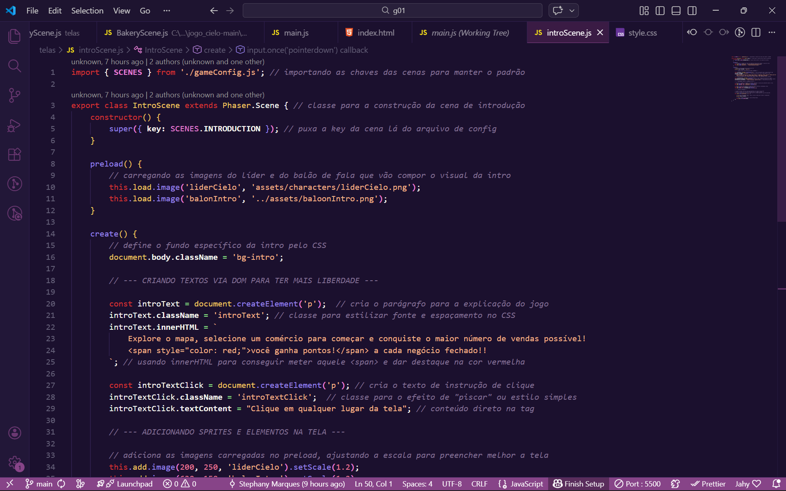

<p align = 'center'><b>Figura 4.1.5.5 </b> - Tela de Introdução (Execução)</p>

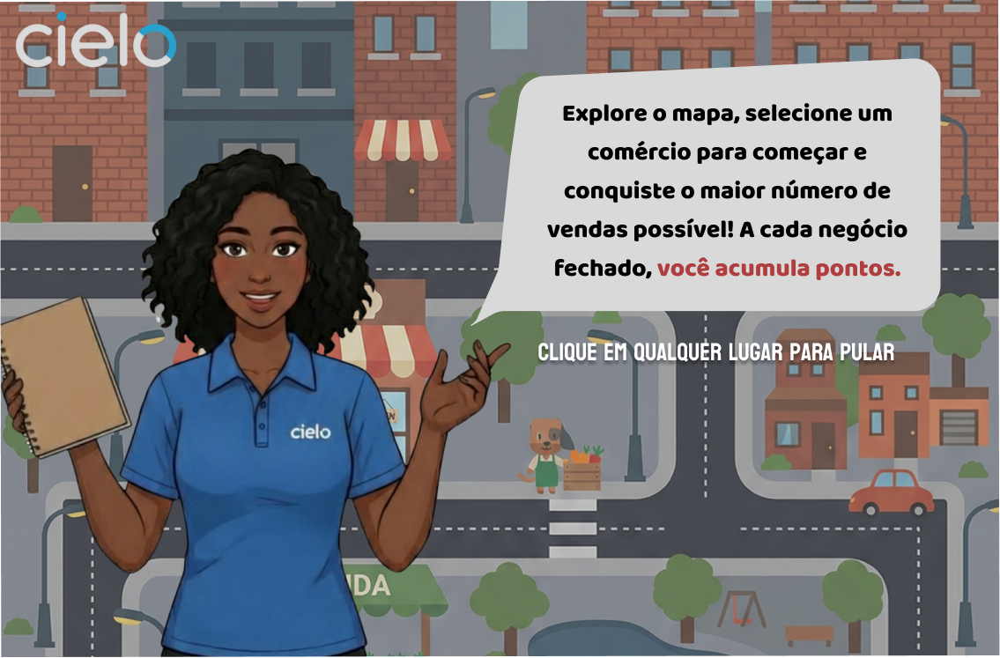

<p align = 'center'><b>Figura 4.1.5.6 </b> - Tela do Mapa (Layout)</p>


<p align = 'center'><b>Figura 4.1.5.7 </b> - Tela do Mapa (Execução)</p>


<p align = 'center'><b>Figura 4.1.5.8 </b> - Tela de Encerramento (Layout)</p>

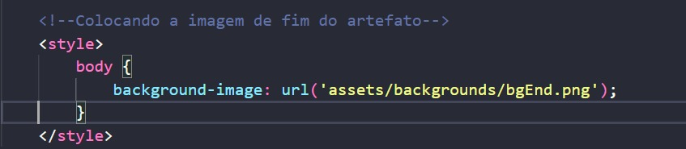

<p align = 'center'><b>Figura 4.1.5.9 </b> - Tela de Encerramento (Execução)</p>


### 4.1.6 Telas Futuras 

<p align = 'center'><b>Figura 4.1.6.1 </b> - Cena Interna da Padaria (Layout)</p>


<p align = 'center'><b>Figura 4.1.6.2 </b> - Cena Interna da Padaria (Execução)</p>

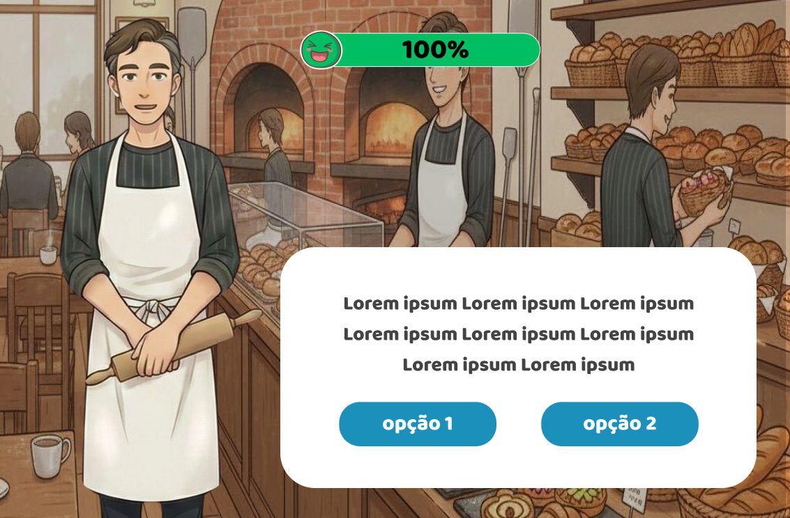

<p align = 'center'><b>Figura 4.1.6.3 </b> - Estrutura dos Arquivos de Diálogo</p>

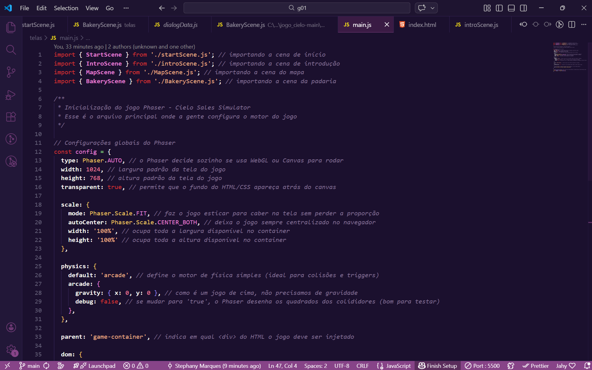

<p align = 'center'><b>Figura 4.1.6.4 </b> - Código de Conexão entre Cenas</p>

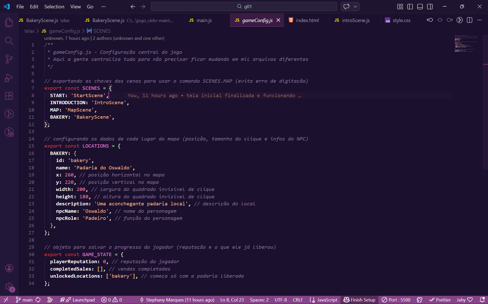

## 4.2. Desenvolvimento básico do jogo (sprint 2)

### 4.2.1 Objetivo da Versão 2
A segunda versão do projeto teve como foco a implementação das primeiras mecânicas jogáveis do sistema, transformando a estrutura inicial em uma experiência funcional. Nesta etapa foram integradas as principais telas do jogo, além da introdução do primeiro cenário jogável e do sistema inicial de diálogo com NPCs. Também foi iniciada a implementação da lógica da Barra de Satisfação do cliente.

### 4.2.2 Escopo Entregue – Interface
Na Sprint 2, foram implementadas e refinadas as seguintes telas:
* **Tela 1 — Menu Inicial:** Interface de entrada do jogo contendo o título e o botão de Start.
* **Tela 2 — Tela de Introdução (Tutorial):** Tela na qual a personagem Cielita apresenta instruções iniciais.
* **Tela 3 — Mapa Interativo:** Tela que permite ao jogador navegar pelo ambiente urbano. 
* **Tela 4 — Cenário da Padaria:** Primeiro ambiente jogável do sistema, onde o jogador pode interagir com o NPC Padeiro e iniciar o sistema de diálogo.

### 4.2.3 Escopo Técnico Entregue
Em termos de implementação, foram desenvolvidas as seguintes funcionalidades:
* Sistema funcional de transição entre cenas
* Integração entre menu inicial, tutorial, mapa e cenário jogável
* Sistema de colisão para entrada em estabelecimentos
* Implementação do cenário interno da Padaria
* Sistema inicial de diálogos com NPC
* Estrutura lógica da Barra de Satisfação do cliente
* Implementação de diálogos adaptativos baseados em escolhas

O sistema de diálogo foi estruturado em três etapas progressivas. Em cada etapa, as escolhas do jogador são verificadas por meio de uma condição lógica (`isCorrect`). Quando a escolha é considerada correta, ocorre um aumento na Barra de Satisfação do cliente.

### 4.2.4 Evidências – Prints de Código

<p align = 'center'><b>Figura 4.2.4.1 </b> - Código da Tela Inicial</p>

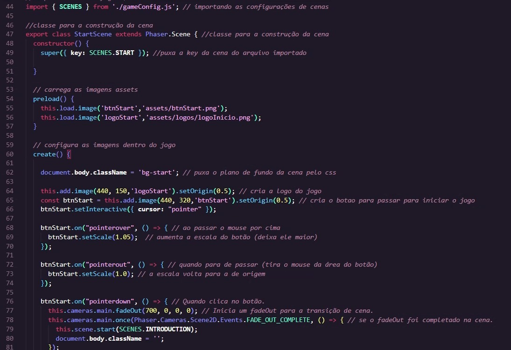

<p align = 'center'><b>Figura 4.2.4.2 </b> - Código da Tela de Introdução</p>


<p align = 'center'><b>Figura 4.2.4.3 </b> - Código da Tela de Mapa</p>


<p align = 'center'><b>Figura 4.2.4.4 </b> - Códigos do Cenário da Padaria</p>

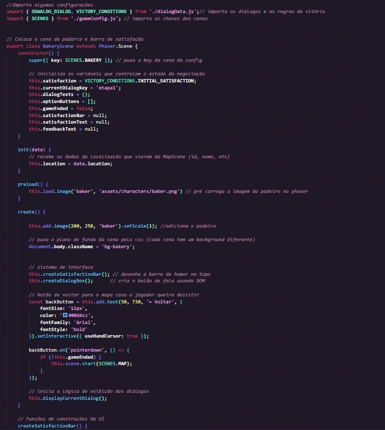

<p align = 'center'><b>Figura 4.2.4.5 </b> - Códigos do Sistema de Diálogo</p>

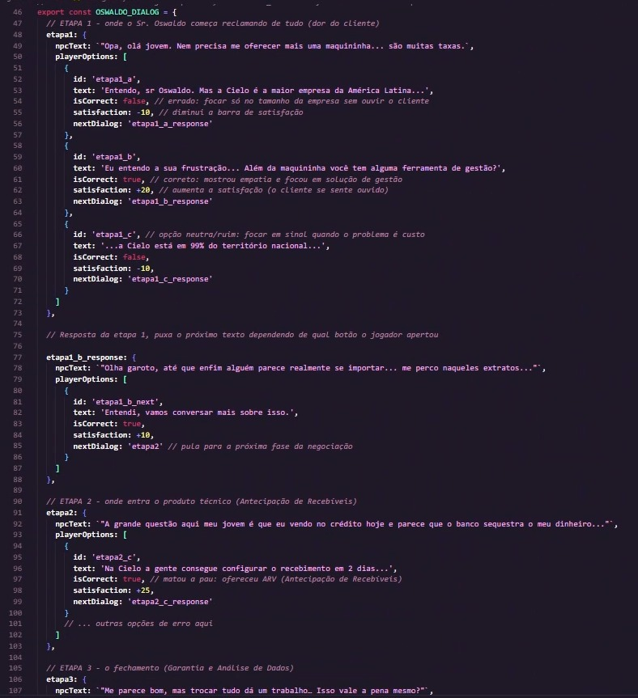

### 4.2.5 Limitações Atuais
Nesta versão, algumas funcionalidades ainda não foram completamente implementadas:
* Sistema de redução da Barra de Satisfação em caso de escolhas incorretas
* Expansão do sistema de diálogos para outros estabelecimentos
* Implementação de novos cenários jogáveis
* Sistema de progressão baseado em reputação do jogador

## 4.3. Desenvolvimento intermediário do jogo (sprint 3)

### 4.3.1 Objetivo da Versão 3
A terceira versão do projeto teve como foco a implementação da fase da Quitanda e da fase final do Posto de Gasolina. Além disso, foi desenvolvida a lógica da Barra de Satisfação do Cliente, responsável por medir o desempenho do jogador durante as interações de venda. Também foram realizadas correções no sistema de diálogos do jogo.

### 4.3.2 Escopo Entregue – Interface
* **Tela 1 — Menu Inicial:** Tela de entrada do jogo.
* **Tela 2 — Tela de Introdução (Tutorial):** Interface com instruções de Cielita.
* **Tela 3 — Mapa Interativo:** Permite acessar os cenários disponíveis.
* **Tela 4 — Cenário da Padaria:** Primeiro ambiente jogável.
* **Tela 5 — Cenário da Quitanda:** Segundo ambiente jogável, interação com a NPC Dona da Quitanda.
* **Tela 6 — Cenário do Posto de Gasolina:** Quarto ambiente jogável, interação com o NPC Dono do Posto.

### 4.3.3 Escopo Técnico Entregue
Em termos de implementação, foram desenvolvidas as seguintes funcionalidades:
* Sistema funcional da barra de satisfação do cliente
* Sistema de diálogo funcional 
* Implementação do cenário interno da Quitanda
* Implementação do cenário interno do Posto de Gasolina

A Barra de Satisfação do cliente foi implementada para representar visualmente o desempenho do jogador. Conforme o jogador realiza escolhas durante os diálogos, a barra é atualizada. O sistema de diálogos também foi aprimorado e corrigido para garantir o fluxo de desenvolvimento da negociação.

### 4.3.4 Evidências – Prints de Código

<p align = 'center'><b>Figura 4.3.4.1 </b> - Códigos do Cenário da Quitanda</p>

 
<p align = "center">Fonte: Figura criada pelos autores.</p>

<p align = 'center'><b>Figura 4.3.4.2 </b> - Tela da Quitanda</p>

 
<p align = "center">Fonte: Figura criada pelos autores.</p>

<p align = 'center'><b>Figura 4.3.4.3 </b> - Códigos do Cenário do Posto</p>

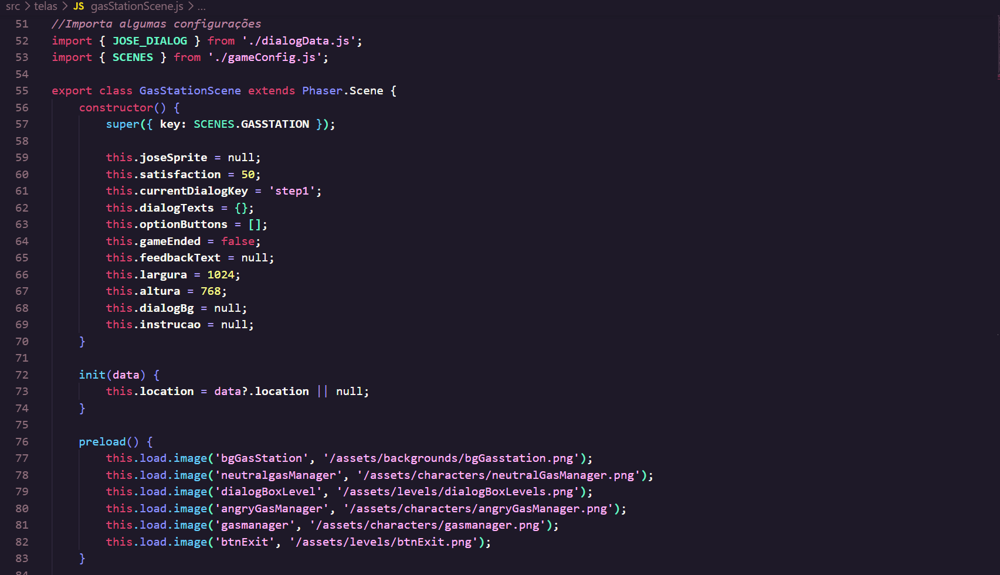
<p align = "center">Fonte: Figura criada pelos autores.</p>

<p align = 'center'><b>Figura 4.3.4.4 </b> - Tela do Posto</p>

 
<p align = "center">Fonte: Figura criada pelos autores.</p>

### 4.3.5 Limitações Atuais
Nesta versão, algumas funcionalidades ainda não foram completamente implementadas:
* Expansão do sistema de diálogos para os estabelecimentos restantes.
* Implementação completa dos cenários jogáveis pendentes.
* Sistema final de progressão baseado na reputação geral do jogador.

## 4.4. Desenvolvimento final do MVP (sprint 4)

Na Sprint 4, foi finalizada a versão MVP do jogo, consolidando as principais funcionalidades propostas ao longo do projeto. O foco principal foi garantir uma experiência simples, funcional e alinhada à realidade dos vendedores da Cielo, permitindo que o jogador pratique negociações por meio de simulações interativas.

O MVP conta com quatro fases distintas padaria, quitanda, restaurante e posto de gasolina, cada uma representando diferentes contextos reais de venda enfrentados pelos Gerentes de Negócios. Cada fase possui um perfil de cliente específico, exigindo que o jogador adapte sua abordagem durante os diálogos para obter melhores resultados.

Como pode ser observado na Figura 4.4.1, o jogo apresenta uma interface inicial que permite ao usuário iniciar o jogo por meio de um botão interativo

<p align = 'center'><b>Figura 4.4.1</b> - Tela inicial do jogo</p>


<p align = 'center'>Fonte: Material produzido pelos autores (2026)</p>


Ao iniciar o jogo, o usuário é recepcionado pela lider Cielita (Figura 4.4.2), a guia do GN pelo jogo, onde oferece as primeiras informações necessárias sobre as mecânicas e o instigando a explorar o mapa.

<p align = 'center'><b>Figura 4.4.2</b> - Tela inicial do jogo</p>


<p align = 'center'>Fonte: Material produzido pelos autores (2026)</p>

Após a introdução da cielita, o jogador é liberado para explorar o mapa (Figura 4.4.3), onde encontra algumas fases/estabelecimentos bloqueados por falta de reputação (mensagem que é exibida ao tentar acessar a fase) (Figura 4.4.4).

<p align = 'center'><b>Figura 4.4.3</b> - Mapa do jogo (posiçao inicial)</p>


<p align = 'center'>Fonte: Material produzido pelos autores (2026)</p>

<p align = 'center'><b>Figura 4.4.4</b> - Fase bloqueada</p>


<p align = 'center'>Fonte: Material produzido pelos autores (2026)</p>


O usuário é orientado pela Cielita a explorar o mapa em busca da primeira e única fase desbloqueada, a Padaria. Então, ao selecionar a padaria no mapa, começa-se o fluxo de diálogos com perguntas (Figura 4.4.5 e Figura 4.4.6), respostas e interação do gerente de negócios com o Oswaldo (padeiro) até que ele chegue ao final do fluxo, onde caso finalize a fase com 50% ou mais de barra de satisfação ele recebe uma frase de vitória (Figura 4.4.6) e soma-se 100 de reputação ao seu score. Caso contrário, é exibida uma de derrota (Figura 4.4.7) e ele pode voltar ao mapa e tentar novamente. 

<p align = 'center'><b>Figura 4.4.5</b> - Fase da Padaria (diálogo)</p>


<p align = 'center'>Fonte: Material produzido pelos autores (2026)</p>

<p align = 'center'><b>Figura 4.4.5</b> - Fase da Padaria (opções)</p>


<p align = 'center'>Fonte: Material produzido pelos autores (2026)</p>

<p align = 'center'><b>Figura 4.4.7</b> - Tela de vitória das fases </p>


<p align = 'center'>Fonte: Material produzido pelos autores (2026)</p>


<p align = 'center'><b>Figura 4.4.8</b> - Tela de derrota das fases </p>


<p align = 'center'>Fonte: Material produzido pelos autores (2026)</p>


Em seguida, o jogador acessa as fases que são desbloqueadas com a vitória da padaria, o restaurante (Figura 4.4.9) e a quitanda (Figura 4.4.10). Ele fica livre para escolher qual fase quer jogar, além disso, não é permitido rejogar uma fase após a vitória, para evitar "acumulo de score indevido" (Figura 4.4.11). 
Todas as fases seguem a mesma estrutura (exceto a fase do posto de gasolina) de diálogo, barra de reputação e telas de vitória e derrotas, como as duas fases são de nível médio, é necessário uma satisfação de 65% ou mais.


<p align = 'center'><b>Figura 4.4.9</b> - Fase do Restaurante</p>


<p align = 'center'>Fonte: Material produzido pelos autores (2026)</p>

<p align = 'center'><b>Figura 4.4.10</b> - Fase da Quitanda</p>

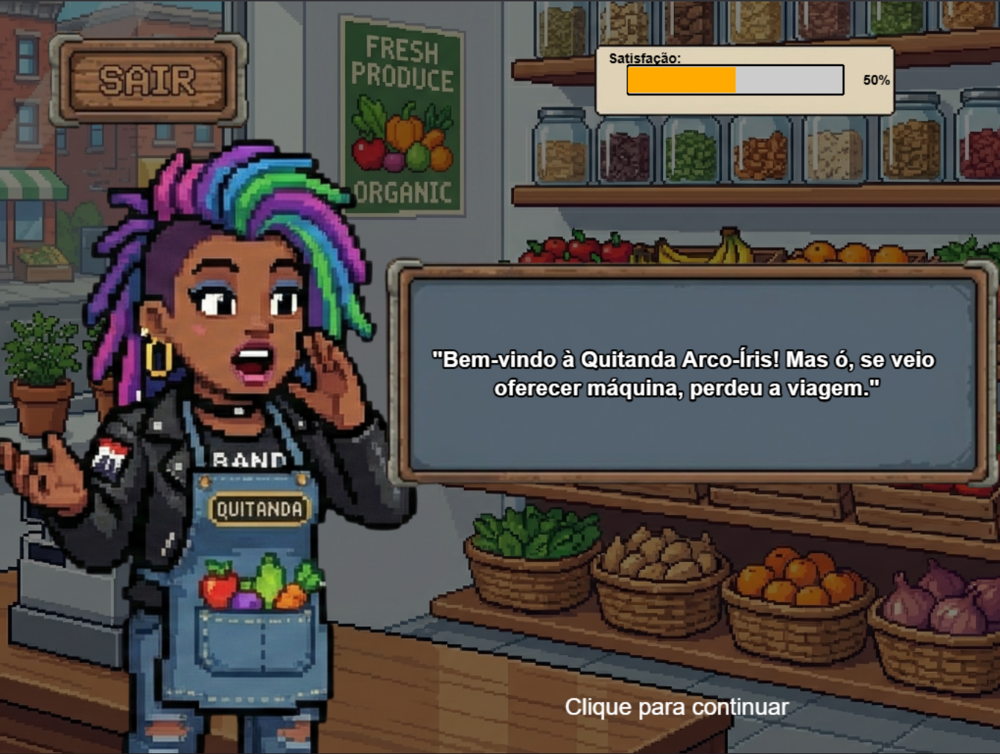

<p align = 'center'>Fonte: Material produzido pelos autores (2026)</p>

<p align = 'center'><b>Figura 4.4.11</b> - Bloqueio de fase já concluida

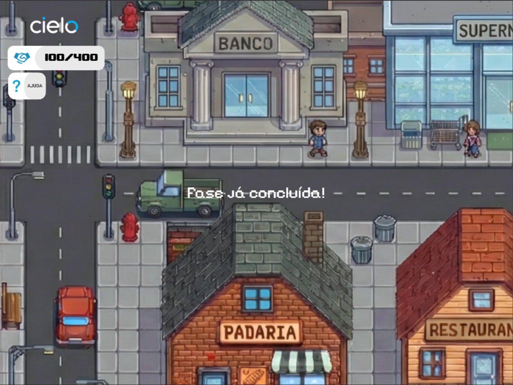

<p align = 'center'>Fonte: Material produzido pelos autores (2026)</p>

Com a conclusão das duas fases, o usuário acumula 400 de reputação, o suficiente para desbloquear a fase final, o posto de gasolina (Figura 4.4.12). O posto é a fase final, a mais dificil, para sua conclusão é necessário uma satisfação de 75% ou mais, além disso, o jogador só sabe se acertou a resposta por meio das expressões do José (o npc do posto), onde fica feliz com uma resposta certa (Figura 4.4.13) e bravo para respostas incorretas (Figura 4.4.14). A mecânica de expressões acontece em todas as fases, entretanto, apenas a do posto é usada como uma das mecânicas principais.

<p align = 'center'><b>Figura 4.4.12</b> - Fase do Posto de Gasolina


<p align = 'center'>Fonte: Material produzido pelos autores (2026)</p>

<p align = 'center'><b>Figura 4.4.13</b> - NPC do posto feliz como feedback

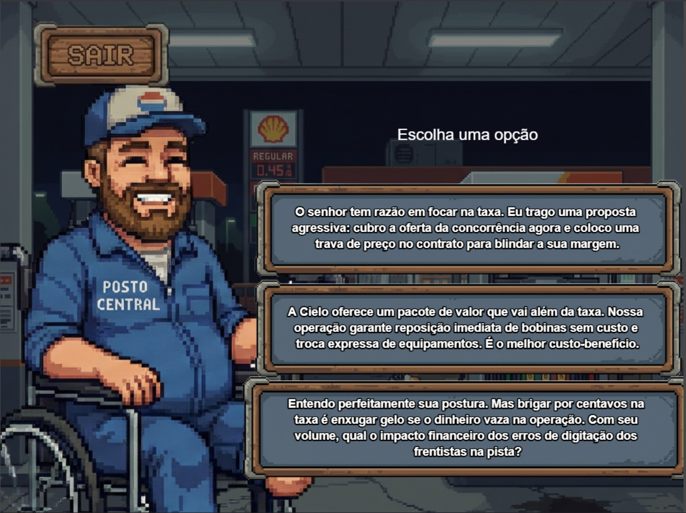

<p align = 'center'>Fonte: Material produzido pelos autores (2026)</p>

<p align = 'center'><b>Figura 4.4.14</b> - NPC do posto bravo como feedback


<p align = 'center'>Fonte: Material produzido pelos autores (2026)</p>

Por fim, ao finalizar a fase do posto, o jogador é encaminhado para a tela final, onde a cielita aparece mais uma vez parabenizando o usuário por ter concluído o jogo e entrega um certificado a ele (figura 4.4.15), além disso, ela reforça a ideia que os npcs viraram parceiros do jogador. Depois de um tempo ela some e aparecem todos os npcs juntos comemorando e a opção de jogar novamente (apagando o progresso feito e salvo) (Figura 4.4.16).

<p align = 'center'><b>Figura 4.4.15</b> - Cielita parabenizando pela conclusão do jogo


<p align = 'center'>Fonte: Material produzido pelos autores (2026)</p>

<p align = 'center'><b>Figura 4.4.16</b> - Cena final do jogo 

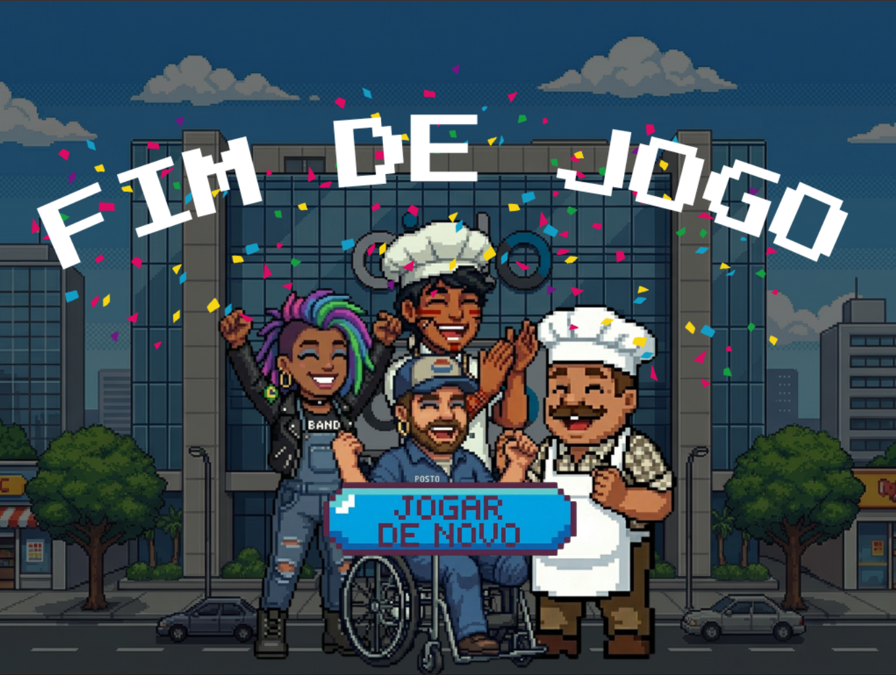

<p align = 'center'>Fonte: Material produzido pelos autores (2026)</p>

Ao longo dessa etapa, foram realizados testes para garantir o funcionamento adequado do jogo em diferentes situações, incluindo a validação de entradas do usuário e o tratamento de possíveis erros, como interações inválidas. Após os testes, o projeto foi organizado e disponibilizado em repositório Git, com commits descritivos, e preparado para deploy na plataforma indicada.

As principais dificuldades encontradas estiveram relacionadas à implementação da lógica de diálogos ramificados, exigindo atenção para manter a coerência das interações e dos impactos das escolhas. Como próximos passos, pretende-se aprimorar os elementos visuais, adicionar novos cenários e perfis de clientes, além de incluir trilha sonora e expandir as mecânicas de progressão, tornando a experiência mais completa e imersiva.

## 4.5. Revisão do MVP (sprint 5)
*Pendente para a próxima sprint.*

# <a name="c5"></a>5. Testes

Nesta seção, são apresentados os processos de validação e verificação realizados para atestar o correto funcionamento do simulador educacional. O objetivo dessas validações é garantir a Qualidade de Software (QA - Quality Assurance), certificando-se de que o jogo está em total alinhamento estrutural e lógico com os requisitos funcionais e não funcionais previamente mapeados no escopo do projeto.

## 5.1. Casos de Teste (sprints 2 a 4)

Em Engenharia de Software, segundo Pressman e Maxim (2016), um Caso de Teste (Test Case) é um cenário documentado e estruturado que define um conjunto de condições prévias, ações a serem executadas e os resultados esperados para validar se uma funcionalidade específica do sistema está operando da maneira correta.

De acordo com Sommerville (2019), o uso de casos de teste é fundamental para padronizar as avaliações do software, permitindo que qualquer desenvolvedor ou testador replique o mesmo cenário em busca de falhas (bugs), gargalos de usabilidade ou quebras lógicas no código. Eles funcionam como um roteiro de aprovação: se o resultado obtido após a ação (pós-condição) for idêntico ao resultado esperado, a funcionalidade é considerada validada.

Os casos de teste listados na Tabela 5.1.1 abaixo foram projetados para serem executados de forma iterativa em diferentes momentos do desenvolvimento. Eles têm como foco principal verificar o funcionamento isolado e a integração coesa entre as mecânicas essenciais do jogo: navegação de interfaces, renderização do mapa, sistema interativo de diálogo, lógica de cálculo da barra de satisfação e o sistema de progressão por reputação.
<p align = 'center'><b>Tabela 5.1.1 </b> - Casos de teste do jogo</p>

| ID | Pré-condição | Descrição do teste (Ação) | Pós-condição (Resultado Esperado) |
|:---|:---|:---|:---|
| 1 | Jogo executado no navegador. | Verificar a proporção da tela durante a navegação entre menus e o mapa. | Imagens, diálogos e textos são renderizados corretamente, sem distorções, mantendo a proporção visual. |
| 2 | Jogo aberto na tela inicial (StartScene). | Clicar no botão "Start". | O sistema transiciona para a tela de introdução do tutorial (IntroScene). |
| 3 | Tela de introdução (IntroScene) ativa na tela. | Clicar em qualquer área livre da tela. | O sistema transiciona para a tela do mapa urbano (MapScene). |
| 4 | Tela do mapa (MapScene) ativa na tela. | Clicar em um estabelecimento visualmente disponível no mapa (ex: Padaria). | O sistema carrega e exibe o respectivo cenário interno do local selecionado. |
| 5 | Interação de diálogo ativa no cenário do lojista. | Escolher e clicar em uma das opções de diálogo apresentadas. | A barra de satisfação visual na UI do cliente aumenta ou diminui de acordo com a precisão da resposta. |
| 6 | Diálogo de vendas chega ao fim com a tela de encerramento ativa. | Verificar o cálculo do sistema baseado na barra de satisfação. | Se o nível final da barra for maior que o mínimo exigido, a venda é concluída. Se menor, a venda falha e o ciclo repete. |
| 7 | Tela de encerramento ativada indicando que a Venda foi Concluída (Sucesso). | Clicar no botão "Voltar ao Mapa". | O jogador retorna ao mapa principal, recebe feedback positivo, ganha reputação e visualiza novos locais desbloqueados. |
| 8 | Tela de encerramento ativada indicando que a Venda Não foi Concluída (Falha). | Clicar em "Tentar Novamente" ou "Voltar ao Mapa". | O jogador não ganha reputação, recebe o feedback educativo sobre as escolhas e deve reiniciar a negociação com o cliente. |

<p align = "center">Fonte: Tabela criada pelos autores.</p>

## 5.2. Testes de jogabilidade (playtests) (sprint 5)

### 5.2.1 Registros de testes

Nome | João Jonas (nome fictício)
--- | ---
Já possuía experiência prévia com games? | Sim, é um jogador casual.
Conseguiu iniciar o jogo? | Sim.
Entendeu as regras e mecânicas do jogo? | Entendeu as regras; sobre as mecânicas, utilizou apenas as essenciais e não explorou comandos complexos.
Conseguiu progredir no jogo? | Sim, sem dificuldades.
Apresentou dificuldades? | Não, conseguiu jogar com facilidade e afirmou ser um sistema bem intuitivo.
Que nota deu ao jogo? | 9.0
O que gostou no jogo? | Gostou de como o jogo eleva a dificuldade ao longo do tempo sem deixar de ser divertido.
O que poderia melhorar no jogo? | A responsividade do personagem aos controles (relatou pequeno *delay* de *input*).

### 5.2.2 Melhorias
*Pendente para a próxima sprint.*

# <a name="c6"></a>6. Conclusões e trabalhos futuros (sprint 5)
*Pendente para a próxima sprint.*

# <a name="c7"></a>7. Referências (sprint 5)

Abecs. (2024). Balanço do Setor de Meios Eletrônicos de Pagamento – 2023. Recuperado de https://abecs.org.br/storage/sector_balances/24/01KH6F7ASSZ4ST9T6R0515EC2E.pdf <br>

BOLLER, Sharon; KAPP, Karl M., 1967-; TILELLI, Sally. Jogar para aprender: tudo o que você precisa saber sobre o design de jogos de aprendizagem eficazes. São Paulo: DVS, 2018. 207 p., il., 23 cm. ISBN 9788582891957. <br>

CARVALHO, Marly Monteiro. Fundamentos em gestão de projetos: construindo competências para gerenciar projetos. 5. ed. São Paulo: Atlas, 2018. 1 recurso online. ISBN 9788597018950. Disponível em: https://integrada.minhabiblioteca.com.br/books/9788597018950. Acesso em: 27 mar. 2026. <br>


Cielo. (s.d.). E-commerce: Nossas soluções. Recuperado de https://www.cielo.com.br/ <br>


Cielo. (s.d.). Estratégia e vantagens competitivas. RI Cielo. Recuperado de https://ri.cielo.com.br/sobre-a-cielo/estrategia-e-vantagens-competitivas/ <br>


Cielo. (2023). Demonstrações Financeiras 2022 [Relatório Financeiro]. Recuperado de https://filemanager-cdn.mziq.com.br/published/4d1ebe73-b068-4443-992a-3d72d573238c/696185c4-d779-4b63-bd45-dbad2f9c4dd9_df_ifrs_completa_ri.pdf <br>


Cielo. (2024). Relatório de Resultados [Documento de RI]. Recuperado de https://api.mziq.com/mzfilemanager/v2/d/4d1ebe73-b068-4443-992a-3d72d573238c/5ab9a1ba-b7f2-64ab-4a37-ecd3ad8b6a6a?origin=2 <br>


Cielo. (2025). Fatores de risco. Relacionamento com Investidores. Recuperado de https://ri.cielo.com.br/servicos-ri/fatores-de-risco/ <br>


Cielo. (2026). TAPI_2026 - Jogo Digital_Cielo [Documento de escopo de projeto interno]. Inteli. <br>


CNN Brasil. (2023). Cielo tem soluções digitais para todos os tamanhos e tipos de negócios. Recuperado de https://www.cnnbrasil.com.br/branded-content/nacional/cielo-tem-solucoes-digitais-para-todos-os-tamanhos-e-tipos-de-negocios/ <br>


Edrone. (2024). Dados do e-commerce no Brasil. Recuperado de https://edrone.me/pt/blog/dados-ecommerce-brasil <br>


Febraban. (2025). Pesquisa Febraban de Tecnologia Bancária. Federação Brasileira de Bancos. Recuperado de https://portal.febraban.org.br/ <br>


Fenacon. (2025, 14 de janeiro). Digitalização recorde: Pequenos negócios no Brasil atingem nível histórico em 2025. Recuperado de https://fenacon.org.br/noticias/digitalizacao-recorde-pequenos-negocios-no-brasil-atingem-nivel-historico-em-2025/ <br>


Finsiders Brasil. (2023, 22 de maio). Guerra das maquininhas de cartão já era; agora a briga é por tecnologia. Recuperado de https://finsidersbrasil.com.br/pagamentos/guerra-das-maquininhas-de-cartao-ja-era-agora-a-briga-e-por-tecnologia/ <br>


G1. (2025, 1 de setembro). Como as fintechs mudaram o sistema financeiro no Brasil. Globo. Recuperado de https://g1.globo.com/economia/noticia/2025/09/01/como-as-fintechs-mudaram-o-sistema-financeiro-no-brasil.ghtml <br>


iDinheiro. (2024). Máquina de cartão com menor taxa no débito. Recuperado de https://www.idinheiro.com.br/negocios/maquina-cartao-menor-taxa-debito/ <br>


INPI. (2024). Marcas de Alto Renome em vigência. Instituto Nacional da Propriedade Industrial. Recuperado de https://www.gov.br/inpi/pt-br/servicos/marcas/arquivos/guia-basico/inpi_marcas_marcasdealtorenomeemvigncia_2024_07_09.pdf <br>


Instituto Propague. (2023). O mercado de adquirência no Brasil: concorrência e inovação. Recuperado de https://institutopropague.org/ <br>


InvestNews. (2023). Destronada nas maquininhas, Cielo luta para se manter relevante na era do Pix. Recuperado de https://investnews.com.br/negocios/destronada-nas-maquininhas-cielo-luta-para-se-manter-relevante-na-era-do-pix/ <br>


Mazzoco, P. (2022, 11 de fevereiro). Guerra das maquininhas cobra preço alto e ações da Cielo não param de cair. InfoMoney. Recuperado de https://www.infomoney.com.br/negocios/guerra-das-maquininhas-cobra-preco-alto-e-acoes-da-cielo-nao-param-de-cair/ <br>

OSTERWALDER, Alexander; PIGNEUR, Yves; BERNARDA, Gregory; SMITH, Alan. Value proposition design: como construir propostas de valor inovadoras. São Paulo: HSM Editora, 2014. <br>

PRESSMAN, Roger. Engenharia de software. 8. ed. Porto Alegre: AMGH, 2016. 1 recurso online. ISBN 9788580555349. Disponível em: https://integrada.minhabiblioteca.com.br/books/9788580555349. Acesso em: 27 mar. 2026. <br>

SANTOS, Marcelo Henrique dos. Fundamentos de jogos digitais: game design, game engine e level design. São Paulo: Platos Soluções Educacionais, 2021. 1 recurso online. ISBN 9786589881919. Disponível em: https://integrada.minhabiblioteca.com.br/books/9786589881919. Acesso em: 27 mar. 2026. <br>

Sebrae. (s.d.). Lei Geral de Proteção de Dados (LGPD). Portal Sebrae. Recuperado de https://sebrae.com.br/sites/PortalSebrae/LGPD <br>

SOMMERVILLE, Ian, 1951-. Engenharia de software. São Paulo: Pearson Education do Brasil, 2018. 756p., il. ISBN 9788543024974. <br>

Zoop. (s.d.). Como adequar sua empresa à LGPD. Zoop Blog. Recuperado de https://www.zoop.com.br/blog/regulamentacao/como-adequar-lgpd <br>


Zoop. (s.d.). Panorama dos meios de pagamento no Brasil. Zoop Blog. Recuperado de https://www.zoop.com.br/blog/pagamento/meios-de-pagamento-no-brasil <br>

# <a name="c8"></a>Anexos

*Não há anexos para esta versão.*
